# 摘要
本报告旨在对002410.SZ（广联达科技股份有限公司）进行深入分析。由于缺乏最新的财务数据和新闻快照，我们主要基于近期的股价走势和技术面进行分析。从技术面来看，该股票在近一个月内经历了较大的波动，但整体趋势仍处于调整阶段。综合考虑行业前景、竞争格局及技术面因素，我们对该股票持中性观点。

# 公司与业务概览
广联达科技股份有限公司（以下简称“广联达”）是一家专注于建筑信息化领域的高新技术企业。公司主要提供工程造价软件、项目管理软件以及相关的解决方案和服务。广联达在国内建筑信息化市场具有较高的市场份额，并且在国际市场上也有所布局。

# 财务与基本面
由于缺乏最新的财务数据，我们无法对公司的财务状况进行全面分析。建议投资者关注公司即将发布的财报，以获取更准确的信息。

# 行业与竞争格局
建筑信息化行业正处于快速发展阶段，随着数字化转型的推进，市场需求持续增长。广联达作为行业内的领先企业，面临着来自国内外竞争对手的压力。然而，公司在技术研发和市场拓展方面具备较强的竞争优势。

# 技术面与交易结构
以下是002410.SZ最近20个交易日的收盘价：

| 交易日 | 收盘价 |
| --- | ---: |
| 2026-04-03 | 10.86 |
| 2026-04-02 | 11.01 |
| 2026-04-01 | 11.28 |
| 2026-03-31 | 11.07 |
| 2026-03-30 | 11.16 |
| 2026-03-27 | 11.25 |
| 2026-03-26 | 11.14 |
| 2026-03-25 | 11.37 |
| 2026-03-24 | 11.32 |
| 2026-03-23 | 10.98 |
| 2026-03-20 | 11.80 |
| 2026-03-19 | 12.20 |
| 2026-03-18 | 12.47 |
| 2026-03-17 | 12.38 |
| 2026-03-16 | 12.48 |
| 2026-03-13 | 12.50 |
| 2026-03-12 | 12.73 |
| 2026-03-11 | 12.80 |
| 2026-03-10 | 12.94 |
| 2026-03-09 | 12.77 |

```mermaid
graph TD;
    A[2026-03-09] --> B[12.77];
    B --> C[2026-03-10];
    C --> D[12.94];
    D --> E[2026-03-11];
    E --> F[12.80];
    F --> G[2026-03-12];
    G --> H[12.73];
    H --> I[2026-03-13];
    I --> J[12.50];
    J --> K[2026-03-16];
    K --> L[12.48];
    L --> M[2026-03-17];
    M --> N[12.38];
    N --> O[2026-03-18];
    O --> P[12.47];
    P --> Q[2026-03-19];
    Q --> R[12.20];
    R --> S[2026-03-20];
    S --> T[11.80];
    T --> U[2026-03-23];
    U --> V[10.98];
    V --> W[2026-03-24];
    W --> X[11.32];
    X --> Y[2026-03-25];
    Y --> Z[11.37];
    Z --> AA[2026-03-26];
    AA --> AB[11.14];
    AB --> AC[2026-03-27];
    AC --> AD[11.25];
    AD --> AE[2026-03-30];
    AE --> AF[11.16];
    AF --> AG[2026-03-31];
    AG --> AH[11.07];
    AH --> AI[2026-04-01];
    AI --> AJ[11.28];
    AJ --> AK[2026-04-02];
    AK --> AL[11.01];
    AL --> AM[2026-04-03];
    AM --> AN[10.86];
```

从图表可以看出，股价在3月中旬达到高点后出现回调，目前处于调整阶段。

# 催化与事件
无可用新闻数据，因此无法提供具体的催化与事件信息。建议投资者密切关注公司公告和行业动态。

# 风险清单与应对
1. **市场竞争加剧**：随着行业的发展，新的竞争对手可能进入市场，导致竞争加剧。
   - **应对措施**：加强技术研发，提升产品竞争力。
2. **宏观经济波动**：宏观经济环境的变化可能影响建筑行业的投资需求。
   - **应对措施**：多元化业务布局，降低单一市场的依赖。
3. **政策风险**：政府政策的变化可能对行业发展产生影响。
   - **应对措施**：密切关注政策动态，及时调整战略。

# 结论与建议
**观点**：中性

**关键假设**：
- 建筑信息化行业继续保持稳定增长。
- 公司能够保持其在行业内的竞争优势。

**触发条件**：
- 公司发布超预期的财报。
- 行业政策利好出台。

**止损/风控要点**：
- 设置合理的止损点，如股价跌破重要支撑位时及时减仓或平仓。
- 分散投资，避免单一股票仓位过重。

# 附录（数据与假设）
- 由于缺乏最新的财务数据和新闻快照，本报告的分析主要基于技术面和行业趋势。
- 投资者应结合自身情况和市场变化，谨慎决策。
