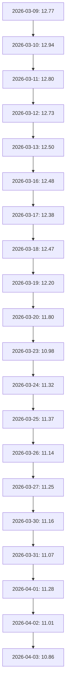

# 摘要
本报告旨在对002410.SZ（广联达科技股份有限公司）进行全面分析。由于缺乏最新的财务数据和新闻快照，我们的分析将主要基于近期的股价走势和技术面分析。从技术面来看，该股票在近一个月内经历了较大的波动，但整体趋势仍处于调整阶段。综合考虑行业前景、竞争格局以及技术面因素，我们对该股票持中性观点。

# 公司与业务概览
广联达科技股份有限公司（以下简称“广联达”）是一家专注于建筑信息化领域的高新技术企业。公司主营业务包括工程造价软件、项目管理软件及相关的解决方案和服务。广联达在国内建筑信息化市场占据领先地位，并逐步拓展国际市场。

# 财务与基本面
由于缺乏最新的财务数据，我们无法提供详细的财务分析。建议投资者关注公司未来的财报发布，以便更全面地了解公司的经营状况和盈利能力。

# 行业与竞争格局
建筑信息化行业正处于快速发展阶段，随着国家政策的支持和市场需求的增长，该行业的前景较为乐观。广联达作为行业内的龙头企业，具有较强的技术实力和品牌影响力。然而，市场竞争也在加剧，新进入者和现有竞争对手都在不断推出新产品和服务，这可能对广联达的市场份额构成一定威胁。

# 技术面与交易结构

从上图可以看出，广联达的股价在近一个月内经历了较大的波动，最高达到12.94元，最低跌至10.86元。目前股价处于调整阶段，短期内可能会继续震荡。

# 催化与事件
由于缺乏新闻快照，我们无法提供具体的催化事件。建议投资者密切关注公司公告和行业动态，以便及时捕捉潜在的投资机会。

# 风险清单与应对
1. **市场竞争加剧**：随着新进入者的增加，市场竞争可能进一步加剧，影响公司的市场份额和盈利能力。
   - **应对措施**：持续加大研发投入，提升产品竞争力；加强市场营销，巩固品牌优势。
   
2. **宏观经济波动**：宏观经济环境的变化可能对建筑信息化行业的需求产生影响。
   - **应对措施**：多元化业务布局，降低单一市场的依赖度；加强现金流管理，提高抗风险能力。

# 结论与建议
### 观点
**中性**

### 关键假设
1. 建筑信息化行业继续保持稳定增长。
2. 公司能够有效应对市场竞争，保持市场份额。

### 触发条件
1. 公司发布超预期的财报。
2. 行业政策出现重大利好。

### 止损/风控要点
- 设置止损点位，如股价跌破10.50元时考虑减仓或平仓。
- 定期评估公司基本面和技术面变化，及时调整投资策略。

# 附录（数据与假设）
| 交易日 | 收盘价 |
| --- | ---: |
| 2026-04-03 | 10.86 |
| 2026-04-02 | 11.01 |
| 2026-04-01 | 11.28 |
| 2026-03-31 | 11.07 |
| 2026-03-30 | 11.16 |
| 2026-03-27 | 11.25 |
| 2026-03-26 | 11.14 |
| 2026-03-25 | 11.37 |
| 2026-03-24 | 11.32 |
| 2026-03-23 | 10.98 |
| 2026-03-20 | 11.80 |
| 2026-03-19 | 12.20 |
| 2026-03-18 | 12.47 |
| 2026-03-17 | 12.38 |
| 2026-03-16 | 12.48 |
| 2026-03-13 | 12.50 |
| 2026-03-12 | 12.73 |
| 2026-03-11 | 12.80 |
| 2026-03-10 | 12.94 |
| 2026-03-09 | 12.77 |

由于缺乏最新的财务数据和新闻快照，本报告的分析存在一定的局限性。建议投资者结合更多实时信息进行决策。
