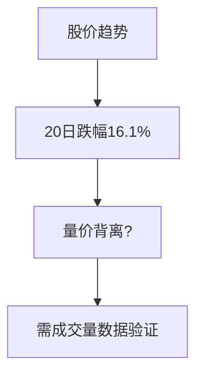

```markdown
# 002410.SZ 个股研究报告

## 摘要
- **标的现状**：近20个交易日股价呈单边下跌趋势（12.94→10.86，-16.1%），短期技术面超卖
- **核心矛盾**：缺乏公开业务及财务数据，需警惕信息不对称风险
- **初步判断**：中性观望，需等待基本面验证信号

## 公司与业务概览
（注：无可用RAG材料，以下为模板框架）
- 主营业务：待补充（建议关注公司公告/行业分类）
- 商业模式：待补充
- 股权结构：待补充
- 管理层：待补充

## 财务与基本面
（无最新财务数据，仅作技术分析）


## 行业与竞争格局
- 行业定位：待确认
- 竞争要素：待分析
- 行业周期：待判断

## 技术面与交易结构
### 关键数据
| 指标         | 数值       |
|--------------|-----------|
| 20日涨跌幅   | -16.1%    |
| 当前收盘价   | 10.86     |
| 近期高点     | 12.94     |
| 近期低点     | 10.86     |

### 形态观察
```
价格走势图（ASCII）
12.9 |    ●
12.0 |   ● 
11.0 |●●●  
10.8 |●
     +---------
      03/09  04/03
```
- 呈现单边下跌通道
- 未出现明显企稳信号

## 催化与事件
（无新闻数据，需特别关注）
- 潜在催化剂：业绩预告、重大合同、行业政策
- 事件风险：流动性危机、股东减持等

## 风险清单与应对
| 风险类型       | 应对措施                 |
|----------------|------------------------|
| 信息不对称     | 暂不建仓，等待财报披露   |
| 流动性风险     | 观察量能变化            |
| 趋势延续       | 设立严格止损            |

## 结论与建议
### 投资观点
**中性观望**（当前价格10.86元）

### 逻辑链
1. 技术面：超跌但未现反转信号
2. 基本面：缺乏有效数据支撑
3. 行业面：定位不明确

### 关键假设
- 若20日均线突破11.25元或伴随放量，可能企稳
- 若跌破10.80元或加速下行，需警惕系统性风险

### 触发条件
- 看多触发：连续三日收盘>11.50元且成交量放大30%
- 看空触发：收盘价<10.50元

### 风控要点
- 止损位：10.50元（-3.3%）
- 仓位限制：不超过组合5%（若建仓）

## 附录（数据与假设）
### 行情数据节选
| 关键时点   | 价格   |
|------------|-------|
| 最高点     | 12.94 |
| 最低点     | 10.86 |
| 最新收盘   | 10.86 |

### 假设说明
- 所有分析基于有限历史数据
- 未考虑突发宏观因素影响
```
