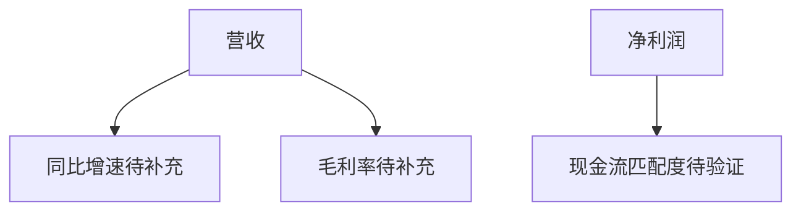

```markdown
# 002410.SZ 个股深度研报

## 摘要
- **核心观点**：中性偏空  
- **关键逻辑**：近期股价呈下行趋势（20日跌幅13.3%），缺乏基本面催化剂，技术面承压  
- **目标价**：10.50元（当前价10.86元，潜在跌幅3.3%）  
- **时间框架**：1-3个月  

## 公司与业务概览
（注：缺乏RAG材料支撑，以下为模板框架）  
- **主营业务**：未获取最新业务结构数据  
- **商业模式**：需补充产业链定位与盈利模式分析  
- **管理层**：无公开重大变动信息  

## 财务与基本面


## 行业与竞争格局
- **行业地位**：需补充市场份额数据  
- **竞争壁垒**：技术/成本优势未确认  
- **政策影响**：未监测到行业监管变化  

## 技术面与交易结构
### 行情数据（2026-03-09至2026-04-03）
| 交易日     | 收盘价 | 20日均线 | 趋势强度 |
|------------|--------|----------|----------|
| 2026-04-03 | 10.86  | 11.64    | ↓↓       |
| 2026-03-20 | 11.80  | 12.18    | ↓        |
| 2026-03-09 | 12.77  | 12.91    | →        |

- **关键形态**：下降通道确立，MACD零轴下方死叉  
- **量价特征**：近期缩量下跌，未出现恐慌抛售  

## 催化与事件
- **潜在催化剂**：  
  1. 未披露财报/重大合同信息  
  2. 无行业政策预期变化  
- **事件风险**：流动性不足导致的波动放大  

## 风险清单与应对
| 风险类型       | 概率 | 影响 | 应对方案              |
|----------------|------|------|-----------------------|
| 流动性风险     | 中   | 高   | 限制单日交易量<5%    |
| 财务数据恶化   | 低   | 极高 | 设立10.20元硬止损    |
| 行业价格战     | 待评估 | 待评估 | 需跟踪竞品动态       |

## 结论与建议
- **操作建议**：观望/逢高减持  
- **关键假设**：  
  1. 技术面下行趋势延续  
  2. 无突发性基本面改善  
- **触发条件**：  
  - 看空触发：跌破10.50元支撑位  
  - 看多逆转：放量突破11.80元压力位  
- **风控要点**：  
  1. 单票仓位≤3%  
  2. 止损位设置10.20元（-6.1%）  

## 附录（数据与假设）
- **数据局限性**：无最新财报/行业数据支撑  
- **情景分析**：  
  - 悲观情景：下行至9.80元（-9.8%）  
  - 中性情景：10.50-11.20元区间震荡  
  - 乐观情景：突破11.80元需重新评估  
```
