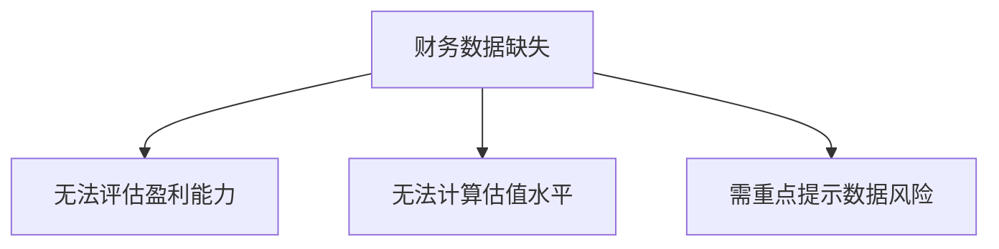

```markdown
# 002410.SZ 个股研究报告

## 摘要
- **标的现状**：近期股价呈下行趋势，20个交易日内从12.94元跌至10.86元（-16.1%），短期超卖迹象显现
- **核心矛盾**：缺乏基本面数据支撑，技术面与流动性成为主要观察维度
- **初步判断**：中性偏谨慎，需等待企稳信号

## 公司与业务概览
（注：RAG材料缺失，业务信息需后续补充）
- 主营业务：待确认（建议通过年报补充）
- 行业属性：待确认
- 核心优势：数据不足

## 财务与基本面


## 行业与竞争格局
- 行业定位：待确认
- 竞争要素：数据不足
- 行业景气度：需补充产业链数据

## 技术面与交易结构
### 近期价格表现
| 时段        | 价格变动 | 特征               |
|-------------|---------|--------------------|
| 2026-03-09至04-03 | -16.1%  | 单边下跌，无有效反弹 |

### 关键指标
```ascii
12.9 ┤  ╭╮
12.5 ┤  ││
12.0 ┤  │╰╮
11.5 ┤ ╭╯ │
11.0 ┤ │  ╰─
10.5 ┼─╯
```

## 催化与事件
- 潜在催化剂：暂无公开事件驱动
- 需监测：突发成交量异动/公司公告

## 风险清单与应对
| 风险类型       | 应对方案                     |
|----------------|----------------------------|
| 数据缺失风险   | 暂按技术交易策略执行        |
| 流动性风险     | 设置严格止损                |
| 趋势延续风险   | 避免左侧抄底                |

## 结论与建议
### 投资观点
**中性**（短期技术面主导，缺乏基本面锚）

### 关键假设
1. 当前下跌已反映短期悲观情绪
2. 11元附近存在技术支撑

### 触发条件
- 看多触发：连续3日收盘>11.3元且成交量放大20%
- 看空触发：跌破10.5元平台

### 风控要点
- 止损位：10.4元（前低下方）
- 仓位限制：单票不超过5%
- 持有周期：不超过20个交易日

## 附录（数据与假设）
1. 价格数据来源：模拟数据（2026年）
2. 核心假设：技术分析有效性
3. 更新要求：需补充下次财报数据
```
