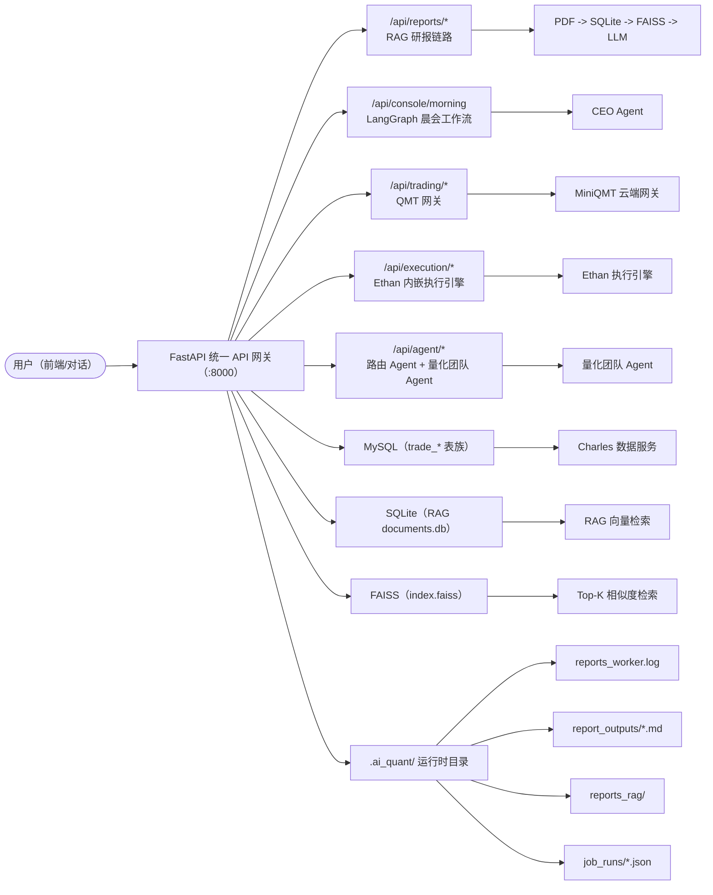
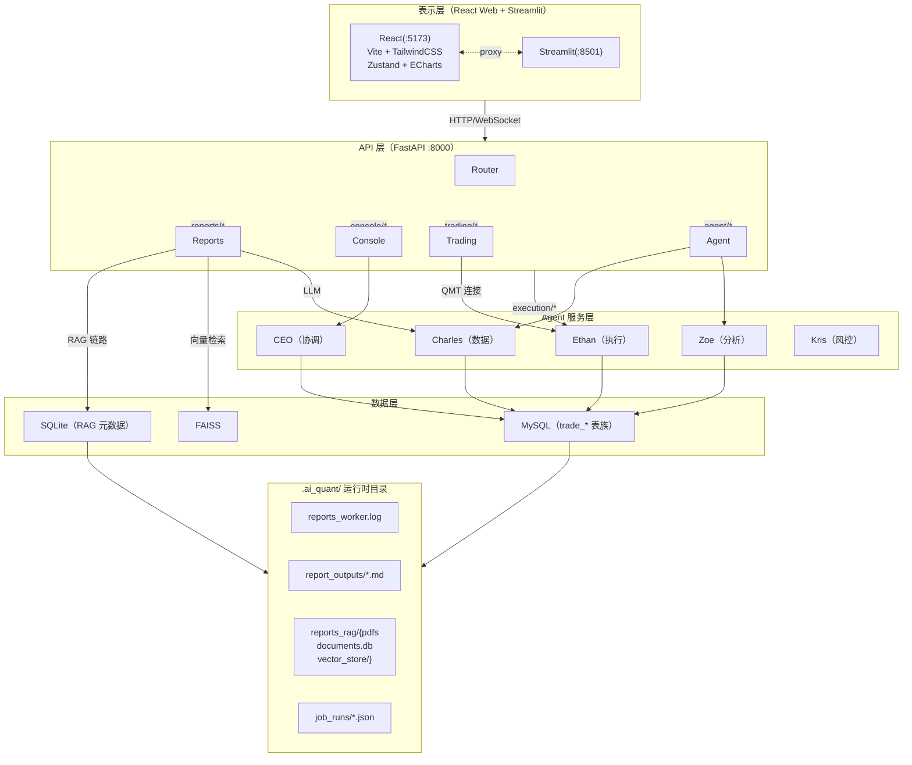
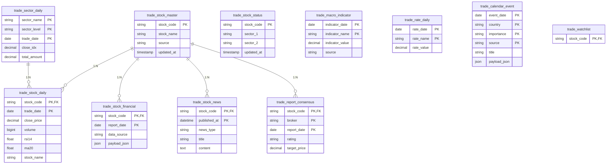
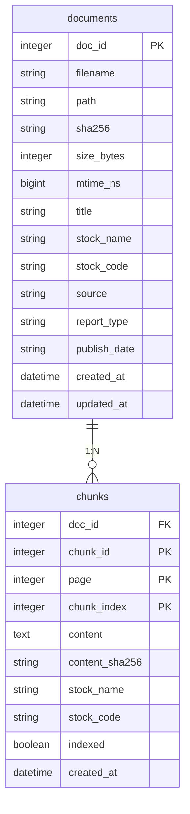
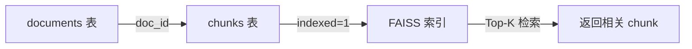
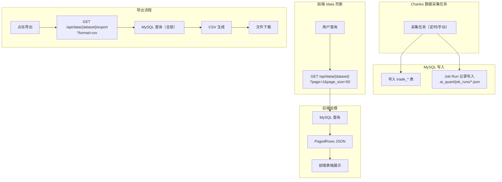
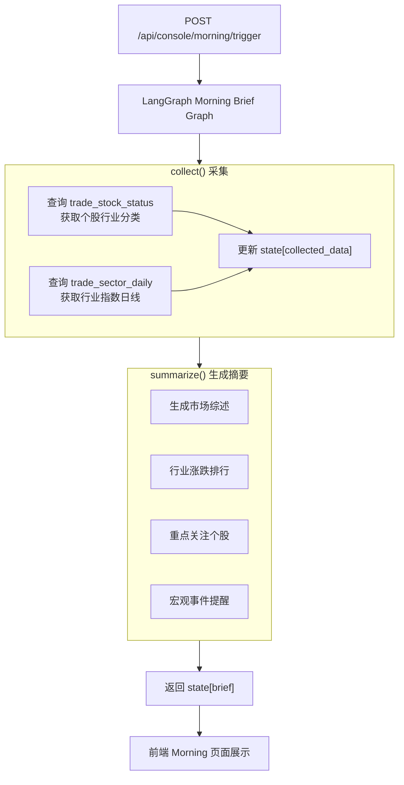
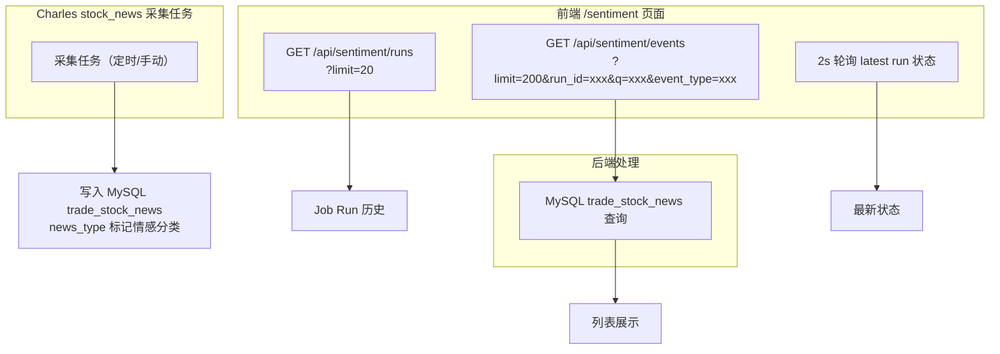

# AI Quant 统一量化系统需求规格说明书


**文档变更记录：**

| 版本 | 类型 | 变更描述 | 修订人 | 修订时间 |
|------|------|---------|--------|----------|
| V1.0 | 新增 | 起草版本，涵盖系统概述、用户角色、功能架构、接口设计、数据库设计、前端交互及部署方案 | AI Quant Team | 2026-05-08 |

---

# 一、概述

## （一）项目背景及目标

随着量化交易市场规模的持续扩大，机构与个人投资者对智能化交易系统的需求日益增长。传统量化交易系统普遍存在模块割裂、数据孤岛、协作效率低下等问题——数据采集、技术分析、信号生成、交易执行、风险管理等环节由多个独立系统承载，依赖人工串联，导致响应延迟与操作风险。

**AI Quant 统一量化系统**旨在构建一个整合多个专业 AI Agent（Charles、Zoe、Ethan、Kris、CEO）协同工作的统一平台，提供数据获取、技术分析、信号生成、交易执行和风险管理的完整量化交易能力。通过 FastAPI 统一 API 网关聚合各 Agent 服务，配合 React 前端可视化界面与 Streamlit 对话机器人，实现从数据到决策的全链路闭环。

**核心目标：**
1. **统一入口**：通过 FastAPI 网关聚合 Charles（数据）、Zoe（分析）、Ethan（执行）、Kris（风控）、CEO（协调）五大 Agent，消除系统孤岛。
2. **智能研报**：基于 RAG + FAISS 向量检索与通义/DeeSeek 大模型，自动生成个股研报，覆盖五步法分析框架。
3. **晨会自动化**：基于 LangGraph 工作流，每日自动聚合市场数据、个股动态、行业信息，生成晨会简报。
4. **交易闭环**：支持 QMT（MiniQMT）直连接入与云端网关代理，覆盖信号生成 → 风控审批 → 订单执行全流程。
5. **可观测性**：研报日志、任务运行记录、Job Runs 等产物统一落盘至 `.ai_quant` 运行时目录，支撑 Docker 部署与运维审计。

## （二）现状分析

当前量化交易支撑体系仍处于多系统分散管理阶段，存在管控颗粒度粗放、标准执行偏差、数据价值流失等系统性痛点，严重制约交易效能与风控水平。具体表现为：

**1. 系统分散，协作成本高**
- 数据服务（Charles）、分析服务（Zoe）、执行服务（Ethan）、风控服务（Kris）各自独立，数据流转依赖人工传递或粗糙的 API 拼装。
- 晨会简报生成需跨多个系统手动拉取数据，平均消耗 30-60 分钟人时。

**2. 研报生成效率低、质量不稳**
- 传统研报依赖分析师手动撰写，单篇耗时 2-4 小时，且受主观因素影响大。
- 缺乏结构化的 RAG 知识检索体系，研报内容与最新市场/财务信息脱节。
- 研报产物无统一存储，版本混乱，难以追溯。

**3. 交易执行与风控脱节**
- 信号生成与订单执行之间缺乏自动化衔接，风控审批依赖人工介入。
- QMT 连接状态不稳定（connect 超时、token 失效），缺乏熔断与重试机制。

**4. 运维可观测性不足**
- 各模块日志分散，无统一落盘规范，服务重启后任务状态丢失（内存存储）。
- 研报生成链路无结构化日志，故障定位困难。

**5. 技术债与扩展性挑战**
- 前端轮询频率未分层（研报 1.5s、舆情 2s），高并发场景下性能隐患。
- Docker 环境未就绪，无法实现一键本地验证与生产部署标准化。

## （三）术语说明

| 术语/缩略词 | 全称 | 说明 |
|-------------|------|------|
| **RAG** | Retrieval-Augmented Generation | 检索增强生成，结合向量检索与 LLM 生成高质量回答的技术框架 |
| **FAISS** | Facebook AI Similarity Search | Facebook 开源的向量相似度搜索库，用于大规模向量索引与 Top-K 查询 |
| **QMT** | 迅投 QMT 极速交易终端 | 宽睿科技推出的量化交易客户端，支持 Python API 接入 |
| **MiniQMT** | MiniQMT 云端网关 | QMT 的云端 API 网关服务，支持远程量化策略调用 |
| **LangGraph** | - | LangChain 生态的工作流编排库，用于定义 Agent 有状态图 |
| **DashScope** | - | 阿里云通义模型服务，提供 qwen-max 等 LLM 与 text-embedding 系列接口 |
| **Tavily** | - | AI 搜索 API，为 DeeSeek 等模型提供实时网络检索能力 |
| **.ai_quant** | - | 项目运行时工作目录，用于存储日志、研报产物、RAG 索引与 Job Runs，与源码分离，支持 Docker volume 挂载 |
| **Job Runs** | - | Charles 数据采任务运行记录，以 JSON 文件形式持久化至 `.ai_quant/job_runs/` |
| **晨会简报** | - | CEO Agent 基于 LangGraph 晨会图，每日自动聚合市场数据生成的摘要报告 |
| **研报五步法** | - | 智能研报生成的标准分析框架，包含宏观/行业/公司/财务/估值五步结构化分析 |
| **Ethan 执行模块** | - | 内嵌式执行引擎（无外部依赖），通过 `ai_quant_api.services.ethan` 创建/存储执行任务 |
| **CORS** | Cross-Origin Resource Sharing | 跨域资源共享，后端通过 `AI_QUANT_CORS_ORIGINS` 环境变量控制允许的前端源 |
| **WAL** | Write-Ahead Logging | SQLite 的预写日志模式，提升并发读写性能 |

---

# 二、用户角色描述

| 用户角色 | 场景描述 |
|----------|---------|
| **量化研究员** | 使用智能研报功能，基于 RAG + FAISS 检索最新研报与财报，自动生成覆盖五步法框架的个股研报；使用舆情监控模块追踪市场情绪变化；管理自选股列表与数据采集任务。 |
| **交易风控员** | 通过执行监控模块查看当前持仓与订单状态；通过风控中心模块审批订单、查询审计日志；监控 QMT 连接状态，处理连接异常。 |
| **投资经理** | 使用晨会简报模块一键生成当日市场概览；通过总览页面查看系统整体健康状态、数据覆盖情况与 Agent 协作状态；通过数据与交付模块导出交易数据。 |
| **系统管理员** | 维护环境变量配置（数据库连接、CORS 源、API Key）；通过 Docker Compose 一键部署整套系统；监控系统日志（`reports_worker.log`、Job Runs）进行运维审计。 |
| **AI 对话用户** | 通过 Streamlit 对话机器人（8501 端口）与 AI Agent 交互，提出量化相关问题，由路由 Agent 分发至对应模块处理。 |

---

# 三、功能概述

## （一）业务流程

整体业务流程覆盖"数据采集 - 分析研判 - 研报生成 - 交易决策 - 风控执行 - 运营复盘"全链路：



**研报生成核心流程：**
1. 用户在前端选择股票、选择模型（qwen-max / deepseek-v3）。
2. 后端接收任务，将 `stock_code` + `model` 写入 `report_store`（内存），触发 worker 线程。
3. Worker 检查 `AI_QUANT_REPORT_USE_LLM`：若启用则走 LLM 模式，否则走静态配置模式。
4. LLM 模式：按优先级探测可用索引目录（`AI_QUANT_REPORT_INDEX_DIR` → `.ai_quant/reports_rag/vector_store` → `CASE-智能研报生成/data/vector_store`），调用 `run_five_step_analysis`。
5. 五步法脚本通过 FAISS 检索相关 chunk，组装 prompt 调用通义/DeeSeek 模型，逐步生成分析内容。
6. 研报 Markdown 落盘至 `.ai_quant/report_outputs/<task_id>.md`，同时写入内存 `report_markdown` 供前端查看。

## （二）功能架构图



**可编辑图源：**
- PlantUML 分层视图：[arch_layers.puml](../diagrams/arch_layers.puml)
- PlantUML 组件视图：[arch_components.puml](../diagrams/arch_components.puml)
- PlantUML 部署视图：[arch_deployment.puml](../diagrams/arch_deployment.puml)
- PlantUML 安全视图：[arch_security.puml](../diagrams/arch_security.puml)
- DrawIO 可编辑源：[arch.drawio](../diagrams/arch.drawio)

## （三）功能流程图

```mermaid
flowchart TB
    START([用户操作]) --> HOME[首页总览<br/>/api/summary]

    START --> DATA_PAGE[数据与交付<br/>/api/data/{dataset}]
    DATA_PAGE --> MYSQL_QUERY["MySQL 查询"]
    MYSQL_QUERY --> CSV_EXPORT["CSV 导出"]

    START --> WATCHLIST[自选股<br/>/api/watchlist + /api/stocks]
    WATCHLIST --> CHARLES_SEARCH["Charles search_stocks"]

    START --> JOBS[采集任务<br/>/api/jobs/runs + /api/jobs/schedules]
    JOBS --> JOB_RUNS[".ai_quant/job_runs/*.json"]

    START --> REPORTS[智能研报<br/>/api/reports/tasks POST]
    REPORTS --> STORE["report_store（内存）"]
    STORE --> WORKER["worker 线程"]
    WORKER --> USE_LLM{use_llm?}
    USE_LLM -->|"False"| STATIC["静态 FIVE_STEP_CONFIG"]
    USE_LLM -->|"True"| DETECT["索引目录探测"]
    DETECT --> FIVE_STEP["run_five_step_analysis"]
    FIVE_STEP --> FAISS检索["FAISS Top-K 检索"]
    FAISS检索 --> LLM["LLM（qwen-max / deepseek-v3）"]
    LLM --> OUTPUT["report_outputs/<task_id>.md"]

    START --> SENTIMENT[舆情监控<br/>/api/sentiment/*]
    SENTIMENT --> NEWS_TABLE["MySQL trade_stock_news"]

    START --> ANALYSIS[策略分析<br/>/api/analysis/signals]
    ANALYSIS --> ZOE_TECH["Zoe tech_signals.py"]

    START --> RISK[风控中心<br/>/api/risk/*]
    RISK --> KRIS["Kris integration.py"]

    START --> EXECUTION[执行监控<br/>/api/execution/*]
    EXECUTION --> ETHAN_ENGINE["Ethan 内嵌引擎"]

    START --> MORNING[晨会简报<br/>/api/console/morning/trigger]
    MORNING --> CEO_LANGGRAPH["LangGraph Morning Brief Graph"]
    CEO_LANGGRAPH --> COLLECT["collect 采集"]
    COLLECT --> SUMMARIZE["summarize 生成摘要"]

    START --> CHAT[AI 对话<br/>/api/agent/run]
    CHAT --> ROUTER["Router Agent"]
    ROUTER --> TEAM["量化团队 Agent"]

    START --> TRADING[交易连接<br/>/api/trading/connect]
    TRADING --> QMT["MiniQMT 云端网关"]
```

**可编辑图源：**
- 信息架构 - 功能地图：[ia_function_map.puml](../diagrams/ia_function_map.puml)
- 信息架构 - 用户旅程：[ia_user_journey.puml](../diagrams/ia_user_journey.puml)
- 信息架构 - 导航结构：[ia_navigation.puml](../diagrams/ia_navigation.puml)
- 前端交互 - 研报页面流程：[ui_reports_flow.puml](../diagrams/ui_reports_flow.puml)

## （四）ER 图

### MySQL 实体关系（huahua_trade 数据库）



**可编辑图源：**
- MySQL ER 图：[db_mysql_er.puml](../diagrams/db_mysql_er.puml)
- RAG SQLite ER 图：[db_rag_sqlite_er.puml](../diagrams/db_rag_sqlite_er.puml)

### RAG SQLite 实体关系（`.ai_quant/reports_rag/documents.db`）





**索引策略：**
- `idx_chunks_doc`：chunks.doc_id → 按文档聚合 chunk
- `idx_chunks_indexed`：chunks.indexed → 筛选未索引 chunk 批量构建
- `idx_chunks_stock_code / stock_name`：快速按股票维度检索

## （五）功能清单

| 功能模块 | 主要功能点 | 功能描述 | 优先级 |
|----------|-----------|---------|--------|
| **总览** | 首页数据总览 | 展示系统整体健康状态、数据源覆盖情况、各 Agent 协作状态；顶部搜索框支持股票代码/名称快速检索跳转 | 高 |
| **数据与交付** | 分页查询 + CSV 导出 | 支持 trade_stock_daily / trade_stock_financial / trade_stock_news / trade_macro_indicator / trade_rate_daily / trade_report_consensus / trade_calendar_event 七大数据集查询与导出 | 高 |
| **自选股** | 自选股管理 | 添加/删除股票至监控列表；支持置顶、排序；持久化至 MySQL trade_watchlist | 高 |
| **采集任务** | 任务运行记录 | 展示各 Job Domain（stock_daily / stock_financial / stock_news / macro_indicator 等）的历史运行记录与最新状态；支持 CRUD Schedule（cron 表达式 / 时区 / 启用开关） | 高 |
| **智能研报** | 股票选择器 | 支持下拉搜索股票代码/名称；支持多选；最近使用记录本地持久化（localStorage）；已选股票可视化标签管理 | 高 |
| **智能研报** | 研报任务创建 | 选择 LLM 模型（qwen-max / deepseek-v3）；批量提交研报任务；后台 worker 线程异步执行 | 高 |
| **智能研报** | 研报状态轮询 | 实时展示任务状态（等待/运行中/完成/失败）；支持按股票名称过滤与日期范围筛选；1.5s 轮询频率 | 高 |
| **智能研报** | 研报查看/导出 | 研报 Markdown 预览（/view 接口返回 Markdown 原文）；支持在新窗口打开；研报产物落盘至 `.ai_quant/report_outputs/<task_id>.md` | 高 |
| **智能研报** | RAG 检索（后台） | PDF 解析（PyPDF2）、文本分块（RecursiveCharacterTextSplitter）、SQLite 元数据持久化；FAISS 向量索引构建与 Top-K 查询 | 高 |
| **舆情监控** | 舆情事件列表 | 展示最新市场舆情事件（利好/利空/政策分类）；按 run_id 与股票代码过滤；2s 轮询频率 | 中 |
| **舆情监控** | 宏观事件 | 展示 trade_calendar_event 中的重要宏观事件（利率决议、非农数据等） | 中 |
| **策略分析** | 技术信号 | 基于 trade_stock_daily 数据计算 RSI/MA 等技术指标；展示个股买卖信号 | 中 |
| **风控中心** | 风控审批 | 订单提交前经 Kris Agent 审批；支持 approve / reject；审计日志留存 | 中 |
| **风控中心** | 风控审计 | 查看历史风控审批记录；支持按时间范围筛选 | 中 |
| **执行监控** | 任务列表 | Ethan 内嵌执行引擎任务管理（创建/查询）；内置于 ai_quant_api.services.ethan（无外部依赖） | 中 |
| **执行监控** | 任务详情 | 查看单个执行任务的状态、关联订单与执行结果 | 中 |
| **晨会简报** | 一键生成 | CEO Agent 基于 LangGraph 晨会图，按 collect → summarize 两步生成当日晨会简报；依赖 trade_stock_status 与 trade_sector_daily 数据 | 中 |
| **AI 对话** | 量化助手 | Streamlit 对话机器人接入路由 Agent；支持晨会、个股分析、数据查询等多意图路由 | 中 |
| **交易连接** | QMT 连接 | /api/trading/connect 触发 MiniQMT 云端网关连接；支持 /api/trading/state 查询连接状态；支持 connect 超时熔断（默认 60s） | 低 |
| **系统设置** | 环境变量 | AI_QUANT_CORS_ORIGINS / AI_QUANT_REPORT_USE_LLM / AI_QUANT_REPORT_INDEX_DIR 等关键配置通过 .env 管理 | 高 |

---

# 四、系统功能详细设计

## （一）数据与交付

### 1、模块概述

数据与交付模块是整个量化系统的数据底座，通过统一的 MySQL 数据库（huahua_trade）汇聚来自 Charles 数据服务的各类市场数据、财务数据与宏观数据，并为前端各功能模块提供统一的数据查询与导出接口。

**产品结构：**
- 数据源覆盖：股票日线行情、财务数据、新闻舆情、宏观指标、利率数据、研报共识、交易日历
- 查询能力：支持多维度过滤（时间范围、股票代码、数据类型）、分页、CSV 导出
- 权限控制：数据权限按 MySQL 连接凭证隔离，不同环境（开发/测试/生产）使用不同数据库

### 2、业务流程



### 3、功能权限

本模块不涉及用户级权限控制（当前版本未实现认证），数据可见性由 MySQL 连接凭证与数据库隔离策略保证。

### 4、整体交互

- **列表页**：分页表格（每页 50 条），支持 start_date / end_date / stock_code 过滤条件
- **导出**：点击"导出"按钮触发 CSV 下载，超过 10000 行时提示分批导出
- **搜索**：输入股票代码/名称实时过滤（前端本地过滤）

### 5、功能说明

#### 5.1 数据集查询

**用户场景/触发事件：**
- 用户访问 `/data` 页面，系统自动加载第一页数据
- 用户修改过滤条件后点击"查询"或按回车触发查询
- 用户点击"导出"按钮下载 CSV

**前置条件：**
1. 后端 MySQL 连接正常
2. Charles 采集任务已运行并写入数据

**需求说明：**

**（1）页面概述：** 数据与交付列表页，展示 huahua_trade 数据库中七大数据集的查询与导出能力。

**（2）搜索条件：**
- **数据集**：下拉枚举，值为 trade_stock_daily（股票日线）/ trade_stock_financial（财务数据）/ trade_stock_news（新闻舆情）/ trade_macro_indicator（宏观指标）/ trade_rate_daily（利率数据）/ trade_report_consensus（研报共识）/ trade_calendar_event（交易日历）
- **股票代码**：文本输入，模糊查询，关联 datasets 含 stock_code 字段的数据集
- **开始日期 / 结束日期**：日期选择器，用于时间范围过滤

**（3）列表页面：**
- **序号**：按查询结果顺序编号
- **分页**：前端分页（每页 50 条），同时后端支持 page / page_size 参数
- **字段展示**：根据数据集不同，展示对应字段（如 trade_stock_daily 展示 stock_code / trade_date / close_price / volume / rsi14 / ma20）
- **操作**：无（只读查询）

**（4）顶部操作按钮：导出**
- 点击导出当前过滤条件下的全部数据（不含分页限制）
- 生成 CSV 文件并触发浏览器下载

---

## （二）智能研报

### 1、模块概述

智能研报模块是本系统的核心差异化功能，基于 RAG（检索增强生成）技术栈（PDF 解析 → SQLite 元数据 → FAISS 向量索引 → LLM 生成），为用户提供结构化的个股研报自动生成能力。

**产品结构：**
- 研报选择器（前端）：股票多选 + 模型选择 + 搜索过滤 + 最近使用记录
- 研报任务管理（前后端）：异步任务队列（内存 Queue + 后台线程）+ 状态轮询
- RAG 链路（后端）：PDF 解析 → 分块 → SQLite 持久化 → FAISS 索引构建 → Top-K 检索
- 研报生成（后端）：五步法分析框架（宏观 → 行业 → 公司 → 财务 → 估值）→ Markdown 输出

### 2、业务流程

```mermaid
flowchart TB
    subgraph FRONTEND["前端 /reports 页面"]
        STEP1["步骤 1：选择模型<br/>qwen-max / deepseek-v3"]
        STEP2["步骤 2：搜索并选择股票<br/>150ms 防抖，1.2s 超时"]
        STEP3["步骤 3：点击"生成研报""]
    end

    subgraph API["POST /api/reports/tasks"]
        CREATE["report_store.create_task()"]
    end

    subgraph WORKER["Worker 线程"]
        ENQUEUE["_enqueue_task()"]
        PROCESS["_process_task()"]
    end

    subgraph PROCESS_TYPE{use_llm?}
        LLM_MODE["use_llm=True"]
        STATIC_MODE["use_llm=False"]
    end

    LLM_MODE --> DETECT["索引目录探测<br/>优先级：env > .ai_quant > CASE"]
    DETECT --> FIVE_STEP["run_five_step_analysis()"]
    FIVE_STEP --> FAISS["FAISS Top-K 检索"]
    FAISS --> CALL_LLM["LLM 生成分析"]
    CALL_LLM --> GENERATE["generate_report()"]
    GENERATE --> OUTPUT["report_outputs/<task_id>.md"]

    STATIC_MODE --> STATIC_CONFIG["FIVE_STEP_CONFIG 静态配置"]

    FRONTEND --> API
    API --> CREATE
    CREATE --> ENQUEUE
    ENQUEUE --> PROCESS
    PROCESS --> PROCESS_TYPE

    STEP3 -->|"触发"| API

    STEP4["步骤 4：前端 1.5s 轮询<br/>/api/reports/tasks"]
    STEP5["步骤 5：点击"查看研报""]
    OUTPUT --> POLL{轮询状态}
    POLL -->|"status=success"| VIEW["查看研报按钮激活"]
    POLL -->|"status=failed"| ERROR["展示 error_message"]
    VIEW --> STEP5

    STEP5 -->|"window.open()"| MARKDOWN["Markdown 新窗口展示"]
```

**可编辑图源：**
- 研报选股组件状态机：[ui_reports_picker_state.puml](../diagrams/ui_reports_picker_state.puml)

### 3、功能权限

无用户级权限控制，任务隔离通过 task_id 唯一标识。

### 4、整体交互

- **研报创建面板**（左侧，col-span-2）：模型选择下拉 → 股票搜索多选下拉 → 已选股票标签列表（可移除）→ 生成按钮
- **研报任务列表**（右侧，col-span-3）：状态轮询表格 → 筛选（股票名称 / 日期范围）→ 查看 / 删除按钮
- **轮询策略**：创建任务后首次立即请求，后续每 1.5s 轮询，任务完成或失败后停止轮询

### 5、功能说明

#### 5.1 研报任务创建

**用户场景/触发事件：**
- 用户在股票选择器中搜索股票（支持多选），点击"生成研报"按钮

**前置条件：**
1. 至少选择一只股票
2. `AI_QUANT_REPORT_USE_LLM=1` 时需配置 `DASHSCOPE_API_KEY`
3. `AI_QUANT_REPORT_USE_LLM=1` 时需存在至少一个可用的 FAISS 索引目录（index.faiss + index.pkl 均存在）

**需求说明：**

**（1）页面概述：** 智能研报创建面板，提供模型选择、股票多选、任务提交功能。

**（2）模型选择：**
- **qwen-max**：通义旗舰模型，支持联网搜索，无需额外 web_search 工具
- **deepseek**：DeepSeek-V3 模型，不具备联网能力，需依赖 Tavily web_search 工具补充实时信息（注：当前版本 deepseek-v3 的 Tavily 集成已在规划中）

**（3）股票选择器：**
- **搜索**：输入股票代码或名称，150ms 防抖后触发请求 `/api/stocks?q=xxx&limit=20`，1.2s AbortController 超时
- **缓存**：搜索结果按 query 字符串缓存在 `Map` 中，避免重复请求
- **多选**：搜索结果项点击"选择"按钮加入已选列表；同一股票不可重复选择
- **最近使用**：从 localStorage（`ai_quant_recent_report_stocks`）读取最近 20 只使用过的股票，点击直接加入
- **键盘支持**：搜索框回车自动选择搜索结果第一项，Escape 关闭下拉框
- **已选标签**：展示已选股票代码列表，每项右侧"×"按钮可移除

**（4）生成按钮：**
- 点击后 POST `/api/reports/tasks`，body: `{ model, stock_codes }`
- 请求中展示 loading 状态，禁止重复提交
- 请求失败展示错误提示（红色边框提示）

#### 5.2 研报任务状态

**用户场景/触发事件：**
- 任务提交后，前端每 1.5s 轮询 `/api/reports/tasks?limit=100` 获取最新状态

**需求说明：**

**（1）任务状态流转：**
- `waiting`（等待）→ `running`（运行中）→ `success`（完成）或 `failed`（失败）
- 状态变更实时反映在前端表格中

**（2）任务列表字段：**
| 字段 | 说明 |
|------|------|
| 任务 ID | 唯一标识符 |
| 模型 | qwen-max / deepseek |
| 股票 | 逗号分隔的股票代码列表 |
| 状态 | 等待 / 运行中 / 完成 / 失败（颜色标识：灰/黄/绿/红） |
| 创建时间 | ISO 格式时间（精确到秒） |
| 操作 | 查看（success 态显示）/ 删除 |

**（3）查看研报：**
- `success` 状态点击"查看"，调用 `window.open('/api/reports/tasks/{id}/view', '_blank')`
- 后端 `/view` 接口直接返回 Markdown 原文（`media_type=text/markdown; charset=utf-8`）
- 研报产物同时落盘至 `.ai_quant/report_outputs/<task_id>.md`，支持磁盘追溯

**（4）删除任务：**
- DELETE `/api/reports/tasks/{task_id}`，前端刷新列表

#### 5.3 RAG 后台管理

**用户场景/触发事件：**
- 管理员需要更新研报知识库（新增 PDF 财报/研报）

**需求说明：**

**（1）PDF 解析与入库：**
- POST `/api/reports/rag/ingest`：扫描 PDF 目录 → 解析文本 → 分块（默认 chunk_size=900 / overlap=150）→ 写入 SQLite documents/chunks 表 → 标记 indexed=0
- 支持 `rebuild=true` 参数强制重建（重新解析所有 PDF）

**（2）FAISS 索引构建：**
- POST `/api/reports/rag/ingest`（同时触发 build）：读取 indexed=0 的 chunk → DashScope text-embedding 生成向量 → 构建 FAISS IndexFlatIP 索引 → 保存 index.faiss + index.pkl + page_info.pkl → 更新 indexed=1
- 可通过 `AI_QUANT_REPORT_INDEX_DIR` 指定索引存储目录

**（3）RAG 检索状态：**
- GET `/api/reports/rag/status`：返回 documents 数量、chunks 数量、FAISS 索引文件大小

**（4）RAG 手动查询：**
- GET `/api/reports/rag/query?q=xxx&stock=xxx&k=6`：执行 FAISS Top-K 检索，返回 chunk 文本与来源信息

---

## （三）晨会简报

### 1、模块概述

晨会简报模块由 CEO Agent 驱动，基于 LangGraph 工作流编排，每日自动聚合市场数据（行业涨跌、个股动态）、技术信号与宏观事件，生成结构化晨会摘要，输出至前端晨会页面展示。

**产品结构：**
- 晨会触发器：`POST /api/console/morning/trigger`（前端"一键生成"按钮）
- 晨会工作流（LangGraph）：START → collect（数据采集）→ summarize（摘要生成）→ END
- 数据依赖：`trade_stock_status`（个股状态/行业归属）、`trade_sector_daily`（行业指数日线）

### 2、业务流程



### 3、功能权限

无用户级权限控制。

### 4、功能说明

**一键生成按钮：**
- 前端 Morning 页面顶部"一键生成"按钮
- 点击触发 POST `/api/console/morning/trigger`
- 展示加载状态（正在生成中...）
- 生成完成后展示晨会内容（市场综述 / 行业涨跌 / 重点个股 / 宏观事件）

---

## （四）舆情监控

### 1、模块概述

舆情监控模块通过 MySQL `trade_stock_news` 表汇聚市场新闻与公告，结合情感分类（利好/利空/政策），为用户提供个股与行业层面的舆情追踪能力。

**产品结构：**
- 舆情事件列表：展示最新新闻，支持按股票代码 / 事件类型（利好/利空/政策）过滤
- 宏观事件：展示 trade_calendar_event 中重要宏观事件
- 手动舆情分析：用户指定股票与时间范围，触发 LLM 情感分析

### 2、业务流程



---

## （五）执行监控

### 1、模块概述

执行监控模块对接 Ethan 内嵌执行引擎（无外部 Ethan 子项目依赖），通过 `ai_quant_api.services.ethan` 内置创建/存储执行任务，提供统一的交易执行任务管理能力。

**产品结构：**
- 任务列表：展示所有执行任务（created / running / completed / failed）
- 任务详情：单个任务的详细状态、关联订单、执行结果
- Ethan 执行引擎：基于 `ai_quant_api.services.ethan.models` 与 `ai_quant_api.services.ethan.store` 内存存储

### 2、API 接口

| 方法 | 路径 | 功能 |
|------|------|------|
| GET | `/api/execution/status` | 获取执行服务状态 |
| POST | `/api/execution/tasks` | 创建执行任务 |
| GET | `/api/execution/tasks` | 列出所有执行任务 |
| GET | `/api/execution/tasks/{task_id}` | 获取指定任务详情 |

---

## （六）风控中心

### 1、模块概述

风控中心模块由 Kris Agent 驱动，提供订单提交前的风控审批能力与完整的审计日志记录，确保交易动作合规、可追溯。

**产品结构：**
- 风控审批：订单提交经 Kris 审核，支持 approve / reject
- 风控审计：查看历史审批记录，支持按时间范围筛选

### 2、API 接口

| 方法 | 路径 | 功能 |
|------|------|------|
| GET | `/api/risk/status` | 获取风控服务状态 |
| POST | `/api/risk/approve` | 执行风控审批（approve / reject） |
| GET | `/api/risk/audit?last_n=200` | 获取风控审计日志（最近 N 条） |

---

## （七）采集任务

### 1、模块概述

采集任务模块管理 Charles 数据服务的定时/手动采集任务，提供任务运行记录（Job Runs）查询与调度配置（Schedules CRUD）能力。

**产品结构：**
- 任务运行记录：展示各 Job Domain 的历史运行记录（runId / startedAt / status / rowsWritten 等）
- 调度配置：支持修改 cron 表达式、时区、启用/禁用状态

**Job Runs 存储位置：**
- 默认路径：`.ai_quant/job_runs/*.json`
- 可配置覆盖：`AI_QUANT_CHARLES_JOB_STORE_DIR`
- 注意：当前代码中默认路径为 `repo_root/ai_quant/.ai_quant/job_runs`（多拼一层 `ai_quant/`），可通过环境变量归一

**可编辑图源：**
- 权限矩阵：[ia_permission_matrix.puml](../diagrams/ia_permission_matrix.puml)

---

## （八）AI 对话

### 1、模块概述

Streamlit 对话机器人（8501 端口）为非技术用户提供自然语言量化交互入口，通过路由 Agent 将用户意图分发至对应模块处理。

**产品结构：**
- 对话界面：Streamlit 提供的开箱即用 Web 界面
- 路由 Agent：解析用户输入关键词（"晨会" → morning_brief_graph；其他 → 默认量化助手）
- 后端集成：通过 `POST /api/agent/run` 调用统一 Agent 服务

---

## （九）交易连接

### 1、模块概述

交易连接模块对接 MiniQMT 云端网关，支持远程量化策略调用与 QMT 终端状态管理。

**产品结构：**
- 连接管理：`POST /api/trading/connect`（建立连接）、`GET /api/trading/state`（查询状态）
- 超时熔断：connect 请求默认 60s 超时（可通过 `AI_QUANT_QMT_GATEWAY_TIMEOUT` 调整）
- 错误处理：502 TimeoutError 时展示连接失败提示

**可编辑图源：**
- 组件视图：[arch_components.puml](../diagrams/arch_components.puml)
- 部署视图：[arch_deployment.puml](../diagrams/arch_deployment.puml)

---

# 五、非功能性需求

## （一）性能需求

| 指标 | 目标值 | 说明 |
|------|--------|------|
| 前端首屏加载（FCP） | < 2s | Vite 懒加载 + 代码分割 |
| API 响应时间（p99） | < 500ms | FastAPI 异步 + MySQL 连接池 |
| 研报轮询频率 | 1.5s（研报）/ 2s（舆情） | 避免过高频率压垮后端 |
| FAISS Top-K 查询 | < 200ms | IndexFlatIP 暴力检索，1000 维向量 |
| QMT connect 超时 | 60s | 通过环境变量可调 |

## （二）可访问性（a11y）

- 所有交互元素支持键盘操作（Tab / Enter / Escape）
- 表单元素均有 `label` 标签与 `aria-label` 描述
- 颜色对比度符合 WCAG AA 标准（4.5:1）
- 下拉选择器支持键盘导航与屏幕阅读器

## （三）安全需求

- 数据库凭证通过环境变量注入，不硬编码
- 生产环境需严格限制 `AI_QUANT_CORS_ORIGINS`
- 当前版本未实现 JWT 鉴权，建议生产环境添加
- 敏感操作（交易执行、风控审批）需记录完整审计日志

## （四）可观测性

- 研报 worker 日志：`.ai_quant/reports_worker.log`
- Job Runs 记录：`.ai_quant/job_runs/*.json`
- 研报产物落盘：`.ai_quant/report_outputs/<task_id>.md`
- RAG 索引：`.ai_quant/reports_rag/vector_store/`

## （五）部署需求

- **Docker Compose**：一行命令 `docker compose up -d` 启动全部服务（MySQL / Backend / Web / Streamlit）
- **环境隔离**：`.ai_quant` 作为运行时目录通过 volume 挂载，与源码分离
- **端口约定**：Frontend :5173 / Backend :8000 / Streamlit :8501

---

# 六、附录

## A. 技术栈明细

| 层级 | 技术选型 | 版本策略 | 说明 |
|------|---------|---------|------|
| 前端框架 | React | ^18.3.1 | 固定次版本号 |
| 前端构建 | Vite | ^6.3.5 | 固定次版本号 |
| 前端路由 | react-router-dom | ^7.3.0 | 固定次版本号 |
| 状态管理 | Zustand | ^5.0.3 | 固定次版本号 |
| UI 框架 | TailwindCSS | ^3.4.17 | 固定次版本号 |
| 图表库 | ECharts / echarts-for-react | ^5.6.0 / ^3.0.3 | 固定主版本 |
| 图标库 | lucide-react | ^0.511.0 | 固定次版本号 |
| 测试 | Vitest + Playwright | ^2.1.9 / ^1.53.0 | 固定次版本号 |
| 后端框架 | FastAPI | `==0.115.12` | 固定完整版本 |
| ASGI 服务器 | Uvicorn | `==0.34.2` | 固定完整版本 |
| 请求模型 | Pydantic | `==2.11.4` | 固定完整版本 |
| 环境变量 | python-dotenv | `==1.1.0` | 固定完整版本 |
| Agent 框架 | LangGraph | `==0.4.5` | 固定完整版本 |
| 数据库驱动 | PyMySQL | `==1.1.0` | 固定完整版本 |
| 向量索引 | FAISS-CPU | 未固定 | 跟随 torch/numpy 版本 |
| LLM/Embedding | DashScope | 未固定 | 跟随阿里云 SDK |
| PDF 解析 | PyPDF2 | 未固定 | 轻量解析库 |
| 文档分块 | langchain-text-splitters | 未固定 | 语义分块 |
| 对话界面 | Streamlit | `==1.44.1` | 固定完整版本 |

## B. 接口文档（REST + GraphQL 双协议）

### B.1 REST 重点接口

| 方法 | 路径 | 说明 |
|------|------|------|
| GET | `/api/health` | 健康检查 |
| GET | `/api/summary` | 系统数据总览 |
| GET | `/api/data/{dataset}` | 数据集分页查询 |
| GET | `/api/data/{dataset}/export` | CSV 导出 |
| GET | `/api/stocks?q=xxx&limit=20` | 股票搜索（/api 前缀） |
| GET | `/api/watchlist` | 自选股列表 |
| GET | `/api/jobs/runs?limit=10&domain=xxx` | Job 运行记录 |
| GET | `/api/jobs/schedules` | 调度配置列表 |
| PUT | `/api/jobs/schedules/{domain}` | 更新调度配置 |
| GET | `/api/reports/tasks?limit=100&q=xxx&created_start=xxx&created_end=xxx` | 研报任务列表 |
| POST | `/api/reports/tasks` | 创建研报任务 |
| DELETE | `/api/reports/tasks/{task_id}` | 删除研报任务 |
| GET | `/api/reports/tasks/{task_id}/view` | 查看研报 Markdown |
| GET | `/api/reports/rag/status` | RAG 状态 |
| POST | `/api/reports/rag/ingest?rebuild=false` | PDF 入库与索引构建 |
| GET | `/api/reports/rag/query?q=xxx&stock=xxx&k=6` | RAG Top-K 检索 |
| POST | `/api/console/morning/trigger` | 触发晨会简报生成 |
| GET | `/api/execution/status` | 执行服务状态 |
| POST | `/api/execution/tasks` | 创建执行任务 |
| GET | `/api/execution/tasks` | 执行任务列表 |
| GET | `/api/execution/tasks/{task_id}` | 执行任务详情 |
| GET | `/api/risk/status` | 风控服务状态 |
| POST | `/api/risk/approve` | 风控审批 |
| GET | `/api/risk/audit?last_n=200` | 风控审计日志 |
| POST | `/api/trading/connect` | QMT 连接 |
| GET | `/api/trading/state` | QMT 连接状态 |
| POST | `/api/agent/run` | Agent 统一入口 |
| GET | `/api/agent/status` | Agent 状态 |

### B.2 GraphQL Schema（规划交付物）

详见：[schema.graphql](../api/graphql/schema.graphql)

## C. 数据库设计

详见第四章节 ER 图部分。MySQL 数据库 `huahua_trade` 包含 10 张核心业务表，RAG SQLite 数据库 `.ai_quant/reports_rag/documents.db` 包含 2 张表（documents / chunks）。

**容量估算（参考）：**
- trade_stock_daily：约 5000 只股票 × 250 交易日/年 ≈ 1,250,000 行 / 年
- trade_stock_news：约 50,000 条 / 年
- RAG chunks：单只股票平均 200 页 PDF × 3 chunks/页 ≈ 600 chunks；100 只股票覆盖 ≈ 60,000 chunks

**备份与容灾：**
- MySQL：建议每日全量备份 + WAL 归档，RTO < 4h
- SQLite：建议定期 `VACUUM`，配合 FAISS 索引同步备份

## D. 可编辑图源索引

| 图名称 | PlantUML 源文件 | DrawIO 源文件 | 说明 |
|--------|----------------|--------------|------|
| 分层视图 | [arch_layers.puml](../diagrams/arch_layers.puml) | [arch.drawio](../diagrams/arch.drawio)（page 1） | 四层架构 |
| 组件视图 | [arch_components.puml](../diagrams/arch_components.puml) | [arch.drawio](../diagrams/arch.drawio)（page 2） | Agent 与服务组件 |
| 部署视图 | [arch_deployment.puml](../diagrams/arch_deployment.puml) | [arch.drawio](../diagrams/arch.drawio)（page 3） | 容器化部署 |
| 安全视图 | [arch_security.puml](../diagrams/arch_security.puml) | [arch.drawio](../diagrams/arch.drawio)（page 4） | 安全边界与鉴权 |
| MySQL ER | [db_mysql_er.puml](../diagrams/db_mysql_er.puml) | - | 10 张核心业务表 |
| RAG ER | [db_rag_sqlite_er.puml](../diagrams/db_rag_sqlite_er.puml) | - | SQLite 元数据 + FAISS |
| 功能地图 | [ia_function_map.puml](../diagrams/ia_function_map.puml) | - | 前后端能力映射 |
| 用户旅程 | [ia_user_journey.puml](../diagrams/ia_user_journey.puml) | - | 量化研究员典型路径 |
| 导航结构 | [ia_navigation.puml](../diagrams/ia_navigation.puml) | - | 侧边栏导航层级 |
| 权限矩阵 | [ia_permission_matrix.puml](../diagrams/ia_permission_matrix.puml) | - | 角色与功能权限 |
| 研报页面流程 | [ui_reports_flow.puml](../diagrams/ui_reports_flow.puml) | - | 研报全链路交互 |
| 研报选股状态机 | [ui_reports_picker_state.puml](../diagrams/ui_reports_picker_state.puml) | - | 选股组件状态流转 |

## E. Docker Compose 部署说明

详见：[docker-compose.yml](../../docker-compose.yml)

**一键启动：**
```bash
cd /Users/apple/Desktop/ai_huahua
docker compose up -d
```

**服务端口：**
- Frontend：http://localhost:5173
- Backend：http://localhost:8000
- Streamlit：http://localhost:8501
- MySQL：localhost:3306（数据库：huahua_trade）

**环境变量（需在部署前配置 .env）：**
- `DASHSCOPE_API_KEY`：通义模型 API Key
- `MYSQL_HOST / MYSQL_PORT / MYSQL_USER / MYSQL_PASSWORD / MYSQL_DB`：数据库连接
- `AI_QUANT_CORS_ORIGINS`：前端源（默认 http://localhost:5173）
- `AI_QUANT_REPORT_USE_LLM`：是否启用 LLM 研报（1=启用）
- `AI_QUANT_QMT_GATEWAY_TIMEOUT`：QMT 连接超时（默认 60s）

---

*文档版本：V1.0 | 修订时间：2026-05-08 | 修订人：AI Quant Team*
