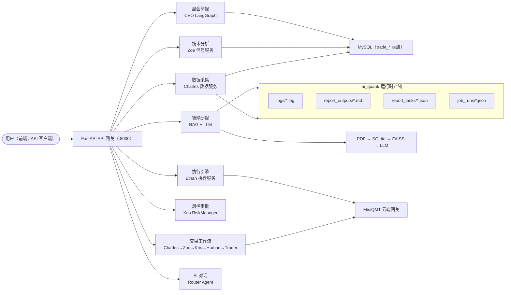
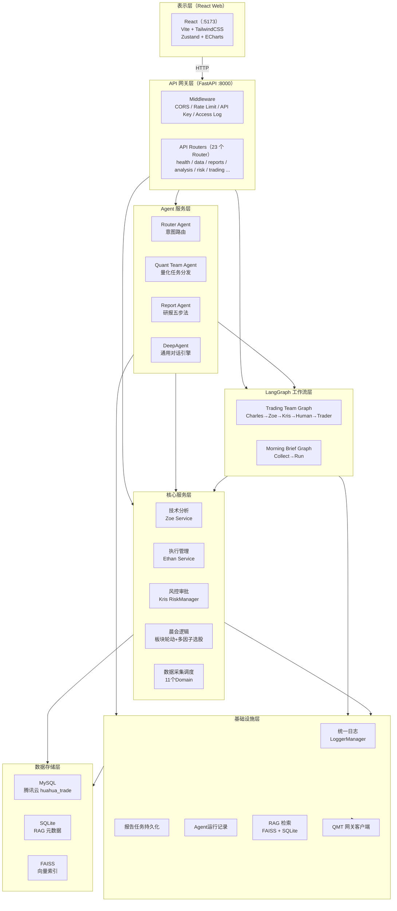
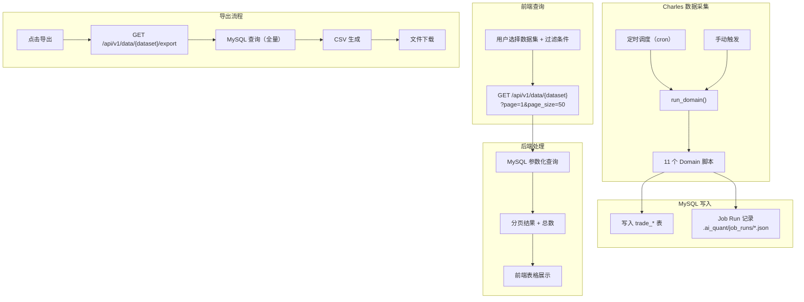

# AI Quant 统一量化系统**需求规格说明书**

**文档变更记录：**

| 版本 | 类型 | 变更描述 | 修订人 | 修订时间 |
|------|------|---------|--------|----------|
| V1.0 | 新增 | 起草版本，涵盖系统概述、用户角色、功能架构、系统功能详细设计、非功能性需求、风险分析 | AI Quant Team | 2026-05-16 |

---

# 一、概述

## （一）项目背景及目标

随着量化交易市场规模的持续扩大，机构与个人投资者对智能化、自动化交易系统的需求日益增长。传统量化交易系统普遍存在模块割裂、数据孤岛、协作效率低下等问题——数据采集、技术分析、信号生成、交易执行、风险管理等环节由多个独立系统承载，依赖人工串联，导致响应延迟与操作风险。

**AI Quant 统一量化系统**旨在构建一个整合多个专业 AI Agent（Charles、Zoe、Ethan、Kris、CEO）协同工作的统一平台，提供数据采集、技术分析、信号生成、交易执行、风险管理和智能研报生成的完整量化交易能力。系统采用前后端分离架构，后端基于 FastAPI，前端基于 React + TypeScript + Vite，同时集成 LangGraph AI Agent 工作流引擎与 RAG 智能研报链路，实现从数据到决策的全链路闭环。

**核心目标：**

1. **统一 API 网关**：通过 FastAPI 聚合 Charles（数据）、Zoe（分析）、Ethan（执行）、Kris（风控）、CEO（协调）五大 Agent 的服务，消除系统孤岛，提供统一的 REST API 入口。
2. **智能研报生成**：基于 RAG（FAISS 向量检索 + SQLite 元数据）+ 通义千问/DeepSeek 大模型，自动生成覆盖"五步法"分析框架的结构化个股研报。
3. **晨会自动化**：基于 LangGraph 工作流，每日自动聚合市场数据、行业板块轮动分析、个股动态，生成结构化晨会简报。
4. **交易决策闭环**：通过 LangGraph StateGraph 编排 Charles（投研）→ Zoe（信号）→ Kris（风控）→ Human（审批）→ Trader（下单）五阶段交易流水线，覆盖从信号生成到订单执行的全流程。
5. **可观测性**：统一日志服务（RotatingFileHandler 轮转）、研报产物落盘、Job Runs 持久化 JSON、审计日志，支撑运维审计与回溯。

## （二）现状分析

当前量化交易支撑体系仍处于多系统分散管理阶段，存在管控颗粒度粗放、标准执行偏差、数据价值流失等系统性痛点，严重制约交易效能与风控水平。具体表现为：

**1. 系统分散，协作成本高**

- 数据服务、分析服务、执行服务、风控服务各自独立，数据流转依赖人工传递或粗糙的 API 拼装。
- 晨会简报生成需跨多个系统手动拉取数据，平均消耗 30-60 分钟人时。
- 多 AI Agent 之间缺乏统一协作框架，模块间调用关系混乱。

**2. 研报生成效率低、质量不稳定**

- 传统研报依赖分析师手动撰写，单篇耗时 2-4 小时，且受主观因素影响大。
- 缺乏结构化的知识检索体系，研报内容与最新市场/财务信息脱节。
- 研报产物无统一存储标准，版本混乱，难以追溯。

**3. 交易执行与风控脱节**

- 信号生成与订单执行之间缺乏自动化衔接，风控审批依赖人工介入。
- 缺乏标准化的交易工作流编排，Charles（投研）、Zoe（信号）、Kris（风控）、Trader（执行）四个角色之间缺少状态同步机制。
- QMT 连接状态不稳定，缺乏熔断与重试机制。

**4. 运维可观测性不足**

- 各模块日志分散，无统一落盘规范，服务重启后任务状态丢失（内存存储）。
- 研报生成链路无结构化日志，故障定位困难。
- 缺乏统一的配置管理，敏感信息（API Key、数据库凭证）散落在不同文件中。

## （三）术语说明

| 术语/缩略词 | 全称 | 说明 |
|-------------|------|------|
| **Agent** | AI 智能体 | 系统中承担特定角色的 AI 模块，包括 Charles（数据）、Zoe（分析）、Ethan（执行）、Kris（风控）、CEO（协调） |
| **RAG** | Retrieval-Augmented Generation | 检索增强生成，结合 FAISS 向量检索与 LLM 生成高质量回答的技术框架 |
| **FAISS** | Facebook AI Similarity Search | Facebook 开源的向量相似度搜索库，用于大规模向量索引与 Top-K 查询 |
| **LangGraph** | - | LangChain 生态的工作流编排库，用于定义 AI Agent 有状态图（StateGraph） |
| **QMT / MiniQMT** | 迅投 QMT 极速交易终端 | 量化交易客户端及云端 API 网关服务，支持 Python API 接入 |
| **DashScope** | - | 阿里云通义模型服务，提供 qwen-plus 等 LLM 与 text-embedding 系列接口 |
| **DeepSeek** | - | DeepSeek 大模型，作为研报生成与对话的备选 LLM |
| **晨会简报** | Morning Brief | CEO Agent 基于 LangGraph 工作流，每日自动聚合市场数据、板块轮动分析、选股结果生成的摘要报告 |
| **五步法** | 国泰君安五步分析法 | 研报核心方法论：信息差 → 逻辑差 → 预期差 → 催化剂 → 结论+风险闭环 |
| **Z-Score 综合打分** | - | 板块轮动排序算法，对多个强度指标进行标准化打分后加权汇总 |
| **Charles / Zoe / Ethan / Kris / CEO** | AI Agent 角色名 | 分别对应：投研情报官(Charles)、信号官(Zoe)、执行官(Ethan)、风控官(Kris)、协调官(CEO) |
| **TradeSignal** | 交易信号 | Zoe 节点输出的交易决策，包含方向(direction)、数量(quantity)、价格(price)、理由(reason) |
| **RiskVerdict** | 风控决议 | Kris 节点输出的风控审核结果，包含决策(decision)、理由(reason)、建议仓位(suggested_max_pct) |
| **InvestmentView** | 投研观点 | Charles 节点输出的研究报告摘要，包含立场(stance)、信心度(confidence)、催化剂(catalysts)、风险(risks) |
| **Job Runs** | 任务运行记录 | 数据采集任务运行记录，以 JSON 文件形式持久化至 `.ai_quant/job_runs/` |
| **.ai_quant** | 运行时工作目录 | 用于存储日志、研报产物、RAG 索引与 Job Runs，与源码分离 |
| **ATR** | Average True Range | 平均真实波动范围，用于波动率风险评估 |
| **MACD** | Moving Average Convergence Divergence | 指数平滑移动平均线，用于趋势判断的经典技术指标 |

---

# 二、用户角色描述

| 用户角色 | 场景描述 |
|----------|---------|
| **量化研究员** | 使用智能研报模块基于 RAG + LLM 自动生成覆盖五步法框架的个股研报；通过舆情监控模块追踪市场情绪变化；管理自选股列表；通过数据与交付模块查询导出历史行情与财务数据 |
| **交易风控员** | 通过执行监控模块查看当前持仓与订单状态；通过风控中心审批交易订单、查询审计日志；监控 QMT 网关连接状态，处理连接异常；在交易工作流中作为 Human-in-the-Loop 节点审批或否决交易信号 |
| **投资经理** | 使用晨会简报模块一键生成当日市场概览（行业板块轮动分析 + 选股推荐）；通过总览页面查看系统整体健康状态、数据覆盖情况与各 Agent 协作状态；通过策略分析模块查看技术信号与策略回测结果 |
| **系统管理员** | 维护环境变量配置（数据库连接、CORS 源、API Key、LLM 凭证）；监控数据采集任务运行状态（Job Runs 调度与执行）；管理系统日志（各模块日志轮转文件）进行运维审计；维护 RAG 知识库（PDF 入库与 FAISS 索引重建） |
| **AI 对话用户** | 通过 Web 前端 AI 助手抽屉或对话页面与系统交互，以自然语言提出量化相关问题，由 Router Agent 自动路由至对应模块处理（晨会 → morning_brief_graph；其他 → 量化团队 Agent） |

---

# 三、功能概述

## （一）业务流程

整体业务流程覆盖"数据采集 → 分析研判 → 研报生成 → 交易决策 → 风控执行 → 运营复盘"全链路：



### 交易团队工作流（核心决策链路）

用户指定交易标的和资金后，系统按以下五阶段流水线执行：

```
用户指定标的和资金
    |
    v
Charles Node (投研情报官)
    |-- web_search: 联网搜索基本面、行业动态
    |-- stock_price: 获取实时K线数据
    |-- financial_analysis: 财务比率分析
    |-- 输出: InvestmentView(stance, confidence, summary, catalysts, risks)
    |
    v
Zoe Node (信号官)
    |-- strategy-backtest: 运行 MACD 策略回测
    |-- 结合 Charles 观点判断方向与仓位
    |-- 输出: TradeSignal(direction, quantity, price, reason)
    |
    v
Kris Node (风控官)
    |-- 黑名单检查 / 资金限制 / ATR 波动率检查
    |-- 输出: RiskVerdict(decision, reason, suggested_max_pct)
    |-- 否决时：最多重试 2 次（回退至 Zoe 调整信号）
    |
    v
Human Node (人在回路)
    |-- 展示交易信号与风控结论
    |-- 自动模式默认批准
    |-- 输出: approved(boolean)
    |
    v
Trader Node (交易执行)
    |-- dry-run 模式(默认) / 真实下单
    |-- 输出: TradeResult(order_id, submitted_at)
    |
    v
END
```

**状态字段契约（TradingState TypedDict）：**

| 字段 | 类型 | 所有权 | 说明 |
|------|------|--------|------|
| `investment_view` | `InvestmentView` | Charles | 投研观点（立场/信心/摘要/催化剂/风险） |
| `trade_signal` | `TradeSignal` | Zoe | 交易信号（方向/数量/价格/策略） |
| `risk_verdict` | `RiskVerdict` | Kris | 风控决议（决策/理由/建议仓位） |
| `approved` | `Optional[bool]` | Human | 人工审批结果 |
| `trade_result` | `TradeResult` | Trader | 下单回执 |
| `retry_count` | `int` | 公共 | 重试计数（默认上限 2 次） |
| `messages` | `Annotated[list, add]` | 公共 | 审计消息列表 |

### 晨会简报工作流

用户触发晨会请求后，系统按以下流程生成简报：

```
用户触发晨会请求
    |
    v
Router Agent (路由)
    |-- 识别"晨会"关键词 → morning_brief_graph
    |
    v
Collect Node (参数初始化)
    |-- 设置行业层级、回溯天数、采样数等默认参数
    |
    v
Run Node (执行晨会分析)
    |-- 1. list_sectors: 从 MySQL 获取板块列表
    |-- 2. load_sector_kline: 获取板块K线数据
    |-- 3. _calc_derivatives: 计算 ROC/MA/MACD 等衍生指标
    |-- 4. detect_phase: 判断板块所处阶段（主升/钝化/主跌/抄底）
    |-- 5. rank_industries_with_phase: Z-Score 综合打分排序
    |-- 6. pick_stocks_from_industries: 多因子选股
    |-- 7. build_report: 生成 Markdown + HTML 报告
    |
    v
END (返回报告)
```

### 智能研报生成流程

```
用户在前端选择股票 + 模型
    |
    v
POST /api/reports/tasks
    |-- report_store.create_task()（task_id + waiting 状态）
    |-- worker 线程异步处理
    |
    v
Worker 检查 AI_QUANT_REPORT_USE_LLM
    |
    ├─ True → 索引目录探测（env > .ai_quant > CASE）
    |          → run_five_step_analysis()
    |          → FAISS Top-K 检索
    |          → LLM 生成（qwen-plus / deepseek-chat）
    |          → generate_report() → Markdown 落盘
    |
    └─ False → 静态 FIVE_STEP_CONFIG 配置
    |
    v
状态轮询（前端 1.5s）→ success → 查看研报（Markdown 新窗口）
```

## （二）功能架构图

系统采用四层架构：前端展示层 → API 网关层 → Agent 服务层 → 数据存储层：



## （三）功能流程图

```mermaid
flowchart TB
    START(["用户操作"]) --> HOME[首页总览<br/>GET /api/v1/summary]
    START --> DATA_PAGE[数据查询<br/>GET /api/v1/data/{dataset}]
    DATA_PAGE --> EXPORT[CSV / JSON 导出]
    START --> WATCHLIST[自选股管理<br/>GET/POST/DELETE /api/v1/watchlist]
    START --> JOBS[采集任务<br/>GET /api/v1/jobs/runs<br/>GET/PUT /api/v1/jobs/schedules]
    START --> REPORTS[智能研报<br/>POST /api/v1/reports/tasks]
    REPORTS --> REPORT_WORKER["Worker 线程<br/>RAG + LLM"]
    REPORT_WORKER --> REPORT_STATUS{"状态轮询<br/>1.5s"}
    REPORT_STATUS -->|"success"| VIEW_REPORT["查看研报<br/>Markdown 预览"]
    REPORT_STATUS -->|"failed"| ERROR_REPORT["展示错误信息<br/>支持重试"]
    START --> ANALYSIS_PAGE[技术分析<br/>GET /api/v1/analysis/signals]
    ANALYSIS_PAGE --> TECH_SIGNALS["RSI / MACD / KDJ / 布林带"]
    START --> SENTIMENT[舆情监控<br/>GET /api/v1/sentiment/*]
    START --> RISK_PAGE[风控中心<br/>POST /api/v1/risk/approve]
    RISK_PAGE --> AUDIT_LOG["审计日志<br/>GET /api/v1/risk/audit"]
    START --> EXECUTION_PAGE[执行监控<br/>POST /api/v1/execution/tasks]
    EXECUTION_PAGE --> EXEC_TASK["任务状态<br/>draft→running→finished/failed"]
    START --> MORNING[晨会简报<br/>POST /api/v1/console/morning/trigger]
    MORNING --> LANGGRAPH["LangGraph 工作流"]
    START --> CHAT[AI 对话<br/>POST /api/v1/agent/run]
    CHAT --> ROUTER["Router Agent"]
    START --> TRADING[交易团队工作流<br/>POST /api/v1/agent/run]
    TRADING --> TRADING_GRAPH["LangGraph StateGraph"]
    TRADING_GRAPH --> CHARLES_NODE["Charles 投研"]
    CHARLES_NODE --> ZOE_NODE["Zoe 信号"]
    ZOE_NODE --> KRIS_NODE["Kris 风控"]
    KRIS_NODE -->|"否决 & retry<2"| ZOE_NODE
    KRIS_NODE -->|"通过"| HUMAN_NODE["Human 审批"]
    HUMAN_NODE -->|"批准"| TRADER_NODE["Trader 下单"]
    HUMAN_NODE -->|"否决"| END_TRADE["终止"]
    START --> TRADING_QMT[QMT 交易连接<br/>POST /api/v1/trading/connect]
    TRADING_QMT --> QMT_GATEWAY["MiniQMT 云端网关"]
```

## （四）ER 图

### MySQL 实体关系（huahua_trade 数据库）

```mermaid
erDiagram
    trade_stock_master ||--o{ trade_stock_daily : "1:N"
    trade_stock_master ||--o{ trade_stock_financial : "1:N"
    trade_stock_master ||--o{ trade_stock_news : "1:N"
    trade_stock_master ||--o{ trade_report_consensus : "1:N"
    trade_sector_daily ||--o{ trade_stock_daily : "1:N"
    trade_stock_master {
        string stock_code PK
        string stock_name
        string source
        timestamp updated_at
    }
    trade_stock_daily {
        string stock_code PK, FK
        date trade_date PK
        decimal close_price
        bigint volume
        float rsi14
        float ma20
        string stock_name
    }
    trade_stock_financial {
        string stock_code PK, FK
        date report_date PK
        string data_source
        json payload_json
    }
    trade_stock_news {
        string stock_code PK, FK
        datetime published_at PK
        string news_type
        string title
        text content
    }
    trade_sector_daily {
        string sector_name PK
        string sector_level PK
        date trade_date PK
        decimal close_idx
        decimal total_amount
    }
    trade_stock_status {
        string stock_code PK
        string sector_1
        string sector_2
        timestamp updated_at
    }
    trade_macro_indicator {
        date indicator_date PK
        string indicator_name PK
        decimal indicator_value
        string source
    }
    trade_rate_daily {
        date rate_date PK
        string rate_name PK
        decimal rate_value
    }
    trade_report_consensus {
        string stock_code PK, FK
        string broker PK
        date report_date PK
        string rating
        decimal target_price
    }
    trade_calendar_event {
        date event_date PK
        string country PK
        string importance PK
        string source PK
        string title
        json payload_json
    }
    trade_watchlist {
        string stock_code PK, FK
    }
    trade_sim_account {
        string account_id PK
        decimal cash_balance
        decimal frozen_cash
        timestamp updated_at
    }
    trade_performance_summary {
        string strategy_id PK
        date calc_date PK
        decimal total_return
        float sharpe_ratio
    }
```



### RAG SQLite 实体关系（.ai_quant/reports_rag/documents.db）

```mermaid
erDiagram
    documents ||--o{ chunks : "1:N"
    documents {
        integer doc_id PK
        string filename
        string path
        string sha256
        integer size_bytes
        bigint mtime_ns
        string title
        string stock_name
        string stock_code
        string source
        string report_type
        string publish_date
        datetime created_at
        datetime updated_at
    }
    chunks {
        integer doc_id FK
        integer chunk_id PK
        integer page PK
        integer chunk_index PK
        text content
        string content_sha256
        string stock_name
        string stock_code
        boolean indexed
        datetime created_at
    }
```



## （五）功能清单

| 功能模块 | 主要功能点 | 功能描述 | 优先级 |
|----------|-----------|---------|--------|
| **总览** | 首页数据总览 | 展示系统整体健康状态、数据源覆盖情况、各 Agent 协作状态；顶部搜索框支持股票代码/名称快速检索跳转 | 高 |
| **数据与交付** | 分页查询 + 导出 | 支持 7 大数据集分页查询与 CSV/JSON 导出 | 高 |
| **自选股** | 自选股管理 | 添加/删除股票至监控列表；持久化至 MySQL trade_watchlist | 高 |
| **采集任务** | 任务运行记录 | 展示 11 个 Job Domain 的历史运行记录与最新状态 | 高 |
| **采集任务** | 调度配置 | 支持 CRUD Schedule（cron 表达式 / 时区 / 启用开关） | 高 |
| **智能研报** | 股票选择器 | 下拉搜索股票代码/名称，支持多选、最近使用记录、已选标签管理 | 高 |
| **智能研报** | 研报任务创建 | 选择 LLM 模型，批量提交研报任务，后台 worker 线程异步执行 | 高 |
| **智能研报** | 研报状态轮询 | 实时展示任务状态，1.5s 轮询频率 | 高 |
| **智能研报** | 研报查看 | Markdown 预览，产物落盘至 .ai_quant/report_outputs/ | 高 |
| **智能研报** | RAG 后台管理 | PDF 解析入库、FAISS 向量索引构建与 Top-K 语义检索 | 高 |
| **舆情监控** | 舆情事件列表 | 展示最新市场舆情事件，2s 轮询 | 中 |
| **舆情监控** | 宏观事件 | 展示重要宏观事件 | 中 |
| **策略分析** | 技术信号 | RSI/MA/MACD/KDJ/布林带等技术指标计算与展示 | 中 |
| **风控中心** | 风控审批 | 7 层风控检查链，支持 APPROVE/WARN/REJECT | 高 |
| **风控中心** | 风控审计 | 历史风控审批记录查询 | 中 |
| **执行监控** | 任务列表 | 执行任务管理，支持 twap/vwap/rl 策略 | 中 |
| **执行监控** | 任务详情 | 单任务状态与执行结果查看 | 中 |
| **晨会简报** | 一键生成 | LangGraph 工作流，板块轮动分析 + 多因子选股 | 中 |
| **AI 对话** | 量化助手 | 自然语言交互，Router Agent 自动路由 | 中 |
| **交易团队工作流** | 全流程交易 | Charles→Zoe→Kris→Human→Trader 五阶段流水线 | 低 |
| **交易连接** | QMT 连接 | MiniQMT 网关连接管理，超时熔断 | 低 |
| **模拟账户** | 账户管理 | 模拟账户余额与持仓查询 | 低 |
| **绩效分析** | 绩效统计 | 收益率、夏普比率、最大回撤等 | 低 |
| **主力资金识别** | 主力资金分析 | 基于量价数据的资金流向识别 | 低 |

---

# 四、系统功能详细设计

## （一）数据与交付（Charles 数据服务）

### 1、模块概述

数据与交付模块是整个量化系统的数据底座，通过统一的 MySQL 数据库（huahua_trade）汇聚来自 Charles 数据服务的各类市场数据、财务数据与宏观数据，并为前端各功能模块提供统一的数据查询与导出接口。

**产品结构：**
- 数据源覆盖：股票日线行情、财务数据、新闻舆情、宏观指标、利率数据、研报共识、交易日历
- 查询能力：支持多维度过滤（时间范围、股票代码、数据类型）、分页、CSV/JSON 导出
- 数据采集：11 个 Job Domain 定时采集，通过 core/jobs/runner.py 的 run_domain() 分发执行

### 2、业务流程



### 3、API 接口

| 方法 | 路径 | 功能 | 请求参数 |
|------|------|------|---------|
| GET | /api/v1/data/summary | 数据源摘要 | 无 |
| GET | /api/v1/data/{dataset} | 数据集分页查询 | page, page_size, stock_code, start_date, end_date |
| POST | /api/v1/export | 导出 CSV/JSON | dataset, format, stock_code, start_date, end_date |

### 4、功能说明

**（1）搜索条件：**
- 数据集：下拉枚举，7 个 trade_* 数据集
- 股票代码：文本输入，模糊查询
- 开始日期 / 结束日期：日期选择器

**（2）列表页面：**
- 分页：每页 50 条（默认），支持 page/page_size 参数（max=200）
- 字段展示：根据数据集动态展示对应字段
- 排序：按 trade_date 倒序

**（3）导出：**
- 点击导出当前过滤条件下的全部数据
- 生成 CSV 文件并触发浏览器下载

### 5、边界场景

| 场景 | 处理方式 |
|------|---------|
| 查询结果为空 | 展示空状态提示，不报错 |
| 导出数据超过 10000 行 | 提示分批导出 |
| MySQL 连接失败 | 返回 503 + 错误信息 |
| 非法 dataset 参数 | 返回 400 + 参数校验提示 |

---

## （二）智能研报（RAG + LLM 五步法）

### 1、模块概述

智能研报模块是系统的核心差异化功能，基于 RAG 技术栈（PDF 解析 → SQLite 元数据 → FAISS 向量索引 → LLM 生成），为用户提供覆盖国泰君安"五步法"分析框架的结构化个股研报自动生成能力。

**产品结构：**
- 研报选择器（前端）：股票多选 + 模型选择 + 搜索过滤 + 最近使用记录
- 研报任务管理（前后端）：异步任务队列 + 状态轮询
- RAG 链路（后端）：PDF 解析 → 分块 → SQLite 持久化 → FAISS 索引构建 → Top-K 检索
- 研报生成（后端）：五步法分析框架 → Markdown 输出

### 2、业务流程

研报生成流程如下：
1. 用户在前端选择模型（qwen-plus / deepseek-chat）和股票
2. 前端 POST /api/v1/reports/tasks 创建任务，获得 task_id
3. 后端 report_store.create_task() 初始化任务（waiting 状态）
4. Worker 线程异步执行，根据 AI_QUANT_REPORT_USE_LLM 决定模式
5. LLM 模式：探测索引目录 → FAISS Top-K 检索 → LLM 生成 → Markdown 落盘
6. 静态模式：使用 FIVE_STEP_CONFIG 配置
7. 前端每 1.5s 轮询任务状态，完成后展示"查看研报"按钮

### 3、研报五步法分析框架

| 步骤 | 维度 | 核心问题 | 数据来源 |
|------|------|---------|---------|
| 1. 信息差 | 市场认知偏差 | 市场还不知道或忽视了什么？ | web_search + RAG 检索 |
| 2. 逻辑差 | 分析框架错误 | 市场的推理错在哪里？ | 财务分析 + 行业对比 |
| 3. 预期差 | 业绩预期偏差 | 一致预期 vs 实际偏离多大？ | report_consensus + 财务数据 |
| 4. 催化剂 | 触发因素 | 什么事件会引爆价值重估？ | 新闻 + 催化剂事件 |
| 5. 结论+风险闭环 | 决策建议 | 最终判断 + 哪里可能出错？ | 综合分析 |

### 4、API 接口

| 方法 | 路径 | 功能 |
|------|------|------|
| GET | /api/v1/reports/tasks | 查询研报任务列表 |
| POST | /api/v1/reports/tasks | 创建研报任务 |
| DELETE | /api/v1/reports/tasks/{task_id} | 删除任务 |
| POST | /api/v1/reports/tasks/{task_id}/retry | 重试失败任务 |
| GET | /api/v1/reports/tasks/{task_id}/view | 查看研报 Markdown |
| GET | /api/v1/reports/rag/status | RAG 索引状态 |
| POST | /api/v1/reports/rag/ingest | 触发 RAG 索引构建 |
| GET | /api/v1/reports/rag/query | RAG 语义检索 |

### 5、状态机定义

waiting → running → success / failed（支持 retry）

### 6、功能说明

**（1）模型选择：**
- qwen-plus：通义模型，默认选项
- deepseek-chat：DeepSeek 模型

**（2）股票选择器：**
- 搜索：150ms 防抖后触发，1.2s AbortController 超时
- 缓存：搜索结果按 query 缓存在 Map 中
- 多选：同一股票不可重复选择
- 最近使用：localStorage 读取最近 20 只股票
- 已选标签：展示已选股票，可逐项移除

**（3）RAG 后台管理：**
- PDF 解析入库：扫描目录 → PyPDF2 解析 → 分块（chunk_size=900/overlap=150）→ SQLite
- FAISS 索引构建：DashScope embedding → IndexFlatIP 索引 → 保存 index.faiss + index.pkl
- RAG 状态：返回 documents/chunks 数量、索引文件大小
- RAG 检索：参数 q/stock/k，返回 Top-K chunk 文本

### 7、边界场景

| 场景 | 处理方式 |
|------|---------|
| LLM 调用超时 | 任务超时 300s，LLM 超时 90s（可配置） |
| FAISS 索引不存在 | 降级为静态 FIVE_STEP_CONFIG 配置 |
| Worker 异常退出 | 状态停留在 running，前端轮询超时后展示异常 |

---

## （三）晨会简报（CEO Agent）

### 1、模块概述

晨会简报模块由 CEO Agent 驱动，基于 LangGraph 工作流编排，每日自动聚合市场数据、技术信号与宏观事件，生成结构化晨会摘要。核心采用板块阶段判定（主升/钝化/主跌/抄底）+ Z-Score 综合打分排序 + 多因子选股。

**产品结构：**
- 晨会触发器：POST /api/v1/console/morning/trigger（前端一键生成）
- LangGraph 工作流：START → collect（参数初始化）→ run（分析执行）→ END
- 数据依赖：trade_stock_status、trade_sector_daily

### 2、业务流程

工作流执行流程：
1. collect() 阶段：normalize_params() 设置行业层级、回溯天数、采样数等参数
2. run() 阶段依次执行：
   - list_sectors()：从 MySQL 获取板块列表
   - load_sector_kline()：获取板块 K 线
   - _calc_derivatives()：计算 ROC / MA_SLOPE / MACD_HIST
   - detect_phase()：拐点探测（主升加速/高位钝化/主跌/左侧抄底/中性）
   - rank_industries_with_phase()：Z-Score 综合打分排序
   - pick_stocks_from_industries()：多因子 alpha 打分选股
   - build_report()：生成 Markdown + HTML 报告

### 3、板块阶段判断逻辑

| 阶段 | 判定条件 | 操作建议 |
|------|---------|---------|
| 主升加速 | MOM_21 > 0 且 MA_SLOPE > 0 | 关注龙头股 |
| 高位钝化 | MOM_21 < 0 且价格仍在高位 | 减仓观望 |
| 主跌阶段 | MOM_21 < 0 且 MA_SLOPE < 0 | 回避 |
| 左侧抄底 | MOM_21 > 0 且价格低位 | 分批建仓 |
| 中性 | 不满足上述条件 | 持有观察 |

### 4、API 接口

| 方法 | 路径 | 功能 |
|------|------|------|
| GET | /api/v1/console/morning/trigger | 触发晨会简报生成 |
| GET | /api/v1/console/morning/latest | 获取最新晨会简报 |

---

## （四）舆情监控

### 1、模块概述

舆情监控模块通过 MySQL trade_stock_news 表汇聚市场新闻与公告，结合情感分类（利好/利空/政策），为用户提供个股与行业层面的舆情追踪能力。同时展示 trade_calendar_event 中的重要宏观事件。

**产品结构：**
- 舆情事件列表：展示最新新闻，支持按股票代码/事件类型过滤，2s 轮询
- 宏观事件：展示重要宏观事件
- 手动分析：用户指定股票与时间范围，触发 LLM 情感分析

### 2、API 接口

| 方法 | 路径 | 功能 |
|------|------|------|
| GET | /api/v1/sentiment/runs | 舆情采集运行记录 |
| GET | /api/v1/sentiment/events | 舆情事件列表（支持过滤） |
| GET | /api/v1/sentiment/macro | 宏观事件列表 |

### 3、边界场景

| 场景 | 处理方式 |
|------|---------|
| 舆情数据为空 | 展示空状态，提示暂无数据 |
| 轮询频率 | 2s 轮询 latest run 状态 |
| 情感分类缺失 | 默认标记为中性 |

---

## （五）执行监控（Ethan）

### 1、模块概述

执行监控模块对接 Ethan 内嵌执行引擎，提供策略执行任务的管理能力。支持 twap（时间加权）、vwap（量加权）、rl（强化学习）三种执行策略。任务状态为内存存储（InMemoryStore），支持线程安全操作。

**产品结构：**
- 任务列表：展示所有执行任务（draft / running / stopped / finished / failed）
- 任务详情：单个任务的详细状态、关联订单、执行结果
- Ethan 执行引擎：基于 Pydantic 模型 + InMemoryStore

### 2、API 接口

| 方法 | 路径 | 功能 |
|------|------|------|
| GET | /api/v1/execution/status | 获取执行服务状态 |
| POST | /api/v1/execution/tasks | 创建执行任务 |
| GET | /api/v1/execution/tasks | 列出所有执行任务 |
| GET | /api/v1/execution/tasks/{task_id} | 获取指定任务详情 |

### 3、状态机定义

draft → running → finished / stopped / failed

### 4、边界场景

| 场景 | 处理方式 |
|------|---------|
| 服务重启 | 内存存储丢失，需重新创建任务 |
| 并发操作 | InMemoryStore 使用线程锁保证安全 |
| 无效 task_id | 返回 404 |

---

## （六）风控中心（Kris）

### 1、模块概述

风控中心模块由 Kris RiskManager 驱动，提供订单提交前的多层级风控审批能力与完整审计日志记录，确保交易动作合规、可追溯。支持 APPROVE（批准）、WARN（警告）、REJECT（拒绝）三种决策类型。

**产品结构：**
- 风控审批：7 层风控检查链的自动化审核
- 风控审计：历史审批记录查询
- 风险规则：ATR 波动率阈值、黑名单、资金比例上限等可配置规则

### 2、审批流程

风控审批按以下 7 层链式检查执行：
1. 总资产验证（total_asset > 0）→ REJECT
2. 交易方向验证（direction in buy/sell）→ REJECT
3. 金额验证（amount > 0）→ REJECT
4. ATR 波动率检查（波动率 >= 6% 时仓位降至 5%）→ WARN
5. 数量验证（quantity > 0）→ REJECT
6. 黑名单检查（不含 ST/退市股）→ REJECT
7. 最大订单金额（amount <= capital * 50%）→ WARN

全部通过 → APPROVE；存在警告 → WARN（允许执行）；严重违规 → REJECT。所有决策均记录审计日志。

### 3、API 接口

| 方法 | 路径 | 功能 |
|------|------|------|
| GET | /api/v1/risk/status | 获取风控服务状态 |
| POST | /api/v1/risk/approve | 执行风控审批 |
| GET | /api/v1/risk/audit | 获取风控审计日志 |

### 4、边界场景

| 场景 | 处理方式 |
|------|---------|
| 多笔订单同时提交 | 每笔独立审批，互不干扰 |
| 审批结果为 WARN | 允许执行但记录警告，前端提示风险 |
| ATR 数据缺失 | 跳过波动率检查，记录日志 |
| 审计日志积累 | 支持 last_n 参数限制返回条数（默认 200） |

---

## （七）采集任务

### 1、模块概述

采集任务模块管理 Charles 数据服务的定时/手动采集任务，提供任务运行记录（Job Runs）查询与调度配置（Schedules CRUD）能力。所有采集脚本位于 core/jobs/domains/ 目录下，通过 core/jobs/runner.py 的 run_domain() 函数分发执行。

### 2、支持的数据域（11 个）

| 域名称 | 采集内容 | 数据源 |
|--------|---------|--------|
| stock_daily | 股票日线行情 | MySQL 数据源 |
| stock_financial | 财务三大报表 | MySQL 数据源 |
| stock_financial_qmt | QMT 财务数据 | QMT 数据源 |
| stock_news | 个股新闻与公告 | 外部 API |
| macro_indicator | 宏观指标（GDP/CPI/PMI） | 外部 API |
| rate_daily | 利率数据（LPR/SHIBOR） | 外部 API |
| calendar | 交易日历 | 外部 API |
| report_consensus | 研报一致预期 | 外部 API |
| catalyst | 催化剂事件 | 外部 API |
| sentiment_monitor | 舆情情感监控 | 外部 API |
| stock_sw_industry_simple | 申万行业分类 | MySQL 数据源 |

### 3、API 接口

| 方法 | 路径 | 功能 |
|------|------|------|
| GET | /api/v1/jobs/runs | Job 运行记录列表 |
| POST | /api/v1/jobs/runs | 创建运行记录 |
| GET | /api/v1/jobs/schedules | 调度配置列表 |
| PUT | /api/v1/jobs/schedules/{domain} | 更新调度配置 |

### 4、边界场景

| 场景 | 处理方式 |
|------|---------|
| 采集任务超时 | JobStats 记录超时状态 |
| cron 表达式非法 | 前端+后端双重校验，返回 400 |
| 数据源不可用 | 记录 failed 状态 + 错误信息 |
| 重复触发同一 domain | 支持并发执行 |

---

## （八）AI 对话

### 1、模块概述

AI 对话模块为自然语言量化交互入口，通过 Router Agent 将用户意图分发至对应模块处理。支持多轮对话（基于 thread_id），默认保留最近 20 条消息。

**产品结构：**
- Router Agent（agents/router_agent.py）：基于关键词的意图路由
- Quant Team Agent（agents/quant_team_agent.py）：量化任务分发
- DeepAgent（llm/deepagent_engine.py）：通用对话引擎，支持自动工具调用
- 前端 AI 助手抽屉（AssistantDrawer.tsx）：侧边滑出面板

### 2、意图路由规则

| 用户输入 | 路由目标 | 说明 |
|----------|---------|------|
| 空/None | none | 返回提示 |
| 包含"晨会" | graph:morning_brief | 晨会工作流 |
| 包含"数据/汇总/概览" | Charles | 数据查询 |
| 包含"执行/下单/买入/卖出" | Ethan + Kris | 交易执行 + 风控 |
| 包含"风控/审批/风险" | Kris | 风控审批 |
| 包含"报告/分析/个股" | Charles + Zoe | 分析报告 |
| 其他 | tool:quant_assistant | 默认路由 |

### 3、API 接口

| 方法 | 路径 | 功能 |
|------|------|------|
| POST | /api/v1/agent/run | Agent 统一入口（支持流式） |
| GET | /api/v1/agent/tools | 可用工具列表 |
| POST | /api/v1/conversation | 创建/获取对话会话 |
| GET | /api/v1/conversation/{thread_id}/messages | 获取对话历史 |

### 4、可用工具

| 工具名称 | 功能 | 对应 LLM 技能 |
|----------|------|--------------|
| web_search | 联网搜索 | web-search-qwen |
| get_kline | K 线行情 | stock-price |
| run_backtest | 策略回测 | strategy-backtest |
| place_order | 下单交易 | trade-order |
| query_account | 查询账户 | trade-order |
| calc_indicators | 技术指标计算 | talib |

---

## （九）交易团队工作流（LangGraph StateGraph）

### 1、模块概述

交易团队工作流是系统的核心交易决策流水线，基于 LangGraph StateGraph 编排五个 AI Agent 角色协同工作：Charles（投研情报官）→ Zoe（信号官）→ Kris（风控官）→ Human（人在回路）→ Trader（交易执行）。每个节点输出结构化状态，支持条件分支与重试机制。

### 2、工作流图结构

工作流执行路径：
- START → Charles Node（投研情报官）→ Zoe Node（信号官）→ Kris Node（风控官）
- Kris 否决且 retry < 2 → Zoe 调整信号 → Kris 再次检查
- Kris 否决且 retry >= 2 → END（重试耗尽）
- Kris 通过 → Human Node（人工审批）
- Human 批准 → Trader Node（交易执行）→ END
- Human 否决 → END（否决）

### 3、状态机定义

状态流转：START → INVESTIGATION（Charles 投研）→ SIGNAL（Zoe 信号）→ RISK_CHECK（Kris 风控）→（否决 & retry<2 回退至 SIGNAL；通过进入 HUMAN_REVIEW）→ HUMAN_REVIEW（人工审批）→（批准进入 EXECUTION；否决终止）→ EXECUTION（执行完成）→ END

### 4、节点职责

| 节点 | 角色 | 输入 | 输出 | 关键功能 |
|------|------|------|------|---------|
| Charles | 投研情报官 | 标的+资金 | InvestmentView | web_search / stock_price / financial_analysis |
| Zoe | 信号官 | InvestmentView | TradeSignal | MACD 回测 + 观点融合 |
| Kris | 风控官 | TradeSignal | RiskVerdict | 7 层风控检查 |
| Human | 人在回路 | 信号+风控 | approved(bool) | 展示结论，默认自动批准 |
| Trader | 交易执行 | approved=True | TradeResult | dry-run 模式/真实下单 |

### 5、API 接口

| 方法 | 路径 | 功能 |
|------|------|------|
| POST | /api/v1/trading/workflow/run | 触发交易工作流 |
| GET | /api/v1/trading/workflow/state | 获取工作流状态 |

---

## （十）交易连接（QMT 网关）

### 1、模块概述

交易连接模块对接 MiniQMT 云端网关，支持远程量化策略调用与 QMT 终端状态管理。通过 infra/qmt_gateway_client.py 封装的 HTTP 客户端与网关通信。

**产品结构：**
- 连接管理：建立/查询 QMT 连接状态
- 交易操作：下单、撤单
- 超时熔断：connect 请求默认 60s 超时（可配置）

### 2、API 接口

| 方法 | 路径 | 功能 |
|------|------|------|
| GET | /api/v1/trading/state | QMT 连接状态 |
| POST | /api/v1/trading/connect | 建立 QMT 连接 |
| POST | /api/v1/trading/order | 下单 |
| POST | /api/v1/trading/cancel | 撤单 |

### 3、边界场景

| 场景 | 处理方式 |
|------|---------|
| QMT 连接超时 | 60s 后返回 TimeoutError（可配置） |
| Token 失效 | 返回 401，提示重新连接 |
| 网关不可用 | 返回 502，提示网关不可用 |

---

## （十一）模拟账户

### 1、模块概述

模拟账户模块提供虚拟资金账户管理，支持查看模拟账户余额、冻结资金、持仓信息，用于策略回测与交易演练，与真实 QMT 交易环境隔离。

### 2、API 接口

| 方法 | 路径 | 功能 |
|------|------|------|
| GET | /api/v1/sim-account | 获取模拟账户信息 |
| POST | /api/v1/sim-account/trade | 模拟交易操作 |

---

## （十二）绩效分析

### 1、模块概述

绩效分析模块展示策略的历史绩效指标，包括累计收益率、夏普比率、最大回撤等关键指标，帮助用户评估策略表现。

### 2、API 接口

| 方法 | 路径 | 功能 |
|------|------|------|
| GET | /api/v1/performance/summary | 策略绩效摘要 |
| GET | /api/v1/performance/detail | 策略绩效明细 |

---

## （十三）主力资金识别

### 1、模块概述

主力资金识别模块基于成交量和价格数据，通过算法识别主力资金的流入/流出方向与控盘程度，辅助用户判断市场主力动向。

### 2、API 接口

| 方法 | 路径 | 功能 |
|------|------|------|
| GET | /api/v1/mainforce/status | 主力资金识别状态 |
| GET | /api/v1/mainforce/analysis | 主力资金分析结果 |

---

# 五、非功能性需求

## （一）性能需求

| 指标 | 目标值 | 说明 |
|------|--------|------|
| 前端首屏加载（FCP） | < 2s | Vite 懒加载 + 代码分割 |
| API 响应时间（p99） | < 500ms | FastAPI 异步 + MySQL 参数化查询 |
| 研报任务轮询频率 | 1.5s | 避免过高频率压垮后端 |
| 舆情事件轮询频率 | 2s | 合理频率平衡用户体验与服务器负载 |
| FAISS Top-K 查询 | < 200ms | IndexFlatIP 暴力检索 |
| QMT connect 超时 | 60s | 可通过环境变量调整 |
| 研报任务超时 | 300s | AI_QUANT_REPORT_TIMEOUT_SECONDS |
| LLM 调用超时 | 90s | AI_QUANT_REPORT_LLM_TIMEOUT_SECONDS |
| 速率限制 | 10s 内最多 200 次 | 基于 IP 的速率限制中间件 |
| 日志轮转 | 单文件 10MB，保留 5 个备份 | RotatingFileHandler |

## （二）安全需求

| 分类 | 需求项 | 实现方式 |
|------|--------|---------|
| 访问控制 | API 密钥认证 | AI_QUANT_API_KEY 环境变量，X-API-Key 请求头校验 |
| 跨域安全 | CORS 白名单 | AI_QUANT_CORS_ORIGINS 配置，禁止通配符 |
| 速率限制 | IP 级别 | 基于 IP 的窗口计数 |
| SQL 注入防护 | 参数化查询 | 所有数据库操作使用 query_dict() 参数化查询 |
| 敏感信息脱敏 | 日志过滤 | API Key/手机号/身份证号自动脱敏 |
| 凭证管理 | 环境变量注入 | 数据库凭证/API Key/Token 通过 .env 管理 |
| 审计日志 | 风控审批可追溯 | 所有审批操作记录审计日志 |

## （三）可观测性

| 观测维度 | 实现机制 | 存储位置 |
|----------|---------|---------|
| 模块日志 | LoggerManager 单例 + 模块级隔离 | .ai_quant/logs/*.log |
| 研报执行日志 | Worker 专用日志 | .ai_quant/reports_worker.log |
| HTTP 访问日志 | HTTP 访问中间件 | .ai_quant/logs/http.log |
| 研报产物 | Markdown 文件 | .ai_quant/report_outputs/*.md |
| 研报任务记录 | JSON 文件 | .ai_quant/report_tasks/*.json |
| Job 运行记录 | JSON 文件 | .ai_quant/job_runs/*.json |
| RAG 索引 | SQLite + FAISS | .ai_quant/reports_rag/ |

## （四）兼容性需求

| 类别 | 要求 |
|------|------|
| 浏览器 | Chrome 85+ / Edge 90+ / Safari 14+ |
| Python 版本 | 3.10+ |
| Node.js 版本 | 18+ |
| 数据库 | MySQL 8.0+ / SQLite 3.x |
| 输出格式 | CSV / JSON / Markdown |

## （五）部署需求

| 项目 | 说明 |
|------|------|
| 部署方式 | 手动部署，后端 Uvicorn + 前端 Vite Dev Server |
| 环境隔离 | .ai_quant 运行时目录与源码分离 |
| 端口约定 | 后端 :8000 / 前端 :5173 |
| 配置管理 | .env 文件位于项目根目录 |

---

# 六、风险分析

| 风险 | 可能性 | 严重性 | 应对策略 | 可应对性 |
|------|--------|--------|---------|---------|
| QMT 网关连接不稳定 | 中 | 高 | connect 超时熔断（60s 可调）、Token 失效自动重连、前端展示连接状态 | 高 |
| LLM API 调用超时或限流 | 中 | 高 | 可配置超时时间（任务 300s / LLM 90s）、降级为静态配置模式 | 高 |
| MySQL 数据库连接中断 | 低 | 高 | 连接池管理、查询错误时返回 503 + 错误信息、日志告警 | 中 |
| FAISS 索引损坏或缺失 | 低 | 中 | 索引目录探测（三级降级策略）、支持 rebuild 重建 | 高 |
| Worker 线程异常退出 | 低 | 中 | 任务状态停留在 running，前端轮询超时后展示异常，支持 retry | 中 |
| 研报生成内容质量不稳定 | 中 | 中 | 多模型可选（qwen-plus / deepseek-chat）、RAG 增强上下文质量 | 中 |
| 服务重启导致内存状态丢失 | 中 | 中 | 研报任务持久化 JSON；执行任务当前为内存存储 | 低 |
| API Key 泄露 | 低 | 高 | 环境变量管理 + 日志脱敏 + 定期轮换 | 中 |
| 前端轮询频率过高压垮后端 | 低 | 中 | 速率限制中间件（10s/200 次）保护后端 | 高 |
| 市场剧烈波动导致风控误判 | 低 | 中 | ATR 动态波动率计算 + WARN 机制保留人工决策通路 | 中 |

---

# 七、原型附件

## 核心页面截图索引

| 页面 | 截图路径 | 说明 |
|------|---------|------|
| 首页总览 | docs/screenshots/01-home.png | 系统总览仪表盘 |
| 研报中心 | docs/screenshots/02-reports.png | 研报任务创建与管理 |
| 采集任务 | docs/screenshots/03-jobs.png | 数据采集任务管理 |
| 数据查询 | docs/screenshots/04-data.png | 数据与交付查询页面 |
| 自选股 | docs/screenshots/05-watchlist.png | 自选股管理 |
| 舆情监控 | docs/screenshots/06-sentiment.png | 舆情事件与宏观数据 |
| 晨会简报 | docs/screenshots/07-morning.png | 晨会一键生成 |
| 执行监控 | docs/screenshots/08-execution.png | 执行任务管理 |
| 风控中心 | docs/screenshots/09-risk.png | 风控审批与审计 |
| AI 对话 | docs/screenshots/10-chat.png | AI 助手对话界面 |
| 策略分析 | docs/screenshots/11-strategy.png | 策略信号分析 |
| 研报详情 | docs/screenshots/09_report_detail.png | 研报 Markdown 预览 |
| 研报搜索 | docs/screenshots/10_report_search.png | RAG 语义检索页面 |

> 完整截图目录：`/Users/apple/Desktop/ai_huahua/ai_quant/docs/screenshots/`

## 关键交互说明

| 功能模块 | 交互说明 |
|----------|---------|
| 股票选择器 | 150ms 防抖搜索，1.2s 超时，支持键盘导航（Enter 选择、Escape 关闭） |
| 研报状态轮询 | 创建后首次立即请求，后续每 1.5s 轮询，完成后停止 |
| 研报查看 | 通过 window.open() 在新窗口展示 Markdown 原文 |
| 晨会触发 | 一键生成，展示 loading 状态，完成后直接展示报告内容 |
| 风控审批 | 选择订单后执行审批，结果实时展示 |

---

# 八、签字确认

| 业务签字确认栏 |
|-------------------|
| 产品经理：_________________ 日期：_________________ |
| 业务负责人：_________________ 日期：_________________ |
| 量化研究员代表：_________________ 日期：_________________ |

| IT 签字确认栏 |
|-------------------|
| 技术负责人：_________________ 日期：_________________ |
| 开发代表：_________________ 日期：_________________ |
| 测试代表：_________________ 日期：_________________ |

---

*文档版本：V1.0 | 修订时间：2026-05-16 | 修订人：AI Quant Team*

> **说明**：本文档严格遵循《需求规格说明书模板》的结构编写，基于 CODE_WIKI_V2.md 的技术规范与项目源码分析生成，涵盖产品背景、用户角色、功能架构、系统功能详细设计（13 个子模块）、非功能性需求、风险分析及原型附件等核心模块。所有技术描述与代码实现保持一致。
