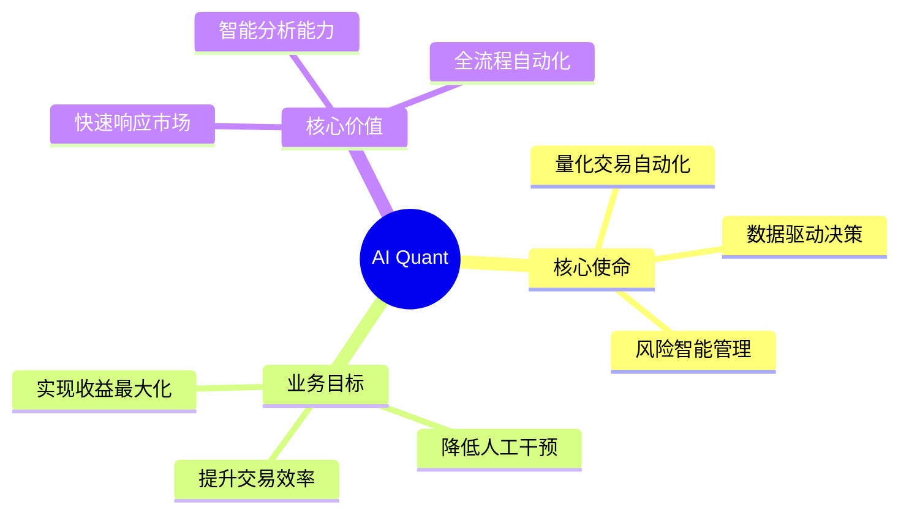
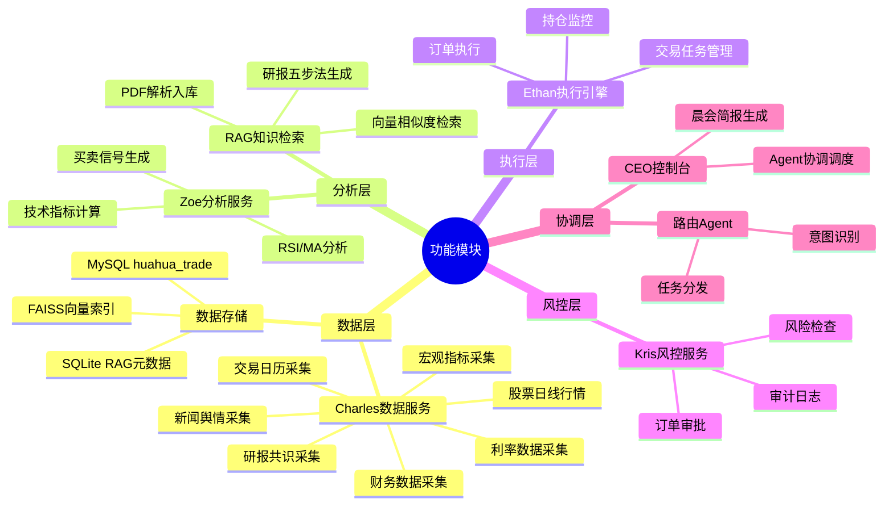
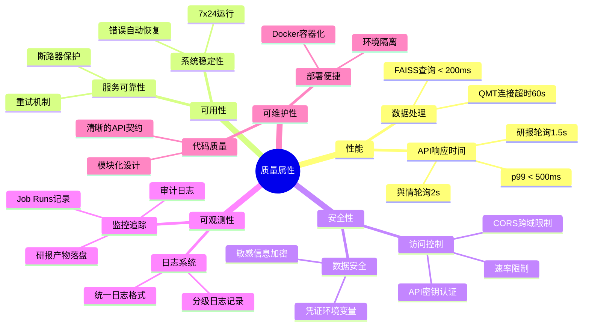
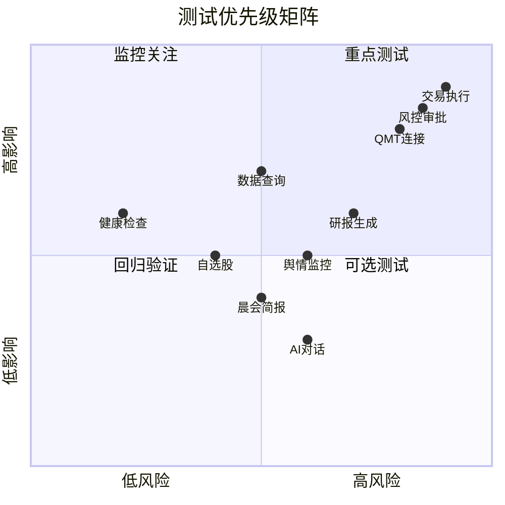

# AI Quant 系统 MFQ 海盗测试法分析

## 一、系统概述

**系统名称**: AI Quant 统一量化交易系统

**系统版本**: V0.1.0

**测试时间**: 2026-05-13

**测试人员**: AI Test Pro

---

## 二、MFQ 海盗测试法分析

### 2.1 Mission (任务)

**系统核心任务**: 构建整合多个专业 AI Agent（Charles、Zoe、Ethan、Kris、CEO）协同工作的统一平台，提供数据获取、技术分析、信号生成、交易执行和风险管理的完整量化交易能力。

### 2.2 Function (功能)

### 2.3 Quality Attributes (质量属性)

---

## 三、功能-质量映射矩阵

| 功能模块 | 性能 | 可用性 | 安全性 | 可观测性 |
|---------|------|--------|--------|---------|
| 健康检查 | 必须 | 必须 | 可选 | 必须 |
| 数据查询 | 必须 | 必须 | 必须 | 必须 |
| 自选股管理 | 必须 | 必须 | 可选 | 必须 |
| 采集任务 | 必须 | 必须 | 可选 | 必须 |
| 智能研报 | 必须 | 可选 | 可选 | 必须 |
| 舆情监控 | 必须 | 必须 | 可选 | 必须 |
| 风控中心 | 必须 | 必须 | 必须 | 必须 |
| 执行监控 | 必须 | 必须 | 必须 | 必须 |
| 晨会简报 | 必须 | 可选 | 可选 | 必须 |
| AI对话 | 必须 | 可选 | 可选 | 必须 |
| 交易连接 | 必须 | 必须 | 必须 | 必须 |

---

## 四、测试风险分析

---

## 五、测试场景优先级

### 5.1 P0 - 核心功能（必须通过）

1. **健康检查**: GET /api/health, GET /api/v1/health
2. **数据查询**: GET /api/v1/data/{dataset}
3. **自选股CRUD**: GET/POST/PUT/DELETE /api/v1/watchlist
4. **Job运行记录**: GET /api/v1/jobs/runs
5. **研报任务创建**: POST /api/v1/reports/tasks
6. **风控审批**: POST /api/v1/risk/approve

### 5.2 P1 - 重要功能（建议通过）

1. **数据导出**: POST /api/v1/export
2. **舆情事件**: GET /api/v1/sentiment/events
3. **执行任务**: POST/GET /api/v1/execution/tasks
4. **晨会简报**: POST /api/v1/console/morning/trigger
5. **交易连接**: POST /api/v1/trading/connect

### 5.3 P2 - 增强功能（可选通过）

1. **策略分析**: GET /api/v1/analysis/signals
2. **RAG检索**: GET /api/v1/reports/rag/query
3. **AI对话**: POST /api/v1/agent/run
4. **调度配置**: GET/PUT /api/v1/jobs/schedules

---

## 六、测试环境配置

### 6.1 后端服务

- **URL**: http://localhost:8000
- **API版本**: /api/v1
- **健康检查**: GET /health, GET /api/v1/health

### 6.2 前端服务

- **URL**: http://localhost:5173
- **技术栈**: React 18 + Vite 6 + TailwindCSS

### 6.3 数据库

- **MySQL**: localhost:3306
- **数据库名**: huahua_trade
- **RAG SQLite**: .ai_quant/reports_rag/documents.db

---

## 七、测试工具清单

| 工具类型 | 工具名称 | 用途 |
|---------|---------|------|
| API测试 | curl / Postman | REST API功能测试 |
| 自动化测试 | Playwright | UI端到端测试 |
| 性能测试 | k6 / locust | 负载压力测试 |
| 单元测试 | pytest | Python后端单元测试 |
| 监控工具 | curl | API响应时间监控 |

---

**文档版本**: V1.0
**创建时间**: 2026-05-13
**文档状态**: 完成
