# AI Quant 统一量化系统使用说明


**文档版本：** V1.0
**适用版本：** AI Quant 统一量化系统 v1.0
**最后更新：** 2026-05-08

---

# 一、系统概述

## 1.1 系统简介

AI Quant 统一量化系统是一套整合多个专业 AI Agent（Charles、Zoe、Ethan、Kris、CEO）协同工作的智能量化交易平台，为量化研究员、交易风控员、投资经理提供从数据采集、技术分析、智能研报生成到交易执行、风控管理的全链路量化能力。

## 1.2 系统架构

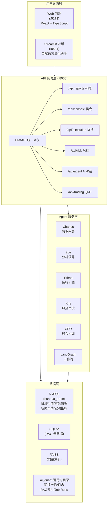
```mermaid
graph TB
    subgraph UI["用户界面层"]
        WEB["Web 前端<br/>(:5173)<br/>React + TypeScript"]
        STREAM["Streamlit 对话<br/>(:8501)<br/>自然语言量化助手"]
    end

    subgraph API["API 网关层 (:8000)"]
        GATEWAY["FastAPI 统一网关"]
        GATEWAY --> R["/api/reports 研报"]
        GATEWAY --> C["/api/console 晨会"]
        GATEWAY --> E["/api/execution 执行"]
        GATEWAY --> K["/api/risk 风控"]
        GATEWAY --> A["/api/agent AI对话"]
        GATEWAY --> T["/api/trading QMT"]
    end

    subgraph AGENT["Agent 服务层"]
        CHARLES["Charles<br/>数据采集"]
        ZOE["Zoe<br/>分析信号"]
        ETHAN["Ethan<br/>执行引擎"]
        KRIS["Kris<br/>风控审批"]
        CEO["CEO<br/>晨会协调"]
        LANGGRAPH["LangGraph<br/>工作流"]
    end

    subgraph DATA["数据层"]
        MYSQL["MySQL<br/>(huahua_trade)<br/>日线行情/财务数据<br/>新闻舆情/宏观指标"]
        SQLITE["SQLite<br/>(RAG 元数据)"]
        FAISS["FAISS<br/>(向量索引)"]
        RUNTIME[".ai_quant 运行时目录<br/>研报产物/日志<br/>RAG索引/Job Runs"]
    end

    UI --> API
    API --> AGENT
    API --> DATA
    AGENT --> DATA
```

## 1.3 页面布局

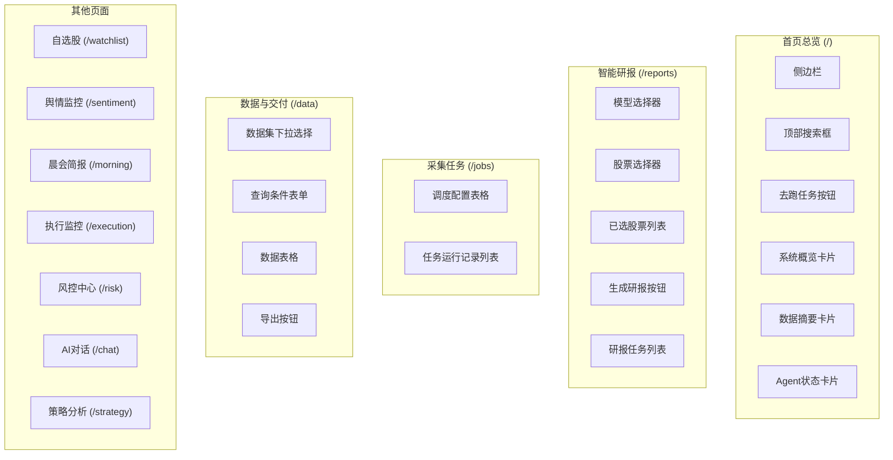
```mermaid
graph TB
    subgraph HOME["首页总览 (/)"]
        H1["侧边栏"]
        H2["顶部搜索框"]
        H3["去跑任务按钮"]
        H4["系统概览卡片"]
        H5["数据摘要卡片"]
        H6["Agent状态卡片"]
    end

    subgraph REPORTS["智能研报 (/reports)"]
        R1["模型选择器"]
        R2["股票选择器"]
        R3["已选股票列表"]
        R4["生成研报按钮"]
        R5["研报任务列表"]
    end

    subgraph JOBS["采集任务 (/jobs)"]
        J1["调度配置表格"]
        J2["任务运行记录列表"]
    end

    subgraph DATA["数据与交付 (/data)"]
        D1["数据集下拉选择"]
        D2["查询条件表单"]
        D3["数据表格"]
        D4["导出按钮"]
    end

    subgraph OTHER["其他页面"]
        WL["自选股 (/watchlist)"]
        SE["舆情监控 (/sentiment)"]
        MR["晨会简报 (/morning)"]
        EX["执行监控 (/execution)"]
        RK["风控中心 (/risk)"]
        CH["AI对话 (/chat)"]
        ST["策略分析 (/strategy)"]
    end
```

## 1.4 用户操作流程

```mermaid
flowchart TD
    START([用户访问系统]) --> HOME{首页总览}

    HOME --> QUICK["快速导航"]
    QUICK -->|"搜索股票"| DATA["数据与交付"]
    QUICK -->|"去跑任务"| JOBS["采集任务"]

    HOME --> REPORTS["智能研报"]
    REPORTS --> SELECT_MODEL["选择模型<br/>qwen-max / deepseek"]
    SELECT_MODEL --> SELECT_STOCK["选择股票"]
    SELECT_STOCK --> GEN_REPORT["点击生成研报"]
    GEN_REPORT --> QUEUE["任务进入后台队列"]
    QUEUE --> POLL{轮询任务状态}
    POLL -->|"运行中"| POLL
    POLL -->|"完成"| VIEW["查看研报"]
    VIEW --> DOWNLOAD["下载/打印研报"]

    HOME --> JOBS2["采集任务"]
    JOBS2 --> VIEW_SCHEDULE["查看调度配置"]
    VIEW_SCHEDULE --> EDIT["编辑 Cron / 时区"]
    EDIT --> ENABLE["启用/禁用任务"]

    HOME --> DATA2["数据与交付"]
    DATA2 --> CHOOSE_DS["选择数据集"]
    CHOOSE_DS --> SET_FILTER["设置过滤条件"]
    SET_FILTER --> QUERY["点击查询"]
    QUERY --> EXPORT["导出 CSV"]

    HOME --> SENTIMENT["舆情监控"]
    SENTIMENT --> FILTER_NEWS["过滤关键词/类型"]
    FILTER_NEWS --> REFRESH["刷新舆情"]

    HOME --> MORNING["晨会简报"]
    MORNING --> TRIGGER["一键生成"]
    TRIGGER --> AUTO["自动执行 LangGraph 工作流"]
    AUTO --> DISPLAY["展示晨会内容"]

    HOME --> RISK["风控中心"]
    RISK --> APPROVE["订单审批"]
    RISK --> LOG["查看审计日志"]

    HOME --> CHAT["AI对话"]
    CHAT --> ASK["输入自然语言问题"]
    ASK --> ROUTE["Agent 路由"]
    ROUTE --> RESPONSE["返回回答"]
    RESPONSE --> MORE{继续对话?}

    MORE -->|"是"| ASK
    MORE -->|"否"| END([结束])

| 服务 | 地址 | 说明 |
|------|------|------|
| **Web 前端** | http://localhost:5173 | React 可视化界面（主入口） |
| **API 文档** | http://localhost:8000/docs | Swagger API 文档 |
| **Streamlit 对话** | http://localhost:8501 | AI 对话机器人 |
| **健康检查** | http://localhost:8000/api/health | 服务状态检查 |

---

# 二、快速开始

## 2.1 启动系统

### macOS / Linux

```bash
bash /Users/apple/Desktop/ai_huahua/ai_quant/scripts/start_all.sh
```

### Windows

```powershell
# PowerShell
.\ai_quant\scripts\start_all.ps1

# CMD
.\ai_quant\scripts\start_all.cmd
```

### 手动启动（各服务独立）

```bash
# 1. 启动后端 API
cd /Users/apple/Desktop/ai_huahua/ai_quant/backend
/Users/apple/Desktop/ai_huahua/ai_quant/venv/bin/python run_server.py

# 2. 启动前端（另一个终端）
cd /Users/apple/Desktop/ai_huahua/ai_quant/web
npm run dev

# 3. 启动 Streamlit（可选）
cd /Users/apple/Desktop/ai_huahua/ai_quant/streamlit_chat
streamlit run app.py --server.port 8501
```

## 2.2 环境准备

系统运行前需要配置以下环境变量（创建或编辑 `.env` 文件）：

```bash
# 数据库配置（必填）
MYSQL_HOST=127.0.0.1
MYSQL_PORT=3306
MYSQL_USER=root
MYSQL_PASSWORD=your_password
MYSQL_DB=huahua_trade

# 通义 API Key（研报 LLM 模式必需）
DASHSCOPE_API_KEY=sk-xxxxxxxxxxxxxxxx

# 前端访问源（CORS）
AI_QUANT_CORS_ORIGINS=http://localhost:5173

# 研报配置（可选）
AI_QUANT_REPORT_USE_LLM=1          # 1=启用 LLM，0=静态配置模式
AI_QUANT_REPORT_INDEX_DIR=          # 自定义 FAISS 索引目录，默认 .ai_quant/reports_rag/vector_store

# QMT 网关超时（秒）
AI_QUANT_QMT_GATEWAY_TIMEOUT=60
```

## 2.3 Docker 一键部署

```bash
cd /Users/apple/Desktop/ai_huahua
docker compose up -d
```

服务启动后访问：
- 前端：http://localhost:5173
- 后端：http://localhost:8000
- Streamlit：http://localhost:8501

---

# 三、页面与功能详解

## 3.1 首页总览（/）

**页面截图：**

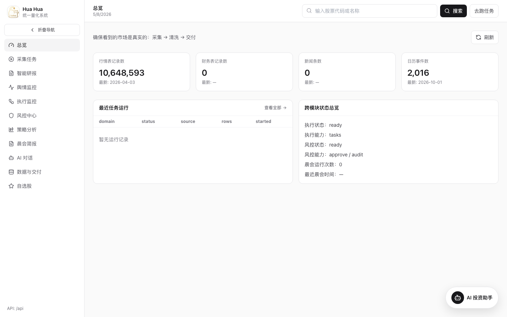

首页是系统的信息中枢，实时展示系统整体运行状态、数据覆盖情况与各 Agent 协作状态。

**页面布局：**

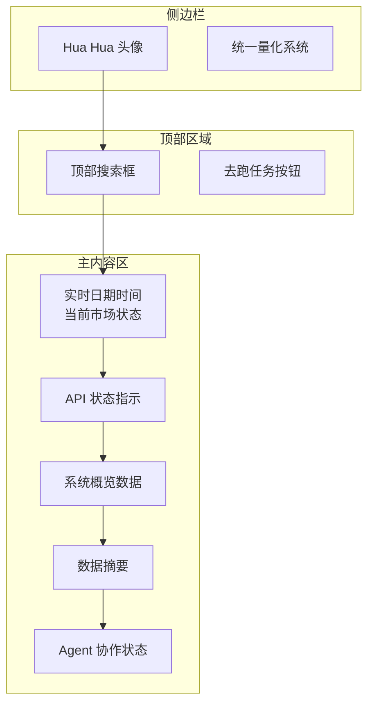
```mermaid
graph TB
    subgraph HEADER["顶部区域"]
        SEARCH["顶部搜索框"]
        TASK_BTN["去跑任务按钮"]
    end

    subgraph SIDEBAR["侧边栏"]
        LOGO["Hua Hua 头像"]
        TITLE["统一量化系统"]
    end

    subgraph MAIN["主内容区"]
        MARKET["实时日期时间<br/>当前市场状态"]
        STATUS["API 状态指示"]
        OVERVIEW["系统概览数据"]
        SUMMARY["数据摘要"]
        AGENT["Agent 协作状态"]
    end

    LOGO --> SEARCH
    SEARCH --> MARKET
    MARKET --> STATUS
    STATUS --> OVERVIEW
    OVERVIEW --> SUMMARY
    SUMMARY --> AGENT
```

**功能说明：**

- **顶部搜索框**：输入股票代码或名称，按回车跳转到数据与交付页面进行查询
- **一键跳转**：点击"去跑任务"按钮，快速进入采集任务页面
- **实时状态**：根据当前时间自动判断 A 股是否处于交易时段（9:30-11:30 / 13:00-15:00）
- **市场时段显示**：非交易时段显示黑色狐狸头像，交易时段显示金色头像

## 3.2 智能研报（/reports）

**页面截图：**

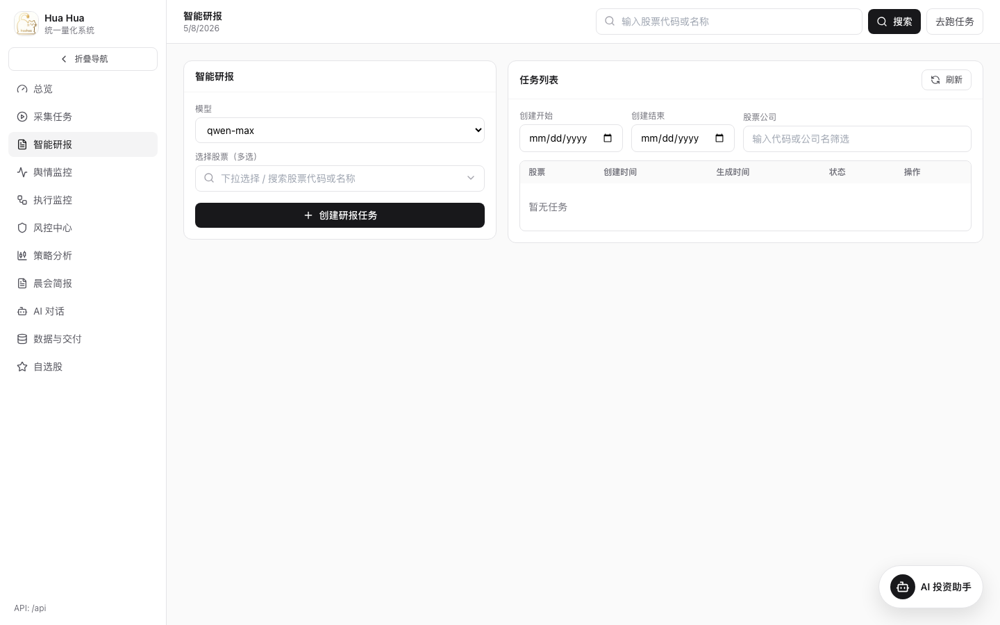

智能研报模块是本系统的核心功能，基于 RAG（检索增强生成）+ FAISS 向量索引 + LLM（大语言模型）技术，自动生成结构化的个股研报。

**前置条件：**
1. 配置 `DASHSCOPE_API_KEY` 环境变量
2. 设置 `AI_QUANT_REPORT_USE_LLM=1`
3. 确保 FAISS 索引目录存在 `index.faiss` 和 `index.pkl` 文件

**页面布局：**

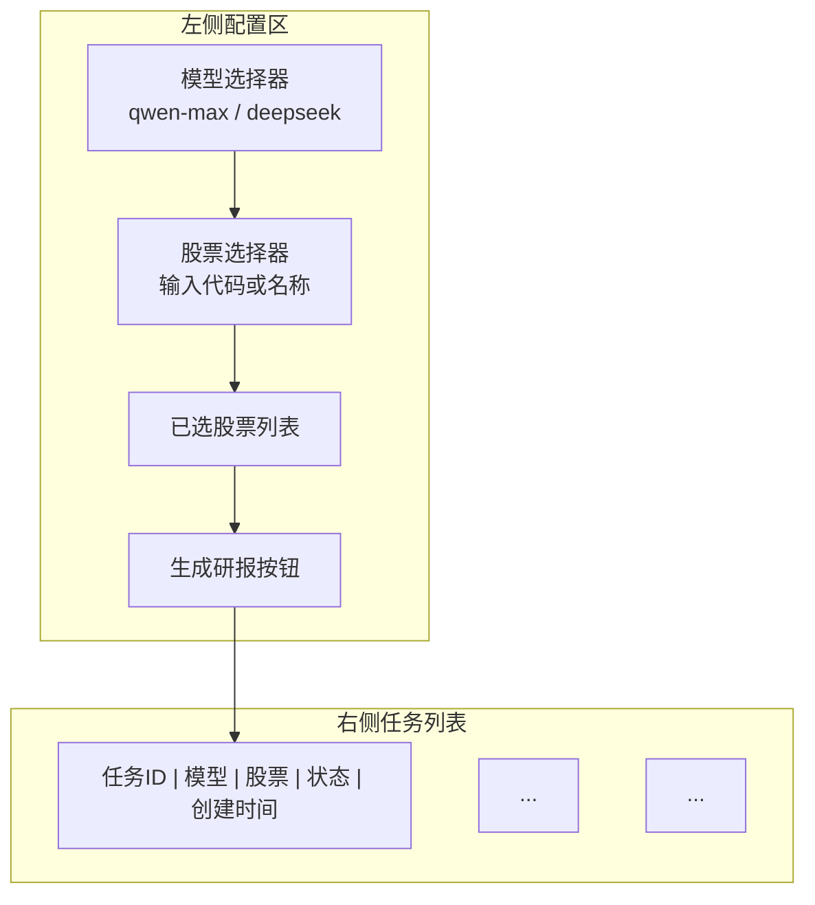
```mermaid
graph TB
    subgraph LEFT["左侧配置区"]
        MODEL["模型选择器<br/>qwen-max / deepseek"]
        STOCK["股票选择器<br/>输入代码或名称"]
        SELECTED["已选股票列表"]
        GEN_BTN["生成研报按钮"]
    end

    subgraph RIGHT["右侧任务列表"]
        TBL_HEADER["任务ID | 模型 | 股票 | 状态 | 创建时间"]
        TBL_ROW1["..."]
        TBL_ROW2["..."]
    end

    MODEL --> STOCK
    STOCK --> SELECTED
    SELECTED --> GEN_BTN
    GEN_BTN --> TBL_HEADER
```

**操作步骤：**

### 3.2.1 选择模型

系统支持两种 LLM 模型：

| 模型 | 说明 | 联网搜索 |
|------|------|----------|
| **qwen-max** | 通义旗舰模型，支持联网搜索 | 有 |
| **deepseek** | DeepSeek-V3 模型 | 无（需 Tavily 补充） |

### 3.2.2 选择股票

1. 点击股票选择器输入框，输入股票代码或名称（如"广联达"或"002410"）
2. 系统自动搜索，搜索结果以列表形式展示
3. 点击股票右侧的"选择"按钮添加至已选列表
4. 支持多选，可同时生成多只股票的研报
5. 最近使用的股票记录保存在本地（localStorage），下次可直接从下拉框中选择

**操作技巧：**
- 输入框支持回车键快速选择搜索结果第一项
- 按 Escape 键可关闭下拉列表
- 已选的股票不可重复选择（按钮变灰）
- 点击已选股票标签右侧的"×"可移除

### 3.2.3 生成研报

1. 确认模型和股票选择无误后，点击"生成研报"按钮
2. 系统显示 loading 状态，禁止重复提交
3. 后端自动执行以下流程：
   - 探测可用的 FAISS 索引目录
   - 调用 `run_five_step_analysis` 执行五步法分析（宏观 → 行业 → 公司 → 财务 → 估值）
   - LLM 生成研报 Markdown 内容
   - 研报落盘至 `.ai_quant/report_outputs/<task_id>.md`
4. 任务自动进入后台队列，前端实时轮询状态（1.5s 间隔）

### 3.2.4 查看研报

研报任务完成后，状态显示为绿色"完成"，点击"查看"按钮：
- 在新窗口打开研报 Markdown 原文
- 研报内容包含五步法分析框架的完整内容
- 支持浏览器直接渲染 Markdown

**任务状态说明：**

| 状态 | 颜色 | 说明 |
|------|------|------|
| 等待 | 灰色 | 任务已创建，等待 worker 处理 |
| 运行中 | 黄色 | 研报正在生成中 |
| 完成 | 绿色 | 研报已生成，可查看 |
| 失败 | 红色 | 生成失败，查看错误信息 |

### 3.2.5 日志追踪

研报生成过程中的日志写入 `.ai_quant/reports_worker.log`，可通过以下命令查看：

```bash
tail -f /Users/apple/Desktop/ai_huahua/.ai_quant/reports_worker.log
```

## 3.3 采集任务（/jobs）

**页面截图：**

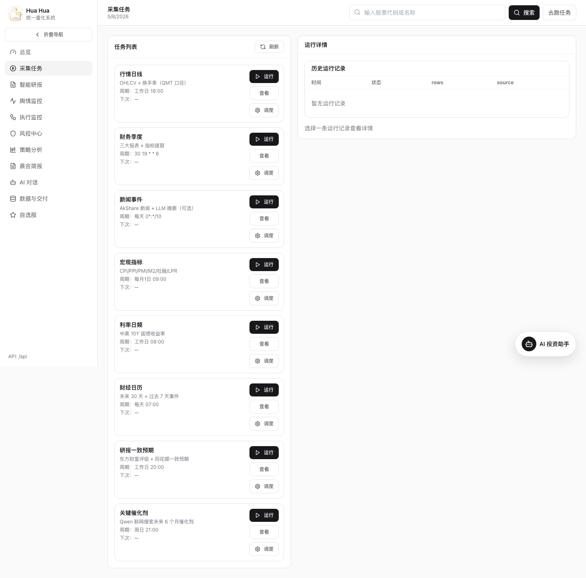

采集任务模块管理 Charles 数据服务的定时采集任务，提供任务运行记录查询与调度配置管理能力。

**页面布局：**

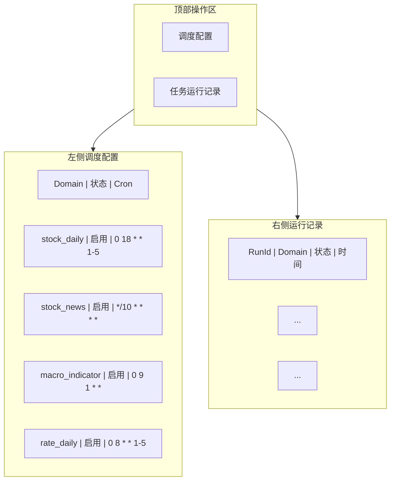
```mermaid
graph TB
    subgraph TOP["顶部操作区"]
        LABEL1["调度配置"]
        LABEL2["任务运行记录"]
    end

    subgraph LEFT["左侧调度配置"]
        SCHED_HEADER["Domain | 状态 | Cron"]
        SCHED_ROW1["stock_daily | 启用 | 0 18 * * 1-5"]
        SCHED_ROW2["stock_news | 启用 | */10 * * * *"]
        SCHED_ROW3["macro_indicator | 启用 | 0 9 1 * *"]
        SCHED_ROW4["rate_daily | 启用 | 0 8 * * 1-5"]
    end

    subgraph RIGHT["右侧运行记录"]
        RUN_HEADER["RunId | Domain | 状态 | 时间"]
        RUN_ROW1["..."]
        RUN_ROW2["..."]
    end

    TOP --> LEFT
    TOP --> RIGHT
```

**支持的采集任务类型：**

| Domain | 说明 | 默认 Cron | 模式 |
|--------|------|----------|------|
| `stock_daily` | 股票日线行情 | `0 18 * * 1-5` (交易日 18:00) | test |
| `stock_financial` | 股票财务数据 | `30 19 * * 6` (周六 19:30) | test |
| `stock_news` | 股票新闻舆情 | `*/10 * * * *` (每 10 分钟) | test |
| `macro_indicator` | 宏观指标 | `0 9 1 * *` (每月 1 日 9:00) | full |
| `rate_daily` | 利率日线 | `0 8 * * 1-5` (交易日 8:00) | full |
| `calendar` | 交易日历事件 | `0 7 * * *` (每日 7:00) | full |
| `report_consensus` | 研报共识 | `0 20 * * 1-5` (交易日 20:00) | test |
| `catalyst` | 催化剂事件 | `0 21 * * 0` (周日 21:00) | full |

**操作说明：**

- **查看运行记录**：右侧列表展示各任务的历史运行状态
- **编辑调度**：点击任务行进入编辑模式，可修改 cron 表达式、时区、启用状态
- **手动触发**：通过 API `POST /api/jobs/runs` 手动触发一次采集（需外部调用）

## 3.4 数据与交付（/data）

**页面截图：**

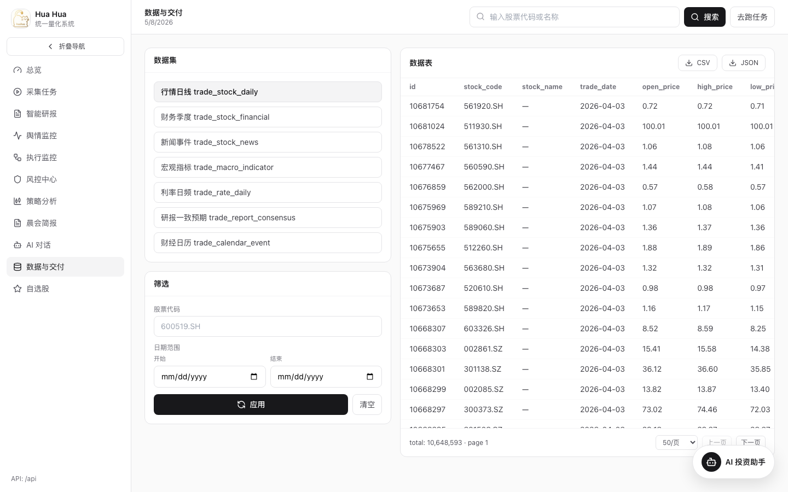

数据与交付模块提供统一的数据查询与导出能力，覆盖股票行情、财务数据、新闻舆情、宏观指标等七大数据集。

**页面布局：**

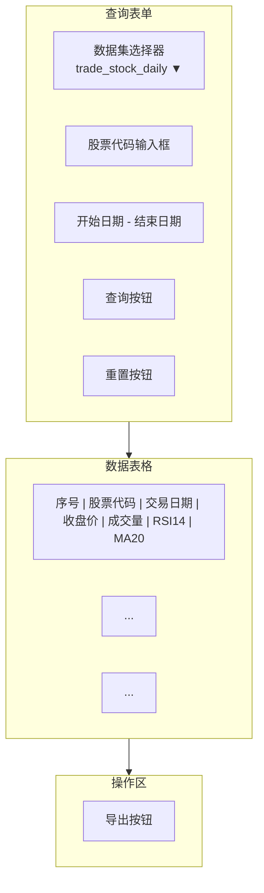
```mermaid
graph TB
    subgraph FORM["查询表单"]
        DS["数据集选择器<br/>trade_stock_daily ▼"]
        CODE["股票代码输入框"]
        DATE_RANGE["开始日期 - 结束日期"]
        QUERY_BTN["查询按钮"]
        RESET_BTN["重置按钮"]
    end

    subgraph TABLE["数据表格"]
        TBL_HEADER["序号 | 股票代码 | 交易日期 | 收盘价 | 成交量 | RSI14 | MA20"]
        TBL_ROW1["..."]
        TBL_ROW2["..."]
    end

    subgraph ACTIONS["操作区"]
        EXPORT_BTN["导出按钮"]
    end

    FORM --> TABLE
    TABLE --> ACTIONS
```

**支持的七大数据集：**

| 数据集 | 说明 | 主要字段 |
|--------|------|----------|
| `trade_stock_daily` | 股票日线行情 | stock_code, trade_date, close_price, volume, rsi14, ma20 |
| `trade_stock_financial` | 股票财务数据 | stock_code, report_date, data_source, payload_json |
| `trade_stock_news` | 股票新闻舆情 | stock_code, published_at, news_type, title, content |
| `trade_macro_indicator` | 宏观指标 | indicator_date, indicator_name, indicator_value, source |
| `trade_rate_daily` | 利率日线 | rate_date, rate_name, rate_value |
| `trade_report_consensus` | 研报共识 | stock_code, broker, report_date, rating, target_price |
| `trade_calendar_event` | 交易日历事件 | event_date, country, importance, source, title |

**操作说明：**

1. **选择数据集**：下拉选择要查询的数据集类型
2. **设置过滤条件**：
   - 股票代码：精确或模糊匹配
   - 开始/结束日期：时间范围过滤
3. **查询**：点击"查询"按钮或按回车执行查询
4. **导出**：点击"导出"按钮下载 CSV 文件

## 3.5 自选股（/watchlist）

**页面截图：**

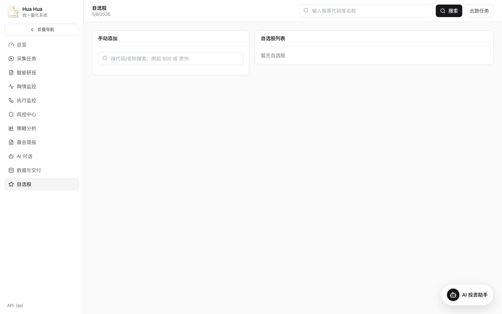

自选股模块允许用户管理关注的股票列表，支持添加、删除、置顶、排序等操作。

**页面布局：**

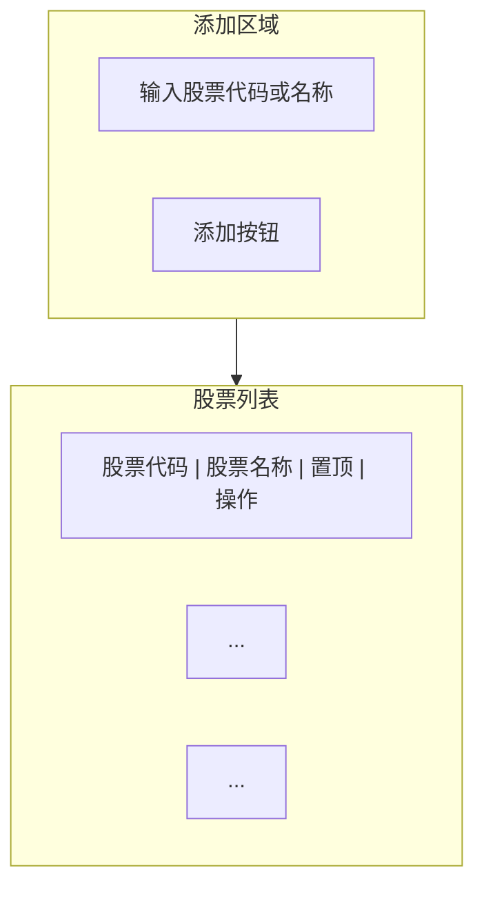
```mermaid
graph TB
    subgraph ADD["添加区域"]
        INPUT["输入股票代码或名称"]
        ADD_BTN["添加按钮"]
    end

    subgraph TABLE["股票列表"]
        TBL_HEADER["股票代码 | 股票名称 | 置顶 | 操作"]
        TBL_ROW1["..."]
        TBL_ROW2["..."]
    end

    ADD --> TABLE
```

**操作说明：**

1. **添加自选股**：在输入框输入股票代码或名称，点击"添加"按钮
2. **置顶**：点击股票行的"置顶"按钮，置顶的股票排在列表最前面
3. **删除**：点击股票行的"删除"按钮移除自选股

## 3.6 舆情监控（/sentiment）

**页面截图：**

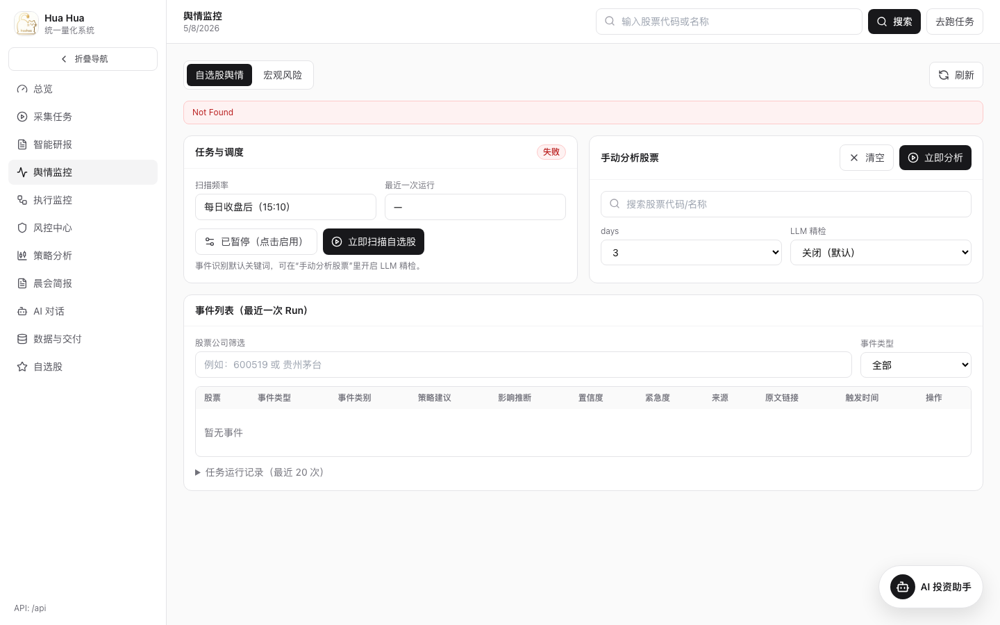

舆情监控模块追踪市场新闻与公告，按利好/利空/政策进行情感分类。

**页面布局：**

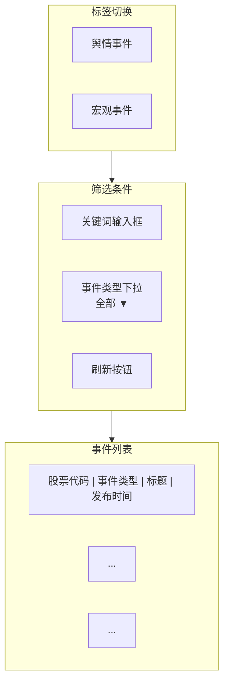
```mermaid
graph TB
    subgraph TABS["标签切换"]
        TAB1["舆情事件"]
        TAB2["宏观事件"]
    end

    subgraph FILTERS["筛选条件"]
        KEYWORD["关键词输入框"]
        TYPE["事件类型下拉<br/>全部 ▼"]
        REFRESH_BTN["刷新按钮"]
    end

    subgraph TABLE["事件列表"]
        TBL_HEADER["股票代码 | 事件类型 | 标题 | 发布时间"]
        TBL_ROW1["..."]
        TBL_ROW2["..."]
    end

    TABS --> FILTERS
    FILTERS --> TABLE
```

**功能说明：**

- **舆情事件**：展示 trade_stock_news 表中的新闻，按情感分类（利好/利空/政策）
- **宏观事件**：展示 trade_calendar_event 中的重要宏观数据（利率决议、非农等）
- **过滤**：支持按股票代码、事件类型进行筛选
- **自动刷新**：2 秒轮询最新舆情数据

## 3.7 晨会简报（/morning）

**页面截图：**

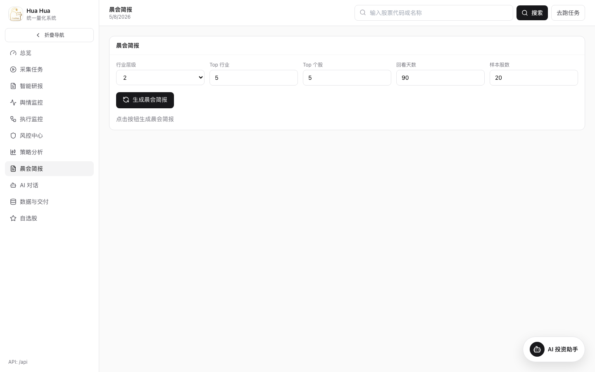

晨会简报模块由 CEO Agent 驱动，基于 LangGraph 工作流自动生成每日晨会摘要。

**页面布局：**

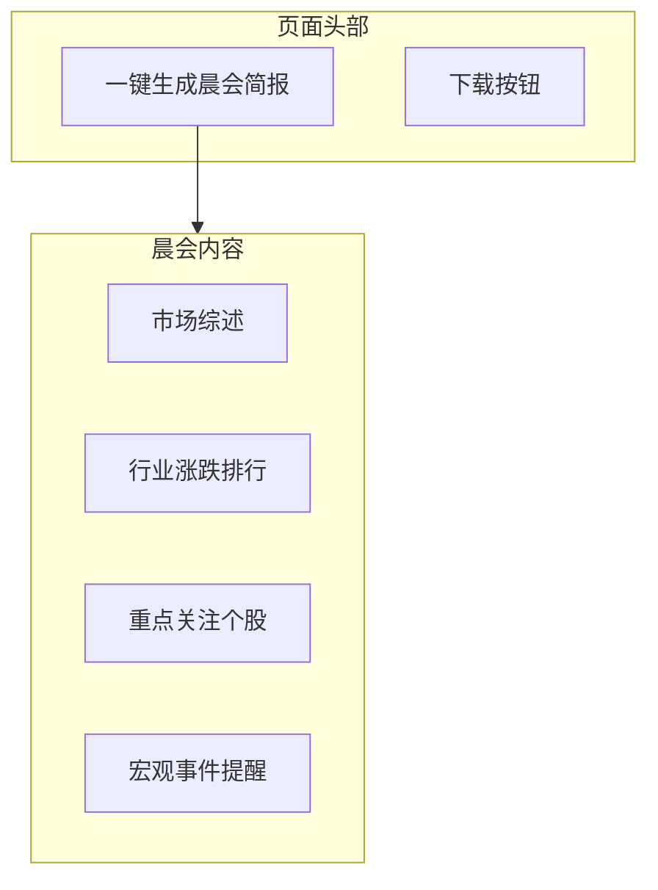
```mermaid
graph TB
    subgraph HEADER["页面头部"]
        GEN_BTN["一键生成晨会简报"]
        DOWNLOAD_BTN["下载按钮"]
    end

    subgraph CONTENT["晨会内容"]
        MARKET["市场综述"]
        SECTOR["行业涨跌排行"]
        STOCKS["重点关注个股"]
        MACRO["宏观事件提醒"]
    end

    GEN_BTN --> CONTENT
```

**操作说明：**

1. 点击"一键生成晨会简报"按钮
2. 系统自动执行：
   - 查询 `trade_stock_status` 获取个股行业分类
   - 查询 `trade_sector_daily` 获取行业指数数据
   - 调用 LangGraph 晨会工作流生成摘要
3. 展示生成的晨会内容

## 3.8 执行监控（/execution）

**页面截图：**

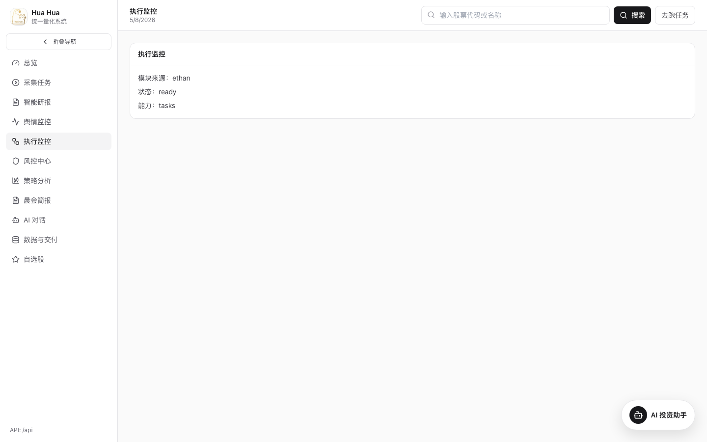

执行监控模块对接 Ethan 内嵌执行引擎，提供交易执行任务的管理与监控能力。

**页面布局：**

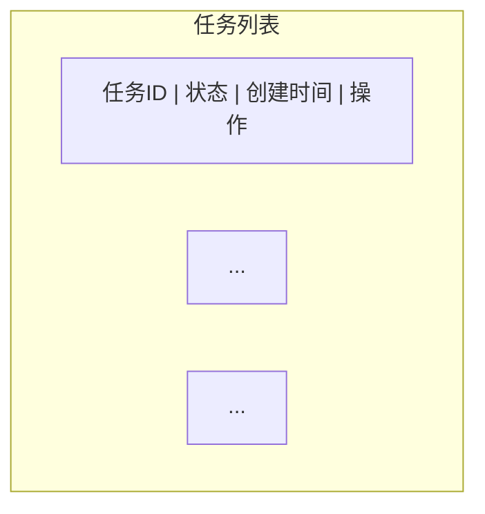
```mermaid
graph TB
    subgraph TABLE["任务列表"]
        TBL_HEADER["任务ID | 状态 | 创建时间 | 操作"]
        TBL_ROW1["..."]
        TBL_ROW2["..."]
    end
```

**任务状态：**

| 状态 | 说明 |
|------|------|
| created | 任务已创建 |
| running | 执行中 |
| completed | 执行完成 |
| failed | 执行失败 |

## 3.9 风控中心（/risk）

**页面截图：**

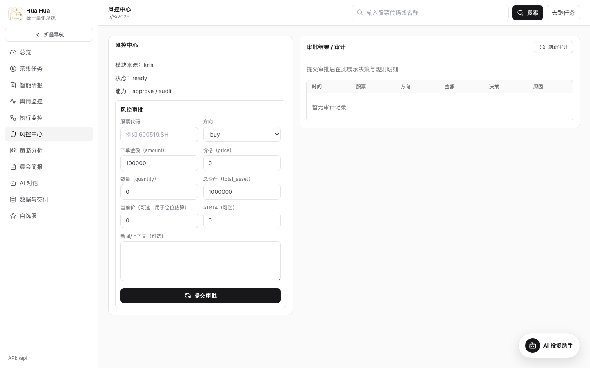

风控中心模块由 Kris Agent 驱动，提供订单风控审批与审计日志功能。

**页面布局：**

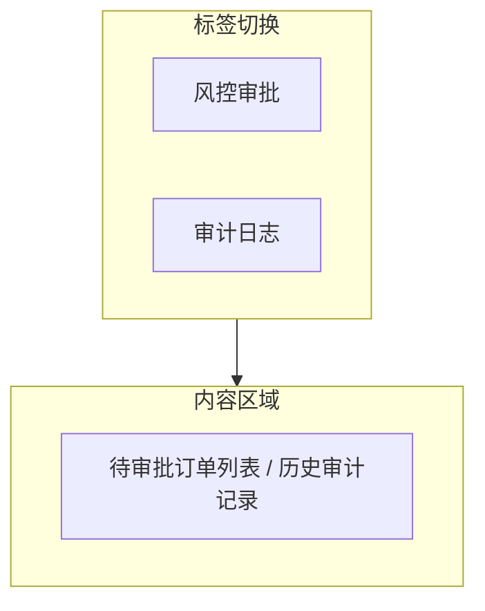
```mermaid
graph TB
    subgraph TABS["标签切换"]
        TAB1["风控审批"]
        TAB2["审计日志"]
    end

    subgraph CONTENT["内容区域"]
        LIST["待审批订单列表 / 历史审计记录"]
    end

    TABS --> CONTENT
```

## 3.10 AI 对话（/chat）

**页面截图：**

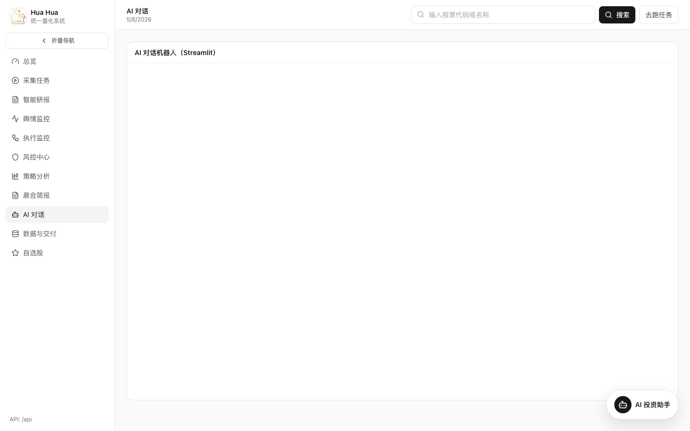

AI 对话模块提供自然语言量化交互能力，通过 Streamlit 对话界面与 AI Agent 交互。

**访问方式：**

1. Web 页面：http://localhost:5173/chat
2. 独立 Streamlit：http://localhost:8501

**功能说明：**

- 输入量化相关问题（如"帮我分析贵州茅台"、"今天晨会有什么"）
- 路由 Agent 自动识别意图并分发至对应模块处理
- 支持多轮对话，上下文记忆

## 3.11 策略分析（/strategy）

**页面截图：**

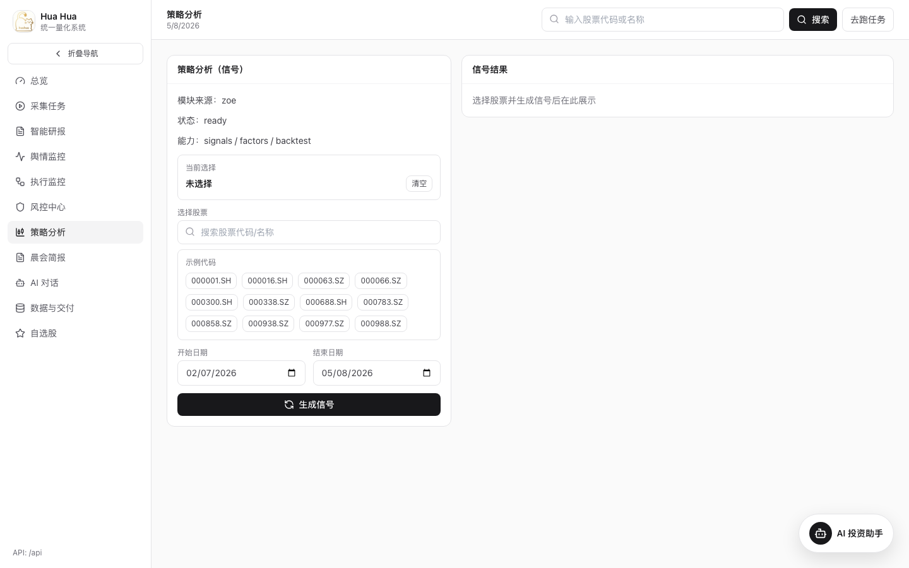

策略分析模块基于技术指标计算，提供个股买卖信号提示。

**功能说明：**

- RSI（相对强弱指标）计算
- MA（移动平均线）分析
- 买卖信号生成与展示

---

# 四、API 接口参考

## 4.1 健康检查

```bash
# 检查服务状态
curl http://localhost:8000/api/health

# 响应
{"ok": true}
```

## 4.2 系统数据总览

```bash
# 获取各数据集记录数与最新更新时间
curl http://localhost:8000/api/summary
```

## 4.3 股票搜索

```bash
# 搜索股票
curl "http://localhost:8000/api/stocks?q=000001&limit=10"

# 响应示例
{
  "items": [
    {"code": "000001.SZ", "name": "平安银行"},
    ...
  ]
}
```

## 4.4 研报任务管理

```bash
# 创建研报任务
curl -X POST http://localhost:8000/api/reports/tasks \
  -H "Content-Type: application/json" \
  -d '{"model": "qwen-max", "stock_codes": ["002410.SZ"]}'

# 查询研报任务列表
curl "http://localhost:8000/api/reports/tasks?limit=100"

# 查看研报内容
curl http://localhost:8000/api/reports/tasks/{task_id}/view
```

## 4.5 晨会简报

```bash
# 触发晨会简报生成
curl -X POST http://localhost:8000/api/console/morning/trigger
```

## 4.6 任务调度

```bash
# 查看所有调度配置
curl http://localhost:8000/api/jobs/schedules

# 查看任务运行记录
curl "http://localhost:8000/api/jobs/runs?limit=10&domain=stock_daily"

# 更新调度配置
curl -X PUT http://localhost:8000/api/jobs/schedules/stock_daily \
  -H "Content-Type: application/json" \
  -d '{"cron": "0 18 * * 1-5", "timezone": "Asia/Shanghai", "enabled": true}'
```

完整的 API 文档请访问：http://localhost:8000/docs

---

# 五、运维指南

## 5.1 日志文件

| 文件路径 | 说明 | 查看命令 |
|----------|------|----------|
| `.ai_quant/reports_worker.log` | 研报生成日志 | `tail -f .ai_quant/reports_worker.log` |
| `.ai_quant/job_runs/*.json` | 采集任务运行记录 | `ls -la .ai_quant/job_runs/` |
| `.ai_quant/report_outputs/*.md` | 研报 Markdown 产物 | `ls -la .ai_quant/report_outputs/` |

## 5.2 RAG 索引管理

```bash
# 查看 RAG 状态
curl http://localhost:8000/api/reports/rag/status

# 触发 PDF 入库与索引重建
curl -X POST "http://localhost:8000/api/reports/rag/ingest?rebuild=true"

# 手动执行 RAG 查询
curl "http://localhost:8000/api/reports/rag/query?q=广联达财务分析&k=6"
```

## 5.3 常见问题排查

### 研报生成失败

1. 检查 `DASHSCOPE_API_KEY` 是否配置正确
2. 检查 FAISS 索引目录是否存在 `index.faiss` 和 `index.pkl`
3. 查看日志：`tail -f .ai_quant/reports_worker.log`
4. 确认 `AI_QUANT_REPORT_USE_LLM=1`

### 前端无法访问后端 API

1. 检查后端是否运行：`curl http://localhost:8000/api/health`
2. 检查 CORS 配置：`AI_QUANT_CORS_ORIGINS` 是否包含前端地址

### MySQL 连接失败

1. 检查 MySQL 服务是否启动
2. 验证数据库连接信息（HOST/PORT/USER/PASSWORD/DB）
3. 确认 `huahua_trade` 数据库存在

### QMT 连接超时

1. 检查网络连接
2. 增加超时时间：`AI_QUANT_QMT_GATEWAY_TIMEOUT=120`
3. 查看网关日志

---

# 六、权限与安全

## 6.1 当前版本说明

本版本（V1.0）**未实现用户认证与权限控制**，所有用户共享同一套数据与功能。

**安全建议（生产部署前必读）：**

1. **数据库安全**：MySQL 密码通过环境变量注入，不写入代码
2. **API Key 安全**：所有 API Key（`DASHSCOPE_API_KEY` 等）通过 `.env` 文件管理，不提交至代码仓库
3. **CORS 限制**：生产环境务必限制 `AI_QUANT_CORS_ORIGINS`，禁止使用通配符
4. **内网部署**：API 网关建议仅在内网访问，不直接暴露到公网
5. **审计日志**：交易相关操作自动记录审计日志（存储在 `.ai_quant/job_runs/`）

## 6.2 生产部署 Checklist

- [ ] 启用 HTTPS / TLS
- [ ] 配置 JWT 或其他认证机制
- [ ] 限制 `AI_QUANT_CORS_ORIGINS`
- [ ] 配置 MySQL 连接池与读写分离
- [ ] 设置 RAG 索引定时备份
- [ ] 配置日志收集与告警
- [ ] 压测性能指标达标

---

*文档版本：V1.0 | 适用版本：AI Quant v1.0 | 更新时间：2026-05-08*
