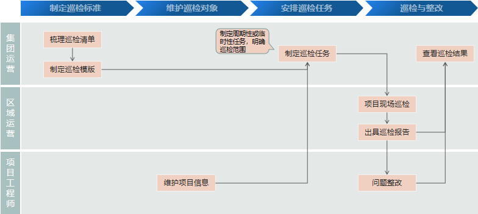
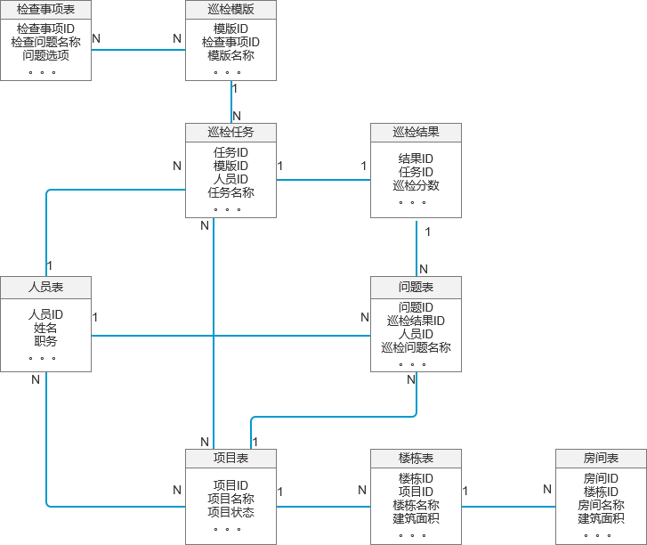
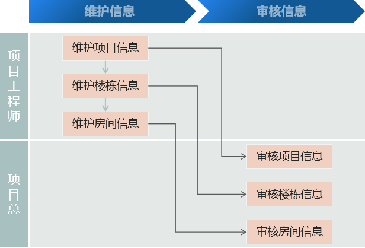
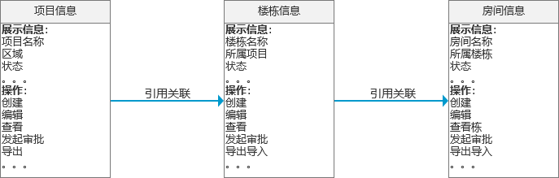
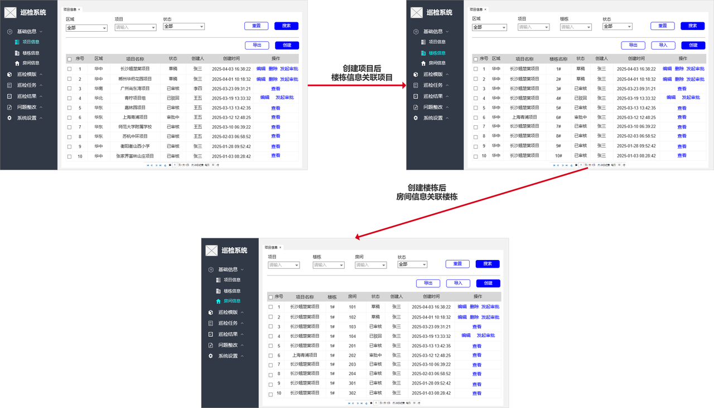
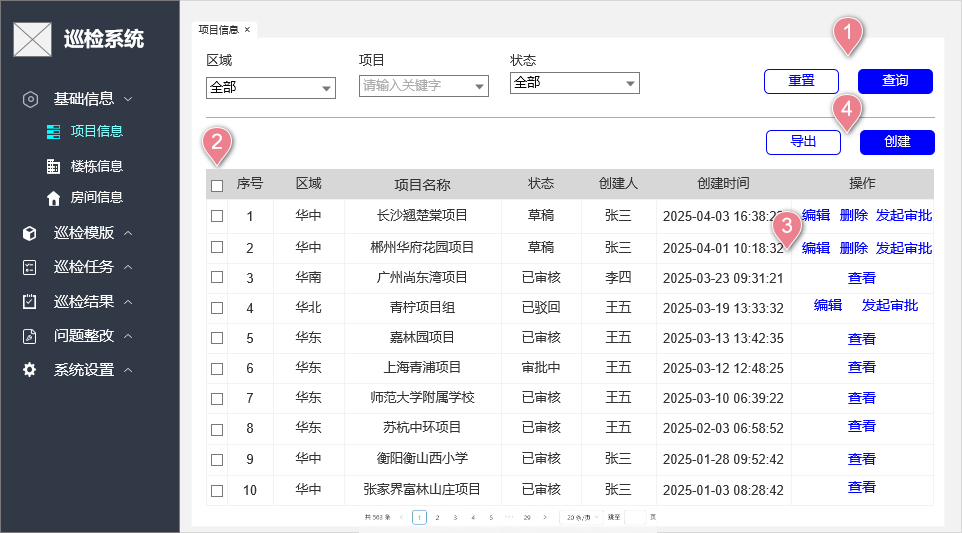
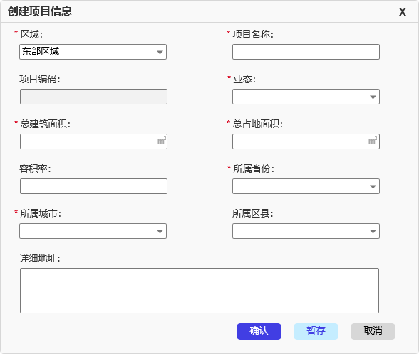

# 巡检系统**需求规格说明书**

**文档变更记录：**

<table><colgroup><col width="72"><col width="65"><col width="501"><col width="111"><col width="143"></colgroup>
<thead>
<tr>
<th><strong>版本</strong></th>
<th><strong>类型</strong></th>
<th><strong>变更描述</strong></th>
<th><strong>修订人</strong></th>
<th><strong>修订时间</strong></th>
</tr>
</thead>
<tbody>
<tr>
<td>V1.0</td>
<td>新增</td>
<td>起草版本</td>
<td>张三</td>
<td>2025-01-31</td>
</tr>
<tr>
<td>V1.1</td>
<td>修改</td>
<td><ul>
<li>增加功能模块-巡检结果</li>
</ul></td>
<td>张三</td>
<td>2025-05-11</td>
</tr>
<tr>
<td> </td>
<td></td>
<td> </td>
<td> </td>
<td> </td>
</tr>
<tr>
<td> </td>
<td></td>
<td> </td>
<td> </td>
<td> </td>
</tr>
</tbody>
</table>

# 一、概述

## （一）项目背景及目标

[需求背景及目标（需求范围）描述，必填]

示例：

为全面落实集团总裁X总关于"高质量做一成一，零伤亡，无重大安全事故"的重要指示要求，进一步强化集团与区域两级管控体系，现需系统性提升建设项目质量与安全管理水平。

通过建立常态化巡检机制，要求各区域按月完成项目全覆盖检查，切实消除质量隐患、防范安全风险，确保每个项目都能以高标准完成交付，实现集团高质量发展目标。

## （二）现状分析

[业务现状描述，必填。]

示例：

当前集团质量安全巡检体系仍处于传统人工管理阶段，存在管控颗粒度粗放、标准执行偏差、数据价值流失等系统性痛点，严重制约管理效能提升。具体表现为：

1. 巡检模式落后
   • 区域运营当前采用纯线下Excel文档作为检查清单记录的交互方式，存在版本管理混乱、信息不同步等问题。
   • 区域运营与集团运营间数据流转依赖人工传递，信息滞后严重（平均延迟3-5个工作日）

2. 数据处理低效
   • 巡检数据需区域运营人工汇总统计，平均每个区域每月消耗16-20人时
   • 数据准确性依赖区域运营人工校验，错误率高达12%（2023年抽样数据）

3. 标准执行不一
   • 各区域执行标准差异率达35%（依据2024年Q1审计报告）
   • 存在"检查表代填"、"事后补录"等违规现象

4. 管控效能不足
   • 集团缺乏实时可视化监管手段，问题整改闭环率仅62%
   • 安全隐患平均发现周期长达11天，超出行业标准2.7倍

## （三）术语说明

[文档中涉及的专业名词、缩略词等说明。选填，也可在各章节说明]

示例：

**巡检**是指按照预定的检查标准、流程和周期，对项目现场的质量、安全、进度等关键要素进行系统性检查与记录的管理活动。其核心目的是及时发现隐患、纠正偏差，确保项目符合集团管理要求及行业规范。

**关键特征**

1. **周期性**：按固定频率（如每日、每周、每月）执行，确保持续监控。

2. **标准化**：基于统一的检查表（Checklist）或评分体系，避免主观差异。

3. **闭环性**：包含“问题发现-记录-整改-验收”的全流程管理。

4. **分层管控**：

   * **集团级巡检**：侧重战略合规性、重大风险核查。

   * **区域级巡检**：聚焦项目执行层面的常态化检查。

# 二、用户角色描述

| 用户角色                                                                          | 场景描述                                                                                         |
| ----------------------------------------------------------------------------- | -------------------------------------------------------------------------------------------- |
| * 示例：* | * （基于业务视角描述方案中的业务场景）* |
| *集团运营对接人*                                                                     | *1、负责制定巡检标准和清单。* *2、管控跟踪落实各区域巡检工作，监督各项目重大级问题整改。落实和提升集团安全、质量管理水平。*                       |
| *&#x20;区域运营*                                                                  | *&#x20;以集团检查标准为准则，聚焦项目安全质量巡检，严格管控项目安全和质量，提升管理水平*                                             |
| *项目工程师&#x20;*                                                                 | *1、负责维护项目基础信息，包括项目、楼栋、房间信息。为后续区域巡检提供巡检对象。&#x20;* *2、负责针对巡检问题进行问题整改和闭环。*                 |
| *&#x20;项目总包工程师*                                                               | *负责问题整改和关闭 （打印整改单线下整改跟进，本批次不涉及线上交互）*                                                         |

# 三、功能概述

## （一）业务流程

[整体业务流程图，尽量必填]

示例：

## （二）功能架构图

[系统功能架构图，选填]

## （三）功能流程图

[系统整体功能流程图，尽量必填]

示例：

## （四）ER图

[数据库设计阶段用于描述数据模型的可视化工具，通过图形化方式展示实体及其属性和关系，为构建高效数据库提供基础框架，尽量必填]

示例：

## （五）功能清单

[简要描述产品的功能点和每个功能点的优先级，参考格式如下，必填]

| **功能模块**                                                                     | **主要功能点**                                                                   | **功能描述**                                                                                                                                     | **优先级**                                                                  |
| ---------------------------------------------------------------------------- | --------------------------------------------------------------------------- | -------------------------------------------------------------------------------------------------------------------------------------------- | ------------------------------------------------------------------------ |
| 功能模块1 | 功能点1 |  功能描述，示例如下                                                            | 低 |
| 基础信息                                                                         | 项目信息                                                                        |  1、针对项目基础信息进行线上化增删改查，新增和变更的项目信息需完成审批（流程集成OA）后生效。 2、支持导出项目信息。且所有操作按钮可单独进行权限控制。                                                           | 高                                                                        |
|                                                                              | 楼栋信息                                                                        |  1、基于项目维护楼栋信息（含增删改查），新增和变更楼栋需完成审批（流程集成OA）后生效。 2、支持批量导出导入快捷维护楼栋信息。且所有操作按钮可单独进行权限控制。 3、楼栋业态信息支持单独配置和引用。 （PS：第一批次功能，仅涉及项目维度问题检查） | 低                                                                        |
|                                                                              | 房间信息                                                                        |  1、基于单个楼栋维护房间信息（含增删改查）新增和变更房间需完成审批（流程集成OA）后生效。 2、支持批量导出导入快捷维护房间信息。且所有操作按钮可单独进行权限控制。 （PS：第一批次功能，仅涉及项目维度问题检查）                        | 低                                                                        |
| 巡检模版                                                                         | 检查问题                                                                        | 1、制定集团标准的检查事项，包括线上化增删改查。单个检查事项明确检查颗粒度（区分项目、楼栋、房间）。 2、支出批量导出导入维护检查问题清单。所有功能均需支持权限配置。 3、XXXXXX                                       | 高                                                                        |
|                                                                              | 巡检模版                                                                        | 1、制定各类型巡检检查模版，每个模版仅可通过引入检查问题明确各类型模版的检查内容。 2、关于模版的增删改查均需通过审批流后方可生效。 3、XXXXXX                                                        | 高                                                                   |
| 巡检任务                                                                         | 巡检任务                                                                        | 1、由集团运营制定周期性或临时性巡检任务，明确巡检内容（模版）、范围（项目）、责任人和时间要求。 2、针对任务区分草稿、生效状态，通过流程审批后方可生效。 3、XXXXXX                                             | 低                                                                        |
| 巡检结果                                                                         | 功能点1                                                                        |  XXXXXXX（PS：V1.1版本文档新增功能）                                                                                                                    | 中                                                                        |
| 问题整改                                                                         | 功能点1                                                                        |  XXXXXXX                                                                                                                                     | 低                                                                        |
| 系统设置                                                                         | 功能点1                                                                        |  XXXXXXX                                                                                                                                     | 高                                                                        |
| 现场巡检                                                                         | XXXX                                                                        | XXXX                                                                                                                                         | X                                                                        |

# 四、系统功能详细设计

## （一）基础信息

### 1、模块概述

1）概述功能模块1的功能简介，必填

2）概述功能模块1的产品结构或包含组件，选填

示例：

本模块用于维护集团及区域管控的**核心实体对象信息**（项目、楼栋、房间），作为巡检问题记录、整改跟踪及责任划分的数据基础，确保管理动作可精准关联至具体物理空间。

* **管控要求**：

  * 所有巡检问题需绑定至具体实体（如“3号楼消防通道堆放杂物”）

  * 整改任务按楼栋分配责任人，定位问题位置

### 2、业务流程

[功能模块 1的子业务流程图例、流程概述，尽量必填]

示例：

基础信息**管理规则如下：**

* 由项目工程师负责信息录入与日常维护。

* 项目总审核数据真实性，确保与施工图纸一致。

### 3、功能权限

[系统菜单权限、功能权限配置说明，必填]

示例：

本模块支持**三级权限控制**，满足集团-区域-项目分层管控需求：

* **菜单权限**：控制用户可见的功能模块（如是否显示“基础信息管理”菜单）

* **功能权限**：细化到按钮级操作权限（如“发起审批”“创建项目”等动作权限）

* **数据权限**：按项目维度隔离数据可见性（如A项目人员仅能查看本项目数据）

说明：整体的集团权限包括集团下所有项目，区域权限包括区域范围内所有项目数据权限。

### 4、整体交互

[功能模块1的页面交互流程图，选填；示例如下：（2选1）]

示例1：

示例2：

### 5、功能说明

#### 5.1 项目信息

[以下内容，根据实际实际需要进行增删]

##### 5.1.1 **用户场景/触发事件：**

[列出用户通过什么操作或途径触发功能点1，如：用户点击其他引导到该板块的链接]

示例：

项目开工后属于在建状态，则属于区域定期巡检范围内。因此需要在项目拿地，明确了项目组织成员，并完成开工后，需第一时间维护项目信息。确保区域巡检时，覆盖该项目。

##### 5.1.2 **前置条件：**

[列出用户触发功能点1的前置条件和必要条件，如：用户已登录，且为社团成员]

示例：

1、用户已登录，且存在对应的菜单权限、数据权限。（操作权限影响项目信息的维护，但不涉及到查看）

2、项目拿地后，项目基础信息已明确。

##### 5.1.3 **需求说明：[必填]**

[通过用例图、流程图、文字说明等组合形式，对功能点1进行详细说明，内容包括但不限于展示内容、数据流转（输入输出）、约束条件、排序规则、状态转换等]

[结合原型页面， 针对单个页面出现的所有字段、按钮进行详细描述，包括对应的取值逻辑、应用场景等 。根据功能页面实际情况，按照不同功能点进行页面的详细描述。包括但不限于： 列表清单、新增、编辑、查询、审批、操作记录、启用/禁用、导入/导出、合并/拆分、报表、其他 。]

示例：1、

如图4-1（项目信息列表页面）所示，以下为项目信息页面，由项目工程师维护项目信息，项目总负责审核项目信息。且支持区域、集团级别领导查看和导出项目信息。

**（1）页面概述：**&#x5C55;示登陆用户管辖区域范围的项目列表信息（数据权限控制），并按照操作权限支持进行项目的创建、导出及不同条件查询。

**（2）搜索条件：**&#x652F;持按照区域、项目名称、状态进行项目信息筛选查询。

**① 区域：**

A、指XX公司的行政管理区域。

B、枚举值：全部、东部、中部、南部、西部、北部。区域数据来源于XXXXX（如字典码表，对应的 编号与值分别为 01 东部、02 中部、03 南部等等）。

**② 项目：**

指区域范围的项目名称，可根据输入的关键字模糊查询项目信息。

**X 操作按钮：**

**A、重置：**&#x6E05;空搜索条件，默认带出全量数据（清空搜索条件，重新搜索展示权限范围内的所有数据）

**B、查询：**&#x6307;按照搜索条件进行搜索，下方列表信息根据搜索条件展示。可通过点击“搜索”按钮或“回车键”进行查询。

**（3）列表页面：**&#x6309;搜索条件，展现用户数据权限范围内的项目清单。

**A、多选框：**&#x652F;持全选、多选。（应用于导出功能）全选为查询后列表中所有项目信息。

**B、序号：**&#x5C55;现数据排序。按照创建时间倒序。

**C、区域**：XXXXX

**X、操作按钮：** 编辑、删除、发起审批、查看

* **编辑：**&#x4EC5;当状态为“草稿”、“已驳回”，存在此功能按钮。点击后，进入到项目信息编辑页面，如图X所示，XXXX

* **删除：**&#x4EC5;当状态为“草稿”状态，存在此功能按钮。点击后，弹出二次确认提示。如图X所示。XXX，提示语为“请确认是否删除，删除后不可恢复！”

* **发起审批：**&#x58;XX

**（4）顶部操作按钮：导出、创建**

**① 导出：**&#x5BFC;出范围为根据条件查询后的列表信息，且仅导出“多选框”选定的数据。

* 如未选择数据，点击导出按钮，则弹出提示“请先选择需要导出的数据！”

* 如选择数据超过1万行（PS：公司实际项目数为2千内），则弹出提示“导出数据量过大，不允许超出1万条！请重新选择数据范围！”

**② 创建：**&#x521B;建项目信息。具备功能权限可操作，点击后弹出【图4-2 创建项目信息】页面。

A、用户根据要求完成项目信息填写后，可通过不同操作选择不同的处理方式：

* 确认：校验必填项是否完成填写。

  * 如校验通过，则弹窗二次确认，提示信息为“请核对关键信息准确性，确认无误后保存项目信息！”。弹窗如图XXXX所示。

  * 如校验不通过，则弹出提示“存在必填项信息未填写，请完成信息填写！”并将未填写的必填项红色突出显示。弹窗如图XXXX所示。

* 暂存：不校验必填项信息，暂存草稿状态，信息实时同步至数据库。并提示“信息暂存成功！”或“信息暂存失败！”。  弹窗如图XXXX所示。

* 取消：点击取消时，弹窗二次确认信息，提示信息为“ 取消操作将导致未保存数据永久丢失，请确认是否取消！”。

  * 如选择确认，自动关闭页面（创建项目信息页面）取消成功。

  * 如选择取消，则仅关闭二次确认弹窗，停留当前页面（创建项目信息页面），填写的数据仍保留。弹窗如图XXXX所示。

B、创建项目信息页面各字段规则如下：

| **序号** | **字段名称** | **必填** | **字段类型** | **规则与要求**                                                                                                                       |
| ------ | -------- | ------ | -------- | ------------------------------------------------------------------------------------------------------------------------------- |
| 1      | 区域       | 是      | 字符串      | （1）单选。根据当前用户数据权限，呈现可选区域范围。默认为第一个区域。 （2）数据来源：区域数据来源于XXXXX（如字典码表，对应的 编号与值分别为 01 东部、02 中部、03 南部等等）。 （3）单选项排序：根据编码从小到大排序。 |
| 2      | 项目名称     | 是      | 字符串      | （1）文本输入框：限制25个字符长度，超出字符无法输入。 （2）不支持特殊字符：@#%&\*等。                                                                           |
| 3      | 项目编码     | 否      | 字符串      | （1）不可编辑，保存确认后，系统自动生成。 （2）生成规则：P+日期（6位）+4位流水号（按照保存生效时间递增），限制15个字符长度。                                                        |
| 4      | 业态       | 是      | 字符串      | （1）单选。无默认值。保留15个字符长度。 （2）数据来源：数据来源字典码表【一级业态】类型，分别为 01 住宅类、02 商写类、XXXXX                                                     |
| 5      | 总建筑面积    | 是      | 数值型      | （1）无默认值，保留2位小数位数。 （2）值域范围限制：大于0。                                                                                           |
| X      | XXX      | XXX    | XXX      | XXXXXXXXXX                                                                                                                      |

**（5）分页操作按钮：**&#x58;XX

##### 5.1.4 **异常分支：**

[异常分支及应对处理描述]

##### 5.1.5 **补充说明：**&#x20;

[相关需要特殊说明的补充事项]

#### 5.2 楼栋信息

#### 5.3 房间信息

## （二）巡检模版

## （三）巡检任务

# 五、非功能性需求

[根据项目实际情况增删]

## （一）性能需求

[如产品对性能有特殊需求，请详细描述，如：大致 响应时间 、最大 并发数 等。]

1. 响应时间

   * 系统在1000个并发用户访问时，核心页面（如巡检任务列表、APP问题记录页面）的响应时间不超过2秒

   * 巡检图片上传（单张≤5MB）时，从提交到完成存储的时间不超过3秒

2. 吞吐量

   * 支持单日处理5万条巡检记录（含文本、图片、位置数据）

   * 服务器集群需承载300台设备同时在线传输传感器数据（每秒处理1000条数据包）

3. 容量

   * 巡检影像存储容量需支持3年历史数据留存（预估总量≥100TB）

   * 数据库设计需满足未来5年用户量增长至7万注册人员的扩展需求

4. 网络

   * 针对工地等弱网环境，提供巡检数据离线缓存和断点续传功能。

## （二）监控需求

[如产品需要特殊的监控和统计，请详细描述，如： PV 、点击、登录数等。]

1. 系统健康监控

   * 实时监控服务器CPU/内存使用率（阈值告警：持续5分钟≥80%）

   * 巡检任务队列积压监控（当待处理任务>800时触发告警）

   * 网络带宽使用率监控（超过70%时自动触发扩容流程）

2. 业务指标监控

   * 每周巡检任务完成率统计（目标≥95%，低于90%时推送预警）

   * 缺陷整改超时监控（超过截止时间48小时未处理的自动上报）

   * 移动端APP崩溃率监控（周崩溃率≥0.5%时触发排查机制）

3. 日志监控

   * 关键操作日志留存≥30天（如任务分配、数据修改、权限变更）

   * 异常登录行为监控（同一账号异地登录间隔<1小时时触发二次验证）

## （三）兼容性需求

[如产品需要对 兼容性 提出特殊的需求，请详细描述，如：兼容IE8、Chrome等。]

1. 设备兼容性

   * 支持Android 9.0及以上、鸿蒙系统、iOS 14及以上版本的移动端设备

2. 软件环境

   * Web端支持Chrome 85+、Edge 90+、Safari 14+浏览器

   * 与第三方系统对接：支持通过API对接SAP、Oracle EBS等ERP系统

3. 数据格式兼容

   * 巡检报告可导出为PDF/EXCel

## （四）安全需求

 [如产品需要对手机号、身份证号等敏感信息在展现和数据传输过程中进行加密等，视情况而定。]

1. 数据安全

   * 传输层加密：所有移动端通信强制使用TLS 1.3协议

   * 存储加密：敏感字段（如人员定位轨迹）采用加密存储

   * 影像文件数字水印：自动嵌入操作人员ID+时间戳不可见水印

2. 访问控制

   * 细粒度权限控制：支持按"公司-区域-项目"权限划分

   * 会话超时：移动端闲置15分钟后自动登出

3. 防御机制

   * SQL注入防护：采用预编译语句+敏感字符过滤双重机制

   * 暴力破解防护：同一账号单日密码错误≥5次则锁定24小时，需联系管理员解锁

4. 合规性

   * 满足GDPR数据最小化原则（定位数据留存不超过90天）

   * 通过第三方渗透测试（年检漏洞评级需≤中危）

# 六、风险分析

[风险内容描述，说明风险产生原因，可能造成的危害以及相应出现的频率信息，另外在此处还需要描述相关风险预防措施及风险出现后的应对措施信息。此处不包括任何系统技术实现层面的风险，例如：系统的备份，监控，模块依赖]

| 风险 | 可能性 | 严重性 | 应对策略 | 可应对性 |
| -- | --- | --- | ---- | ---- |
|    |     |     |      |      |
|    |     |     |      |      |
|    |     |     |      |      |

# &#x20;七、原型附件&#x20;

[一般放在线查看地址。必填]

示例：

整体原型查看地址：

# 八、签字确认

| **业务签字确认栏** |
| ----------------------------------------------------------------------------------- |
|                                                                                |
|                                                                                     |
|                                                                                     |
| **IT签字确认栏** |
|                                                                                |
|                                                                                     |
|                                                                                     |

