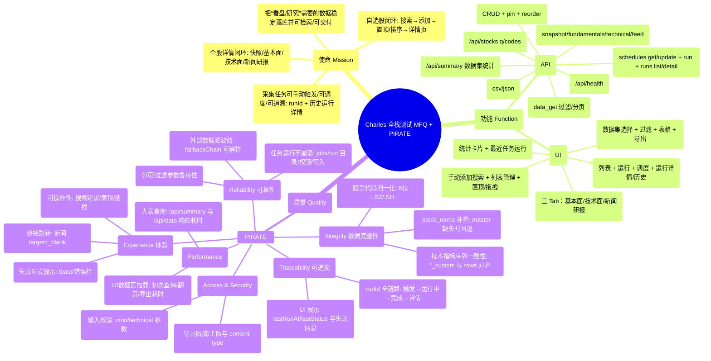

# Charles 全栈测试交付物（MFQ 分析 / 用例 / 执行 / Bug / 报告）

日期：2026-04-22  
环境：Windows 本地（后端 `http://127.0.0.1:8000`，前端 `http://127.0.0.1:5176`）

---

## Step 1：测试分析（MFQ 海盗测试法）—脑图（Mermaid）

---

## Step 2：测试用例（When-Given-Then）—表格

### API 测试用例

| ID | 场景 | Given | When | Then |
|---|---|---|---|---|
| API-01 | 健康检查 | 服务已启动 | When GET `/api/health` | Then 200 且 `ok=true`、`db=true` |
| API-02 | 数据集统计 | DB 可连接 | When GET `/api/summary` | Then 200 且包含各数据表 `latest/count` |
| API-03 | 股票搜索（模糊） | 主数据可检索 | When GET `/api/stocks?q=600519&limit=5` | Then 200 且 items 含 `600519.SH` |
| API-04 | 股票批量映射 | 输入 codes | When GET `/api/stocks?codes=000001.SZ,600519.SH` | Then 200 且两条均有 name |
| API-05 | 个股快照 | stock_code 合法 | When GET `/api/stock/{code}/snapshot` | Then 200 且 `price/pctChange/asOf` 非空 |
| API-06 | 基本面 | DB 有财务数据 | When GET `/api/stock/{code}/fundamentals` | Then 200 且 items 字段完整、`stock_name` 非空 |
| API-07 | 技术最新（合法参数） | DB 有日线 | When GET `/api/stock/{code}/technical/latest?...` | Then 200 且返回 row，含 `*_custom` 字段 |
| API-08 | 技术最新（非法参数校验） | macdShort>=macdLong | When GET `/technical/latest?macdShort=26&macdLong=12` | Then 400 且 detail 可读 |
| API-09 | 技术序列（范围） | start/end 合法 | When GET `/technical/series?...` | Then 200 且 rows 按日期升序、序列长度一致 |
| API-10 | 新闻feed（分页） | news 表有数据 | When GET `/feed?tab=news&page=1&pageSize=3` | Then 200 且 total/page/pageSize 合法 |
| API-11 | 自选股-查询 | watchlist 表存在 | When GET `/api/watchlist` | Then 200 且 items 按 pinned/sortOrder 排序 |
| API-12 | 调度-获取 | scheduler 可用 | When GET `/api/jobs/schedules` | Then 200 且包含 nextRunAt/cron/timezone |
| API-13 | 调度-非法 cron | cron 非法 | When PUT `/api/jobs/schedules/stock_daily` body `{cron:\"bad cron\"}` | Then 400 且提示 cron 格式 |
| API-14 | 任务运行-触发 | job store 可写 | When POST `/api/jobs/run` body `{domain:\"calendar\"}` | Then 200 且返回 runId，runs 详情可查询 |
| API-15 | 数据查询（大表） | dataset 存在 | When GET `/api/data/trade_stock_daily?page=1&pageSize=5` | Then 200 且 rows 非空、total>0 |
| API-16 | 数据导出 | dataset 存在 | When POST `/api/export` csv | Then 200 且 content-type 为 `text/csv` |

### UI 测试用例

| ID | 场景 | Given | When | Then |
|---|---|---|---|---|
| UI-01 | 总览渲染 | 前后端已启动 | When 打开 `/` | Then 展示“总览/最近任务运行/数据源优先级规则” |
| UI-02 | 采集任务列表 | jobs schedules 可读 | When 打开 `/jobs` | Then 展示任务列表、每条含“运行/查看/调度” |
| UI-03 | 采集任务-运行触发 | jobs/run 可用 | When 点击“财经日历-运行”并刷新 | Then 历史运行记录出现新 runId 且 status=running→success |
| UI-04 | 数据与交付-加载 | data api 可用 | When 打开 `/data` 并点击“应用” | Then 表格出现 rows，total>0 |
| UI-05 | 自选股-搜索建议 | stocks q 可用 | When `/watchlist` 中输入“平安” | Then 出现候选列表（code/name/添加） |
| UI-06 | 个股详情-三 Tab | watchlist 有 002410.SZ | When 打开 `/stock/002410.SZ` 切换 tab | Then 基本面/技术面/新闻研报可切换且均有内容 |

---

## Step 3：API 接口测试执行 + Bug 记录

### 执行记录（实际执行数据）

| ID | 方法 | Path | 预期 | 实际 | 耗时(ms) | 结果 | 备注 |
|---|---|---|---:|---:|---:|---|---|
| API-01 | GET | `/api/health` | 200 | 200 | 1051.7 | PASS |  |
| API-02 | GET | `/api/summary` | 200 | 200 | 9933.0 | PASS | 性能偏慢（见缺陷） |
| API-03 | GET | `/api/stocks?q=600519&limit=5` | 200 | 200 | 42.1 | PASS |  |
| API-04 | GET | `/api/stocks?codes=000001.SZ,600519.SH` | 200 | 200 | 83.4 | PASS |  |
| API-05 | GET | `/api/stock/000001.SZ/snapshot` | 200 | 200 | 37.3 | PASS |  |
| API-06 | GET | `/api/stock/000001.SZ/fundamentals` | 200 | 200 | 1271.4 | PASS |  |
| API-07 | GET | `/api/stock/000001.SZ/technical/latest?...` | 200 | 200 | 34.6 | PASS |  |
| API-08 | GET | `/api/stock/000001.SZ/technical/latest?macdShort=26&macdLong=12` | 400 | 400 | 4.2 | PASS | 参数校验可读 |
| API-09 | GET | `/api/stock/000001.SZ/technical/series?...` | 200 | 200 | 30.6 | PASS |  |
| API-10 | GET | `/api/stock/002410.SZ/feed?tab=news&page=1&pageSize=3` | 200 | 200 | 25.4 | PASS |  |
| API-11 | GET | `/api/watchlist` | 200 | 200 | 7.2 | PASS |  |
| API-12 | GET | `/api/jobs/schedules` | 200 | 200 | 38.8 | PASS |  |
| API-13 | PUT | `/api/jobs/schedules/stock_daily` | 400 | 400 | 27.8 | PASS | cron 校验可读 |
| API-14 | POST | `/api/jobs/run` | 200 | 200 | 19.1 | PASS | 生成 runId |
| API-14.1 | GET | `/api/jobs/runs/{runId}` | 200 | 200 | 17.5 | PASS | `running→success` |
| API-15 | GET | `/api/data/trade_stock_daily?page=1&pageSize=5` | 200 | 200 | 10111.8 | PASS | 性能偏慢（见缺陷） |
| API-16 | POST | `/api/export`(csv) | 200 | 200 | 72.7 | PASS | content-type 正确 |

### Bug/Issue 清单（本轮执行）

| Bug ID | 严重级别 | 类型 | 影响模块 | 复现步骤 | 期望 | 实际 | 证据/备注 |
|---|---|---|---|---|---|---|---|
| ISSUE-API-PERF-01 | Major | 性能 | `/api/summary` | GET `/api/summary` | < 2000ms（建议） | ~9933ms | 大表统计耗时高，影响总览加载 |
| ISSUE-API-PERF-02 | Major | 性能 | `/api/data/{dataset}` | GET `/api/data/trade_stock_daily?page=1&pageSize=5` | < 2000ms（建议） | ~10112ms | 首屏数据页加载慢 |

---

## Step 4：UI 自动化测试执行（Playwright MCP）+ Bug 记录

### 执行记录（关键路径）

| 用例 | 操作路径 | 结果 | 备注 |
|---|---|---|---|
| UI-01 | 打开 `/` | PASS | 总览与“数据源优先级规则”可见 |
| UI-02 | 打开 `/jobs` | PASS | 任务列表、调度信息、按钮可见 |
| UI-03 | `/jobs` 点击“财经日历-运行”→点击“刷新” | PASS | 历史运行记录出现新 runId 且可查看详情 |
| UI-04 | 打开 `/data` → 点击“应用” | PASS | 表格 rows 展示，支持 CSV/JSON 导出入口 |
| UI-05 | 打开 `/watchlist` → 输入“平安” | PASS | 候选列表出现且含“添加” |
| UI-06 | 打开 `/stock/002410.SZ` → 切换“技术面/新闻研报” | PASS | tab 内容可见；新闻条目存在“打开”链接 |

### Bug/Issue 清单（本轮执行）

| Bug ID | 严重级别 | 影响页面 | 复现步骤 | 期望 | 实际 | 备注 |
|---|---|---|---|---|---|---|
| ISSUE-UI-PERF-01 | Major | 总览/数据页 | 首次进入页面或点击“应用” | 交互响应流畅 | 受后端 `/api/summary`、`/api/data` 慢查询影响 | 与 ISSUE-API-PERF-01/02 关联 |

---

## Step 5：整体测试报告

### 覆盖范围

- API：health/summary/stocks/stock详情(snapshot/fundamentals/technical/feed)/watchlist/jobs/data/export
- UI：总览、采集任务、数据与交付、自选股、个股详情（三 Tab）

### 结论

- 功能正确性：本轮覆盖的 API 与 UI 核心链路均通过（jobs/run 可触发并可追溯）。
- 主要风险：性能风险突出（统计与大表查询均在 ~10s 级别），会直接拖慢 UI 首屏与数据页体验。

### 上线风险评估

- 高风险（性能）：`/api/summary` 与 `/api/data` 慢查询会造成 UI 卡顿/超时，建议上线前优化或加缓存/预聚合。
- 中风险（外部依赖）：jobs 域任务依赖外部数据源，需保证 fallbackChain 与失败信息可追踪、可告警。

### 优化建议（不修改代码，仅给方向）

- `/api/summary`：对 count/latest 做缓存（例如定时刷新）、或使用更轻量的统计表/物化视图。
- `/api/data`：默认增加日期范围限制/索引覆盖；分页查询使用覆盖索引与必要字段裁剪；避免 `SELECT *`。
- UI：数据页默认自动触发一次查询并展示“慢查询提示/加载耗时”；必要时增加“仅查询最近 N 天”快捷按钮。

---

## Step 6：交付物

本文件已包含：

- Step 1 测试分析（Mermaid 脑图）
- Step 2 用例表（API + UI）
- Step 3 API 执行记录与缺陷清单
- Step 4 UI 执行记录与缺陷清单
- Step 5 整体测试报告

