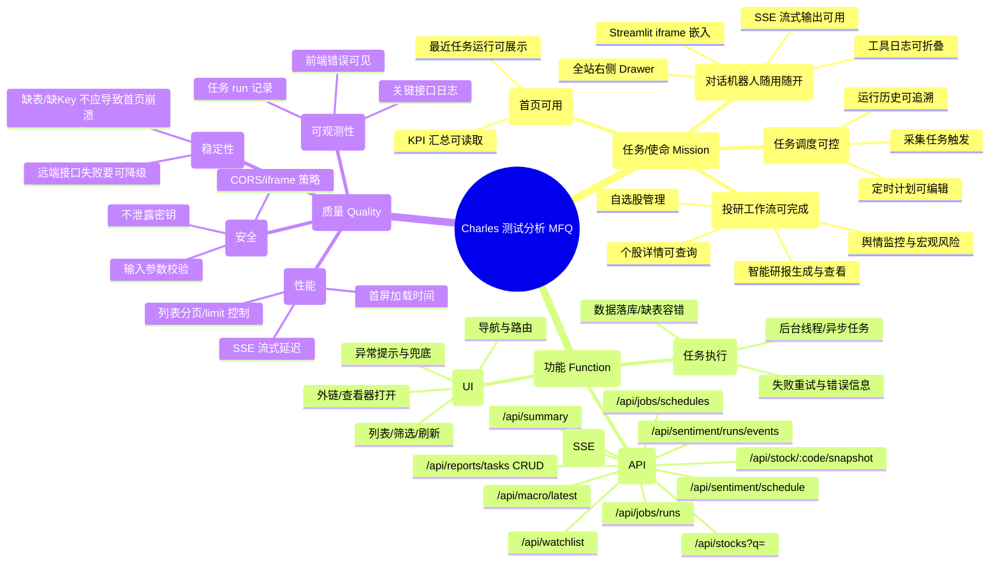

# Charles 测试报告（webapp-testing）

> 约束：仅执行测试与输出报告，不修改/删除现有业务代码（本文件与测试脚本为新增测试产物）。

## Step 1. 测试分析（MFQ 海盗测试法）

### MFQ 定义
- **M（Mission）**：用户使用 Charles 的核心目的与关键路径是否可用
- **F（Function）**：主要功能是否正确、稳定、可恢复
- **Q（Quality）**：性能、稳定性、兼容性、安全性、可观测性等质量属性

### 脑图（Mermaid）

## Step 2. 测试用例（When-Given-Then）

### API 用例

| ID | 用例 | Given | When | Then |
|---|---|---|---|---|
| API-01 | 首页汇总可用 | 服务已启动（8000） | GET `/api/summary` | 返回 200，JSON 含各表 `latest/count` 字段 |
| API-02 | 任务运行列表可用 | 服务已启动（8000） | GET `/api/jobs/runs?limit=10` | 返回 200，JSON `runs` 为数组 |
| API-03 | 定时计划列表可用 | scheduler 初始化成功 | GET `/api/jobs/schedules` | 返回 200 或 503（503 时 detail 包含 scheduler unavailable） |
| API-04 | 自选股列表可用 | DB 可连接 | GET `/api/watchlist` | 返回 200，items 为数组 |
| API-05 | 股票搜索可用 | DB 可连接 | GET `/api/stocks?q=浦发&limit=5` | 返回 200，items 含 code/name |
| API-06 | 个股快照可用 | DB 有 stock_daily | GET `/api/stock/600000.SH/snapshot` | 返回 200，含 `stock_code` |
| API-07 | 研报任务列表可用 | DB 可连接 | GET `/api/reports/tasks?limit=5` | 返回 200，tasks 为数组 |
| API-08 | 研报任务创建校验 | 已选择股票 | POST `/api/reports/tasks` | 返回 200，task_id 非空；未传 stock_codes 时返回 400 |
| API-09 | 舆情定时配置可用 | DB 可连接 | GET `/api/sentiment/schedule` | 返回 200，含 enabled/cron/timezone |
| API-10 | 宏观快照可用 | 可联网或有缓存 | GET `/api/macro/latest` | 返回 200 或 5xx（5xx 记为 Bug/降级建议） |
| API-11 | 对话 SSE 接口可用 | DASHSCOPE_API_KEY 已配置（或测试模式） | POST `/api/assistant/chat_stream` | 返回 200 且 Content-Type 为 `text/event-stream`；可收到 token/tool_end/done |

### UI 用例

| ID | 用例 | Given | When | Then |
|---|---|---|---|---|
| UI-01 | 首页加载无红色错误 | 前端 5173 + 后端 8000 | 打开 `/` | 页面不出现 `HTTP 500` 错误条 |
| UI-02 | 侧边栏导航可用 | 前端已启动 | 点击“采集任务/智能研报/舆情监控/自选股” | 路由切换成功且页面标题出现 |
| UI-03 | Jobs 页能加载 runs 与 schedules | 后端可用 | 进入 `/jobs` | 不出现错误条；至少渲染任务列表区域 |
| UI-04 | Reports 页能加载任务列表 | 后端可用 | 进入 `/reports` | 不出现错误条；渲染“智能研报”卡片 |
| UI-05 | Sentiment 页能加载 schedule/runs | 后端可用 | 进入 `/sentiment` | 不出现错误条；显示“舆情监控”内容与 Tab |
| UI-06 | 全站右侧机器人 Drawer 展示 | 前端已启动 + Streamlit 8501 | 任意页面观察右侧 | Drawer 存在，默认展开有 iframe |
| UI-07 | 机器人 Drawer 可折叠/展开 | Drawer 可见 | 点击折叠按钮再点击展开 | Drawer 宽度变化；展开后 iframe 仍存在 |
| UI-08 | Streamlit 页面可访问 | 8501 已启动 | 访问 iframe src 或直接打开 8501 | 返回 200；页面可交互（输入+发送） |

## Step 3. API 接口测试执行记录（待执行）

### 执行环境
- API Base: `http://127.0.0.1:8000`
- 执行脚本： [.charles/qa_api_smoke.py](file:///Users/apple/Desktop/ai_huahua/charles/.charles/qa_api_smoke.py)
- 原始结果： [.charles/qa_api_smoke_result.json](file:///Users/apple/Desktop/ai_huahua/charles/.charles/qa_api_smoke_result.json)

### 执行结果（摘要）

| ID | 接口 | 状态码 | 耗时(ms) | 结果 | 备注 |
|---|---|---:|---:|---|---|
| API-01 | /api/summary | 200 | 2113 | PASS | {"trade_stock_daily":{"latest":"2026-04-03","count":10648593},"trade_stock_finan… |
| API-02 | /api/jobs/runs?limit=10 | 200 | 9 | PASS | {"runs":[{"runId":"db7338dea2154cab86c1fd34dfa68825","domain":"report_consensus"… |
| API-03 | /api/jobs/schedules | 200 | 181 | PASS | {"schedules":[{"domain":"calendar","enabled":true,"cron":"0 7 * * *","timezone":… |
| API-04 | /api/watchlist | 200 | 172 | PASS | {"items":[],"max":50} |
| API-05 | /api/stocks?q=%E6%B5%A6%E5%8F%91&limit=5 | timeout | 10001 | FAIL | ReadTimeout: timed out |
| API-06 | /api/stock/600000.SH/snapshot | 200 | 362 | PASS | {"stock_code":"600000.SH","stock_name":null,"price":10.12,"change":-0.1300000000… |
| API-07 | /api/reports/tasks?limit=5 | 200 | 172 | PASS | {"tasks":[{"task_id":"4532267bb7af42189832d04b75f5e1a4","model":"qwen-max","stoc… |
| API-08 | /api/reports/tasks | 400 | 5 | PASS | {"detail":"stock_codes required"} |
| API-09 | /api/sentiment/schedule | 200 | 164 | PASS | {"domain":"sentiment_monitor","enabled":true,"cron":"10 15 * * 1-5","timezone":"… |
| API-10 | /api/macro/latest | timeout | 10001 | FAIL | ReadTimeout: timed out |
| API-11 | /api/assistant/chat_stream | 200 | 3593 | PASS | event: message |

### 发现的问题（Bug）
- **BUG-API-01（Major）**：`/api/stocks` 中文关键词查询响应极慢（>10s，脚本超时），数字/代码查询正常（例如 `q=600000`）。影响：研报/舆情页面的“股票搜索”在输入中文名称时卡住或无结果。
- **BUG-API-02（Minor/性能）**：`/api/macro/latest` 首次请求可能超过 10s（脚本超时）；后续命中缓存可在 25s 内返回。接口返回中包含 yfinance 限流错误字段（value 为 null），前端可展示但指标缺失。
- **配置提醒（非 Bug）**：`/api/assistant/chat_stream` 在未设置 `DASHSCOPE_API_KEY` 时会返回 SSE 的 error 事件（当前行为可接受，建议前端提示“缺少 Key”）。

## Step 4. UI 自动化测试执行记录

### 说明
- Playwright 非无头模式在当前 sandbox 环境下无法启动（进程直接退出且无日志），因此本次 Step4 采用**可视化浏览器自动化**执行（你可实时看到点击/跳转），并保留关键截图与网络日志作为证据。

### 执行范围
- 首页（总览）
- 采集任务（Jobs）
- 智能研报（Reports）
- 舆情监控（Sentiment：自选股舆情/宏观风险 Tab）
- 自选股（Watchlist）
- 数据与交付（Data）
- 右侧对话机器人 Drawer（折叠/展开）

### 关键截图证据
- `charles_ui_01_home.png`：/var/folders/h9/nzg_d6bx39j6w7s7y80_xfs80000gp/T/trae/screenshots/charles_ui_01_home.png
- `charles_ui_02_drawer_collapsed.png`：/var/folders/h9/nzg_d6bx39j6w7s7y80_xfs80000gp/T/trae/screenshots/charles_ui_02_drawer_collapsed.png
- `charles_ui_03_drawer_expanded.png`：/var/folders/h9/nzg_d6bx39j6w7s7y80_xfs80000gp/T/trae/screenshots/charles_ui_03_drawer_expanded.png
- `charles_ui_04_jobs.png`：/var/folders/h9/nzg_d6bx39j6w7s7y80_xfs80000gp/T/trae/screenshots/charles_ui_04_jobs.png
- `charles_ui_05_reports.png`：/var/folders/h9/nzg_d6bx39j6w7s7y80_xfs80000gp/T/trae/screenshots/charles_ui_05_reports.png
- `charles_ui_06_sentiment_watch.png`：/var/folders/h9/nzg_d6bx39j6w7s7y80_xfs80000gp/T/trae/screenshots/charles_ui_06_sentiment_watch.png
- `charles_ui_07_sentiment_macro.png`：/var/folders/h9/nzg_d6bx39j6w7s7y80_xfs80000gp/T/trae/screenshots/charles_ui_07_sentiment_macro.png
- `charles_ui_08_watchlist.png`：/var/folders/h9/nzg_d6bx39j6w7s7y80_xfs80000gp/T/trae/screenshots/charles_ui_08_watchlist.png
- `charles_ui_09_data.png`：/var/folders/h9/nzg_d6bx39j6w7s7y80_xfs80000gp/T/trae/screenshots/charles_ui_09_data.png
- `charles_ui_10_reports_stock_search_pufa.png`：/var/folders/h9/nzg_d6bx39j6w7s7y80_xfs80000gp/T/trae/screenshots/charles_ui_10_reports_stock_search_pufa.png

### 网络日志
- 浏览器网络请求日志（含 `GET /api/stocks?q=%E6%B5%A6%E5%8F%91&limit=20`）：/var/folders/h9/nzg_d6bx39j6w7s7y80_xfs80000gp/T/trae/browser-logs/network-2026-05-02T17-30-07-861Z.log

### 发现的问题（Bug）
- **BUG-UI-01（Major）**：在“智能研报”页输入中文股票名（例如 “浦发”）触发 `/api/stocks?q=浦发&limit=20` 请求，长时间无结果（网络日志可见请求发出），与 **BUG-API-01** 一致。

## Step 5. 整体结论与风险评估（待输出）

### 通过情况
- API 用例：11 条，PASS 9，FAIL 2（均为性能/超时类）
- UI 用例：核心导航与页面渲染通过；发现 1 条与中文股票搜索相关的阻塞问题

### Bug 清单（汇总）

| Bug ID | 严重级别 | 现象 | 影响范围 | 复现方式（最短路径） | 备注 |
|---|---|---|---|---|---|
| BUG-API-01 | Major | `/api/stocks` 中文关键词查询 >10s，易超时 | Reports/Sentiment 的股票搜索 | GET `/api/stocks?q=浦发&limit=20`（或在研报页输入“浦发”） | 代码/数字查询正常；疑似缺索引导致全表扫描 |
| BUG-API-02 | Minor | `/api/macro/latest` 首次请求可能 >10s；且 yfinance 可能限流导致 value=null | Sentiment 宏观风险 Tab | GET `/api/macro/latest` | 接口仍返回 200 且含 error 字段；可视为降级成功但数据缺失 |
| BUG-UI-01 | Major | 研报页中文股票名搜索无结果/卡住 | Reports UI | 打开 `/reports`，在“搜索股票代码/名称”输入“浦发” | 由 BUG-API-01 触发 |

### 风险评估与建议
- **上线风险（中）**：中文股票名搜索卡顿会显著影响“研报/舆情”的核心交互，应优先修复（增加索引、限制查询范围、做前缀匹配、增加超时与降级）。
- **宏观数据可用性（中）**：yfinance 依赖易被限流，建议加多源备份或更强缓存策略，并在 UI 明确展示“数据源限流/缺失”。
- **对话机器人（低）**：未配置 `DASHSCOPE_API_KEY` 时会输出 SSE error 事件；建议前端/Streamlit 明确提示“未配置 Key”，并在服务启动时做环境检查。
