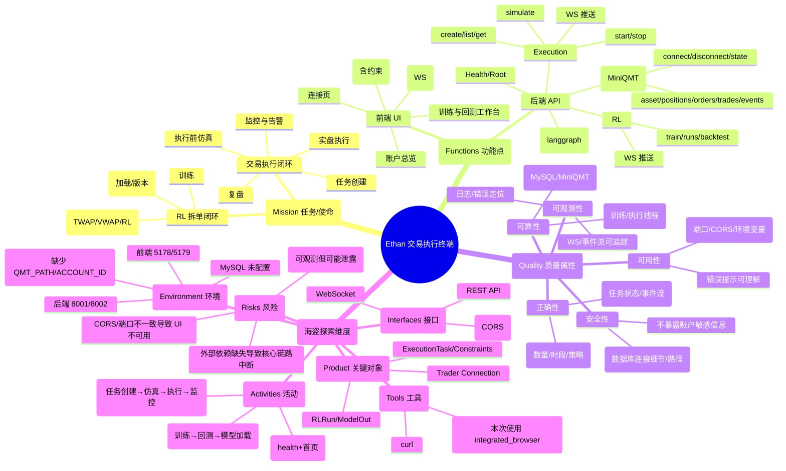

# Ethan（交易官）测试分析与报告（2026-05-03）

> 范围：`/Users/apple/Desktop/ai_huahua/ethan`（FastAPI + React）
>
> 注意：本次仅执行测试与记录，不对现有代码做修改/删除（配置项仅通过运行时环境变量切换）。

---

## Step 1：测试分析（MFQ 海盗测试法）脑图（mermaid）

---

## Step 2：测试用例（When-Give-Then）

### API 用例表

| ID | 接口 | When | Give | Then |
|---|---|---|---|---|
| API-01 | GET /api/health | 服务已启动 | 无 | 返回 200 且 ok=true |
| API-02 | GET / | 服务已启动 | 无 | 返回 200 且包含 docs 字段 |
| API-03 | POST /api/agent/run | 调用 Ethan 编排入口 | task: {symbol,total_qty,num_steps,strategy} | 返回 200，result.ok=true |
| API-04 | GET /api/trading/state | 未连接 MiniQMT | 无 | 返回 200，connected=false |
| API-05 | POST /api/trading/connect | 未配置交易连接环境变量 | 无 | 返回 400（提示 QMT_PATH/ACCOUNT_ID required） |
| API-06 | POST /api/executions | 创建执行任务 | strategy=twap 且 adv 手动填写 | 返回 200，返回 task.id |
| API-07 | GET /api/executions | 已存在任务 | 无 | 返回 200，items 数组包含任务 |
| API-08 | GET /api/executions/{task_id} | 任务存在 | task_id | 返回 200，task.id 匹配 |
| API-09 | POST /api/executions/{task_id}/simulate | 未配置 MySQL 数据源 | n_episodes=1 | 返回 503 data_unavailable |
| API-10 | POST /api/executions/{task_id}/start | 未连接 trader | 无 | 返回 503 trader not connected |
| API-11 | POST /api/executions/{task_id}/stop | 未启动执行线程 | 无 | 返回 200（ok=false 或 ok=true 视实现） |
| API-12 | POST /api/rl/backtest | 未配置 MySQL 数据源 | symbol + date range + n_episodes | 返回 503 data_unavailable |

### UI 用例表

| ID | 页面/模块 | When | Give | Then |
|---|---|---|---|---|
| UI-01 | 顶部导航 | 进入任意页面 | 无 | 导航可跳转：连接页/总览/新建任务/执行监控/训练回测 |
| UI-02 | 连接页 | 点击“连接与校验” | 未配置 QMT_PATH/ACCOUNT_ID | 页面展示错误信息（不会卡死） |
| UI-03 | 新建执行任务 | 填写 ADV 并点击“创建任务” | ADV=1000000 | 生成 task_id，启用“单次仿真/开始实盘执行”按钮 |
| UI-04 | 新建执行任务-仿真 | 点击“单次仿真” | 未配置 MySQL | 页面展示 503 data_unavailable 错误 |
| UI-05 | 新建执行任务-执行 | 点击“开始实盘执行” | trader 未连接 | 页面展示 503 trader not connected 错误 |
| UI-06 | 执行监控 | 选择任务并连接 WebSocket | task_id | WebSocket 能建立连接（事件为空也不报错） |
| UI-07 | 训练与回测-回测 | 点击“运行回测” | 未配置 MySQL | 页面展示 503 data_unavailable 错误 |
| UI-08 | 训练与回测-训练 | 点击“开始训练” | 未配置 MySQL | 页面展示失败/错误信息 |

---

## Step 3：API 接口测试执行记录（含 bug 记录）

### 执行环境
- 后端：`http://127.0.0.1:8001`（uvicorn）
- 外部依赖：MySQL 未配置；MiniQMT 未连接（缺少环境变量）

### 执行结果（节选）

| ID | 实际结果 | 证据 |
|---|---|---|
| API-01 | 200 | `curl -w ... /api/health` |
| API-02 | 200 | `curl -w ... /` |
| API-03 | 200 | `curl -w ... /api/agent/run` |
| API-04 | 200 | `curl -w ... /api/trading/state` |
| API-05 | 400 | `curl -X POST /api/trading/connect` |
| API-06 | 200，返回 task_id：`ca57e0c47f0847a2b1f28c94aa7f6c0b` | `curl -X POST /api/executions` |
| API-07 | 200 | `curl -i /api/executions` |
| API-08 | 200 | `curl -w ... /api/executions/{id}` |
| API-09 | 503 | `curl -w ... /simulate` |
| API-10 | 503，detail=trader not connected | `curl -i -X POST /start` |
| API-11 | 200 | `curl -w ... /stop` |
| API-12 | 503，detail=data_unavailable: OperationalError... | `curl -i -X POST /api/rl/backtest` |

### Bug 清单（API）

| BugID | 严重级别 | 标题 | 复现步骤 | 实际结果 | 期望结果 |
|---|---|---|---|---|---|
| BUG-API-01 | 中 | data_unavailable 返回内容包含底层 MySQL 连接细节 | 调用 /api/rl/backtest 或 /simulate，且 MySQL 未启动 | 503 返回 detail 中包含 `Can't connect to MySQL server ... errno` 等信息 | 503 但不应直接回传底层异常细节（建议给出简洁错误码 + 引导配置项） |

---

## Step 4：UI 可视化自动化测试执行记录（含 bug 记录）

### 执行方式
- 使用“可视化浏览器自动化”（integrated_browser），非无头模式。

### 关键发现：默认配置下 UI 可能无法调用后端（CORS/Origin）
- 当前端运行在 `http://127.0.0.1:5178`，后端默认 CORS 仅允许 `http://localhost:5173`（默认值），导致浏览器请求被拦截，表现为 `net::ERR_FAILED`。
- 为了继续完成 UI 链路测试，本次通过**运行时环境变量**启动一套测试环境：
  - 后端：`ETHAN_CORS_ORIGINS` 放行 `http://127.0.0.1:5179` 等
  - 前端：`VITE_ETHAN_API_BASE=http://localhost:8002`，并在 `5179` 端口启动

### UI 执行结果（节选）

| ID | 实际结果 | 备注 |
|---|---|---|
| UI-01 | 通过 | 路由跳转正常 |
| UI-02 | 通过（报错可见） | 未配置 QMT_PATH/ACCOUNT_ID 时提示错误 |
| UI-03 | 通过 | 创建任务后按钮从 disabled 变为可点击 |
| UI-04 | 失败（环境依赖） | MySQL 未配置，仿真请求报错 |
| UI-05 | 失败（环境依赖） | trader 未连接，start 报错 |
| UI-06 | 通过 | WebSocket 可连接（无事件也正常） |
| UI-07 | 失败（环境依赖） | backtest 报错 |
| UI-08 | 失败（环境依赖） | train 报错 |

### Bug 清单（UI）

| BugID | 严重级别 | 标题 | 复现步骤 | 实际结果 | 期望结果 |
|---|---|---|---|---|---|
| BUG-UI-01 | 高 | 默认 CORS 配置导致前端在非 5173 端口无法调用后端 | 前端 `npm run dev --port 5178`，后端默认启动；访问“账户总览/连接页/新建任务”并点按钮 | 浏览器控制台出现 `net::ERR_FAILED`，功能按钮无效或报错 | 默认配置应允许本地常见 origin（至少包含 `localhost/127.0.0.1` + dev 端口），或提供清晰启动指引 |
| BUG-UI-02 | 中 | 外部依赖缺失时错误呈现偏“技术化” | MySQL 未启用时点击“单次仿真/回测/训练” | UI 展示 raw error（包含后端 detail） | UI 提示应更业务化（如“数据源未配置/数据库不可用”），并引导设置环境变量 |

---

## Step 5：整体测试报告

### 结论
- **基础可用**：后端 health / 根路由 / agent / 任务创建与查询可用；前端路由与基础交互正常。
- **阻塞问题**：
  1) 默认 CORS 配置对本地多端口开发不友好（UI 直接不可用）。
  2) 仿真/回测/训练强依赖 MySQL；实盘执行强依赖 MiniQMT，未配置时核心链路中断（可接受，但需要更清晰的提示与“环境自检”入口）。

### 覆盖率视角（按模块）
- Trading：连接/状态 API 覆盖；实盘下单未覆盖（缺少 MiniQMT 环境）
- Execution：创建/查询覆盖；simulate/start 被外部依赖阻塞
- RL：backtest/train 被外部依赖阻塞
- UI：导航/关键按钮覆盖；数据依赖链路未覆盖（MySQL/MiniQMT）

### 风险与建议（非代码修改，仅作为测试建议）
- 建议增加“环境自检页/按钮”，一次性检测：
  - 后端可达、CORS 是否匹配
  - MySQL 是否可连接
  - MiniQMT 是否已登录且可连接
- 建议将 data_unavailable/detail 做“脱敏/归一化”错误码，避免暴露内部细节。

---

## Step 6：归档说明

本文件已作为最终归档，包含：
- 测试分析脑图（Step 1）
- 用例表（Step 2）
- 执行记录与 bug 清单（Step 3/4）
- 总体测试报告（Step 5）

