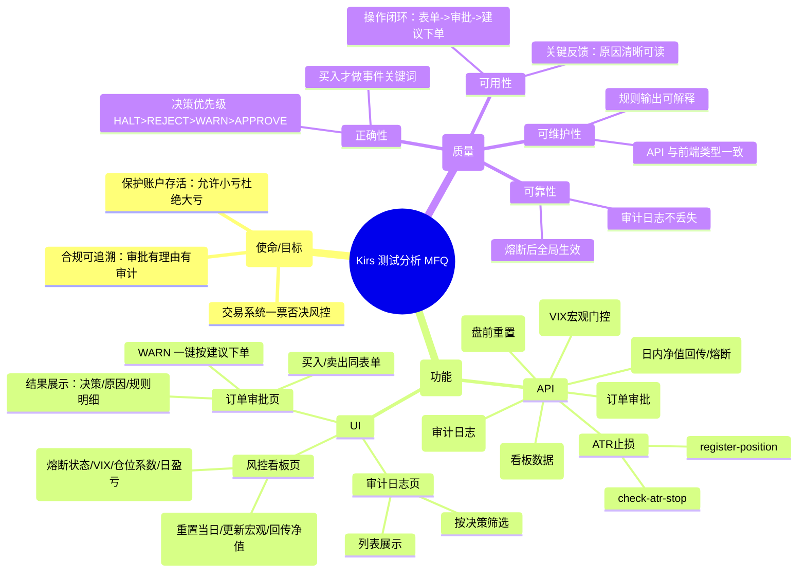

# Kirs（风控师）测试报告

> 目标：对 `/Users/apple/Desktop/ai_huahua/kris` 进行 API + UI 测试，输出测试分析、测试用例、执行记录（含 bug 清单）与总结报告。

## 0. 测试说明

- 应用形态：独立应用（React + FastAPI）
- 前端地址：http://127.0.0.1:5174/
- 后端地址：http://127.0.0.1:8011/
- Swagger：http://127.0.0.1:8011/docs
- 事件风控：关键词模式（MVP）
- 宏观门控：VIX
- 说明：已尝试加载 `webapp-testing` 技能，但出现 IDE 超时错误；本次 UI 自动化改用“可视化浏览器自动化”方式执行（可见操作 + 截图留存）。

---

## Step 1：测试分析（MFQ 海盗测试法）

---

## Step 2：测试用例（When-Given-Then）

### 2.1 API 测试用例

| ID | 优先级 | When | Given | Then |
|---|---|---|---|---|
| API-01 | P0 | 访问健康检查 | 服务已启动 | 返回 `{"ok":true}` |
| API-02 | P0 | 盘前重置 | start_nav=1,000,000 | 返回 ok；当日熔断状态清空 |
| API-03 | P0 | 更新宏观 VIX | vix=18.5 | 返回 risk_level=正常，coefficient=1.0 |
| API-04 | P0 | 提交买入审批 | buy + amount=100000 + price=3 + current_price=3 + ATR=0.05 + total_asset=1,000,000 | 返回 decision=approve；suggested_amount=100000；suggested_quantity>0 |
| API-05 | P0 | 提交买入审批（事件利空） | buy + news_text 含“立案调查” | 返回 decision=reject；reason 命中关键词；suggested_amount=0 |
| API-06 | P0 | 提交买入审批（ATR 超仓） | buy + amount=200000 + total_asset=100000 + ATR=0.05 + price=3 | 返回 decision=warn；max_position_pct≈0.3；suggested_amount≈60000；suggested_quantity≈20000 |
| API-07 | P1 | 提交卖出审批（忽略事件文本） | sell + news_text 含“财务造假/立案调查” | 不因事件关键词拒绝（预期 approve/warn/reject 取决于其它规则） |
| API-08 | P0 | 宏观 VIX 触发 HALT | update-macro vix=50 后再 approve | approve 返回 decision=halt |
| API-09 | P1 | 获取看板状态 | 系统有审批记录 | status 返回 total/approved/warned/rejected 统计 |
| API-10 | P1 | 获取审计日志 | last_n=5 | 返回 items 列表，包含决策与原因 |
| API-11 | P0 | 日内净值触发熔断 | start-day 后 trade-complete(nav=970000) | 返回 decision=halt（3% 亏损触发 2% 熔断） |
| API-12 | P0 | ATR 止损触发 | register-position(entry=3, atr=0.05)，check-atr-stop(price=2.89) | 返回 decision=reject，reason 含止损价 2.90 |

### 2.2 UI 测试用例

| ID | 优先级 | When | Given | Then |
|---|---|---|---|---|
| UI-01 | P0 | 打开首页 | 前端启动、后端可用 | 默认进入“订单审批”页，表单可见 |
| UI-02 | P0 | 提交审批（默认表单） | 默认 stock=510050.SH buy | “审批结果”区域出现决策与原因，规则明细表渲染 |
| UI-03 | P1 | 跳转风控看板 | 点击“风控看板” | 页面展示 KPI 与控制台按钮 |
| UI-04 | P1 | 更新宏观 | 输入 vix 并点“更新宏观” | KPI 的 VIX/仓位系数随宏观更新（肉眼可见） |
| UI-05 | P1 | 跳转审计日志 | 点击“审计日志” | 审计表格展示记录 |
| UI-06 | P1 | 审计筛选 | 选择 warn/reject 等 | 列表被筛选（肉眼可见） |

---

## Step 3：API 接口测试执行（记录 + Bug）

### 3.1 执行结果摘要

- API-01：PASS（`/api/health` 返回 ok）
- API-02：PASS（start-day 返回 ok）
- API-03：PASS（vix=18.5 -> 正常，系数 1.0）
- API-04：PASS（approve=approve；suggested_quantity 返回 33300）
- API-05：PASS（事件关键词命中 -> reject）
- API-06：PASS（ATR 超仓 -> warn；suggested_amount=60000；suggested_quantity=20000）
- API-07：PASS（sell + 负面 news_text 未触发事件拒绝）
- API-08：PASS（vix=50 -> approve 返回 halt）
- API-09：PASS（status 返回统计字段）
- API-10：PASS（audit 返回 items）
- API-11：PASS（nav=970000 -> 单日亏损熔断）
- API-12：PASS（ATR 止损触发 reject）

### 3.2 关键响应摘录（截断）

- start-day：
  - `{"ok":true}`
- update-macro (18.5)：
  - `{"ok":true,"vix":18.5,"risk_level":"正常","coefficient":1.0}`
- approve buy normal：
  - `{"decision":"approve",...,"suggested_amount":100000,"suggested_quantity":33300,...}`
- approve buy event reject：
  - `{"decision":"reject","reason":"[事件关键词] 600519.SH 新闻命中重大利空: 立案调查",...}`
- approve buy warn：
  - `{"decision":"warn","max_position_pct":0.3,"suggested_amount":60000,"suggested_quantity":20000,...}`
- trade-complete 熔断：
  - `{"ok":true,"decision":{"decision":"halt","reason":"单日亏损 3.00% 触发熔断线 2.00%"...}}`
- check-atr-stop：
  - `{"ok":true,"decision":{"decision":"reject","reason":"510050.SH 触发ATR止损: ... 止损价 2.900 ..."}}`

### 3.3 API Bug 记录

| BugID | 严重性 | 模块 | 复现步骤 | 期望 | 实际 | 备注 |
|---|---|---|---|---|---|---|
| B-API-01 | 低 | 命名一致性 | 查看模块/路径：项目名为 kris，但后端包名为 kirs_api，接口前缀为 /api/kris | 命名完全一致（Kirs） | 存在 kris/kirs/kris 混用 | 不影响功能，但影响一致性与后续协作 |
| B-API-02 | 中 | 宏观门控 | vix=50 后对 sell 调用 approve | 若策略是“只禁止开仓”，应允许卖出减仓；或至少文案准确 | 返回 halt 且 reason 文案为“暂停所有开仓” | 可能是需求口径问题：HALT 是否应阻止卖出 |

---

## Step 4：UI 测试执行（可视化自动化 + Bug）

### 4.1 执行轨迹

- UI-01/UI-02：打开 `http://127.0.0.1:5174/`，点击“提交审批”，页面出现结果区域与明细。
  - 截图：`kris-ui-approve-01.png`
- UI-03/UI-04：点击“风控看板”，执行“更新宏观”。
  - 截图：`kris-ui-dashboard-01.png`
- UI-05/UI-06：点击“审计日志”，下拉筛选选择 warn。
  - 截图：`kris-ui-audit-01.png`
  - 截图：`kris-ui-audit-filter-warn.png`

> 截图保存路径（本机临时目录）：`/var/folders/.../T/trae/screenshots/`

### 4.2 UI Bug 记录

| BugID | 严重性 | 模块 | 复现步骤 | 期望 | 实际 | 备注 |
|---|---|---|---|---|---|---|
| B-UI-01 | 低 | 自动化可测性 | 在“下单金额/总资产”等输入框内尝试清空并输入新值（自动化工具） | 输入框可被稳定清空并写入新值 | 自动化输入时容易出现“追加输入”现象，导致值异常变大 | 更偏测试工具限制；人工操作不一定存在此问题 |

---

## Step 5：整体测试结论

- 功能正确性：核心审批链路（宏观→事件→事前→最严格决策）在 API 层验证通过；卖出单不走事件关键词符合预期。
- 风控关键能力：单日亏损熔断与 ATR 止损均可触发并返回可解释原因。
- 可追溯性：审计日志接口能返回审批记录（UI 侧可筛选查看）。
- 风险点：
  - 宏观 HALT 是否应该阻止“卖出减仓”存在口径不确定/可能误伤（建议产品侧确认）。
  - 命名一致性（kris/kirs/kris）建议统一，便于维护与跨项目一致风格。

---

## Step 6：产出物清单

- 本文件：`/Users/apple/Desktop/ai_huahua/kris/TEST_REPORT_2026-05-03.md`
- UI 截图（临时目录）：
  - `kris-ui-approve-01.png`
  - `kris-ui-dashboard-01.png`
  - `kris-ui-audit-01.png`
  - `kris-ui-audit-filter-warn.png`

