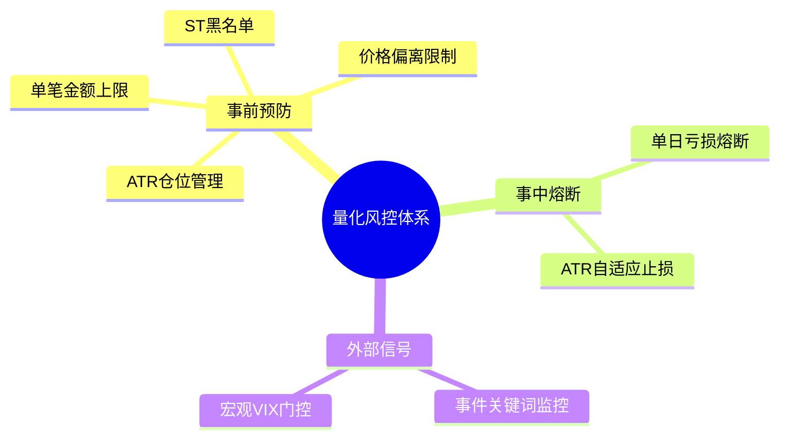
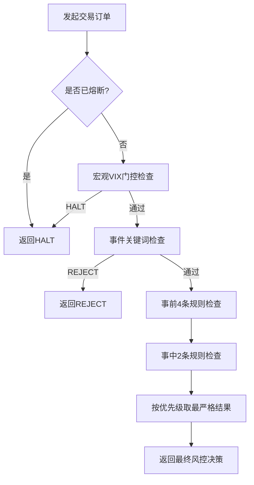
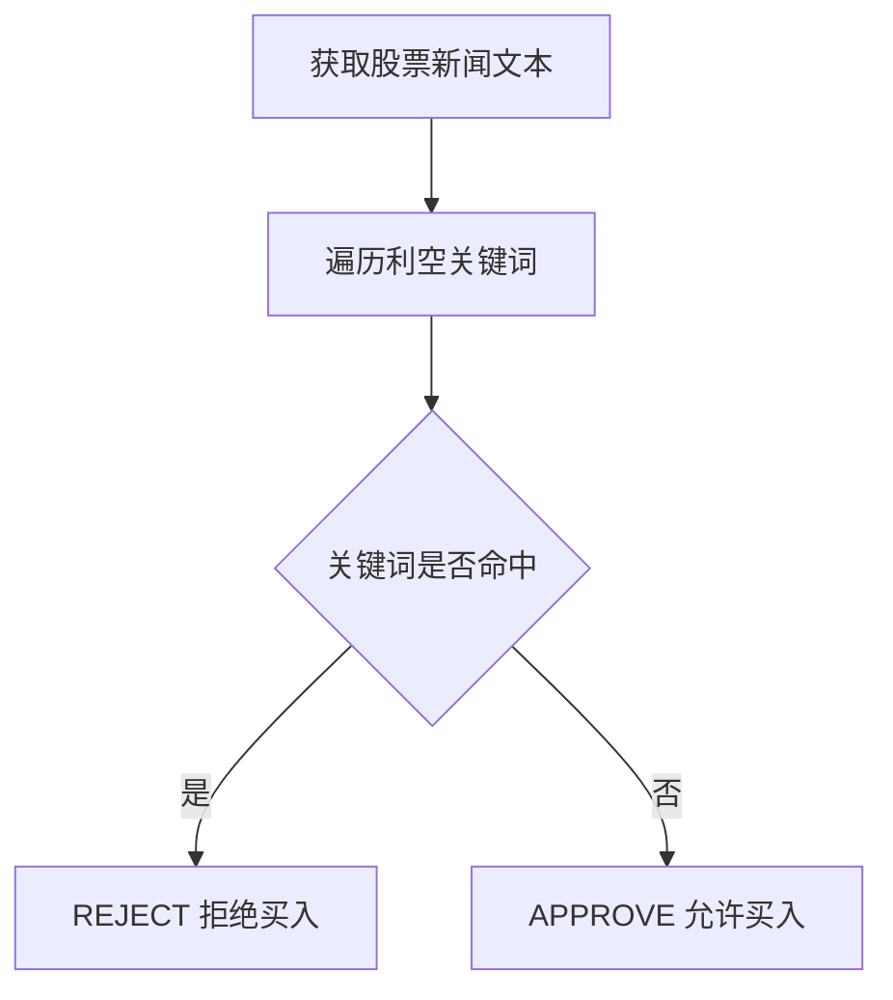
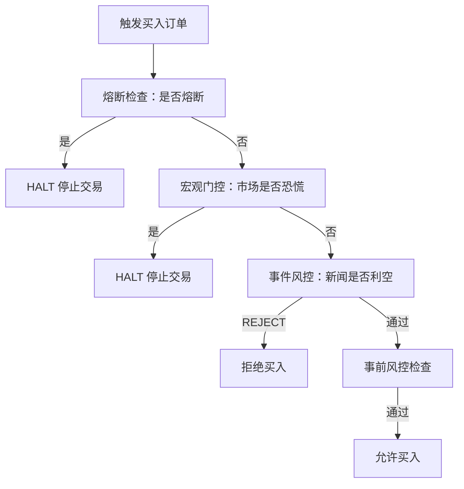

# 3. 风控体系

## 3.1 风控核心定位

风控是量化交易的**生死线**，核心不是追求多赚钱，而是**杜绝大亏、保证账户存活**。

* 盈利靠策略，活着靠风控：无风控时，再优质的策略也会因一次黑天鹅直接归零。

* 规则并非越多越好：规则重叠冲突会降低决策效率、增加正常交易误伤概率。

* 核心目标：守住底线，允许小亏，绝不允许致命亏损，相当于给账户“买保险”。

## 3.2 风控体系整体框架

风控按交易流程分为**事前预防、事中熔断、外部信号**三大维度，共8条核心规则，执行**最严格一票否决**机制。



## 3.3 条核心风控规则

| 维度   | 规则序号 | 规则名称     | 默认参数         | 核心作用       | 防护场景               |
| ---- | ---- | -------- | ------------ | ---------- | ------------------ |
| 事前预防 | 1    | 单笔金额上限   | 20万          | 防乌龙指、程序Bug | Knight Capital错单事件 |
| 事前预防 | 2    | 价格偏离     | 5%           | 防委托价异常     | 闪电崩盘、手抖报价          |
| 事前预防 | 3    | ST黑名单    | 含ST直接拒绝      | 防退市/造假风险股  | 康美药业、康得新           |
| 事前预防 | 4    | ATR仓位    | 总资产1%风险      | 单笔风险恒定     | 高波动品种爆仓            |
| 事中熔断 | 5    | 单日亏损熔断   | 2%           | 日内强制停手     | 连续亏损、日内暴跌          |
| 事中熔断 | 6    | ATR自适应止损 | 入场价-2×ATR    | 适配波动止损     | 假突破、趋势反转           |
| 外部信号 | 7    | 事件关键词    | 立案/造假/退市     | 利空事件拦截     | 瑞幸咖啡造假             |
| 外部信号 | 8    | 宏观VIX门控  | VIX≥50触发HALT | 市场危机总闸     | 2020美股四次熔断         |

## 3.4 四种风控决策类型

决策优先级：**HALT > REJECT > WARN > APPROVE**

| 决策类型    | 执行动作      | 影响范围     | 典型触发场景                    |
| ------- | --------- | -------- | ------------------------- |
| APPROVE | 100%执行原订单 | 不影响后续    | 全部规则通过                    |
| WARN    | 按系数缩单执行   | 不影响后续    | ATR仓位超标2倍内、VIX 20–50、中等风险 |
| REJECT  | 本笔订单拒绝    | 不影响后续    | 金额超限、价格偏离、ST、事件命中         |
| HALT    | 当日停止所有交易  | 全天生效，需重置 | 单日亏损≥2%、VIX≥50            |

## 3.5 风控决策执行流程



## 3.6 典型风险事件与缺失风控

| 事件名称                 | 时间         | 后果          | 缺失的关键风控    |
| -------------------- | ---------- | ----------- | ---------- |
| Knight Capital 软件Bug | 2012-08-01 | 亏损4.4亿美元被收购 | 单笔上限、价格偏离  |
| 康美药业财务造假             | 2018-12    | 市值蒸发90%+、退市 | ST黑名单、事件风控 |
| 美股闪电崩盘               | 2010-05-06 | 道指36分钟跌9%   | 价格偏离、ATR止损 |
| 美股疫情四次熔断             | 2020-03    | VIX创历史新高    | 宏观VIX门控    |
| 瑞幸咖啡业绩造假             | 2020-04    | 单日跌80%、退市   | 事件关键词风控    |

## 3.7 风控引擎核心逻辑

1. 统一入口：`RiskManager.approve()` 集成全部8条规则。

2. 一票否决：按 HALT > REJECT > WARN > APPROVE 取最严格结果。

3) WARN 处理：按 `max_position_pct` 自动缩单，非单纯告警。

4) 重置机制：HALT 后必须调用 `start_day()` 才能恢复交易。

# 4. ATR 风控

## 4.1 ATR基础概念

ATR（Average True Range，平均真实波幅）是海龟交易法则核心指标，用于**自适应仓位管理+动态止损**，解决固定风控“一刀切”导致的风险不均问题。

### 4.1.1 TR 真实波幅计算

TR 包含日内振幅与跳空缺口：

* TR = max(当日high−当日low, |当日high−前日close|, |当日low−前日close|)

* ATR：20日TR的Wilder移动平均（海龟标准参数）。

## 4.2 ATR核心价值

* 固定金额买入：50ETF与茅台波动差10倍，风险敞口极不均衡。

* 固定比例止损：高波动品种一开盘就被噪音扫出场。

* ATR方案：**每笔风险恒定**，波动大则降仓、放宽止损；波动小则加仓、收紧止损。

## 4.3 ATR仓位管理（事前风控）

### 4.3.1 核心公式

**建议仓位金额 =（总资产 × 1%）÷ ATR × 价格**

* 1%：海龟安全线，连续亏损20笔账户约亏18%，仍可继续交易。

* 若设为5%，连续亏损20笔亏约64%，账户几乎无法恢复。

### 4.3.2 实战对比（510050.SH）

| 市场状态 | 日期         | 收盘价   | ATR(20日) | 建议仓位 | 逻辑          |
| ---- | ---------- | ----- | -------- | ---- | ----------- |
| 低波动期 | 2025-08-13 | 2.860 | 0.0260   | 110万 | 波动小，可加大仓位   |
| 高波动期 | 2025-10-17 | 3.030 | 0.0446   | 68万  | 波动大，降低仓位控风险 |

## 4.4 ATR自适应止损（事中风控）

### 4.4.1 核心公式

**止损价 = 入场价 − 2×ATR（2N止损）**

### 4.4.2 统计意义

覆盖约95%的正常日内波动（近似正态分布2σ区间），突破后大概率是趋势反转，而非噪音。

### 4.4.3 固定止损 vs ATR止损

| 市场状态          | 固定5%止损       | ATR 2N止损         |
| ------------- | ------------ | ---------------- |
| 低波动（ATR≈0.5%） | 止损过宽（10倍ATR） | 止损合理（2倍ATR），快速离场 |
| 高波动（ATR≈3%）   | 止损过紧，易被噪音触发  | 止损宽松，给趋势足够空间     |

## 4.5 ATR实战案例（螺纹钢期货）

* 入场价：4000元

* 固定2%止损：3920元

* ATR 2N止损：3900元（ATR=50）

| 时间   | 行情              | 固定止损         | ATR止损     | 结果       |
| ---- | --------------- | ------------ | --------- | -------- |
| Day1 | 最低3950，收盘4020   | 未触发，精神紧张     | 未触发，安全垫充足 | ATR更稳    |
| Day2 | 跳空低开3930，收盘3980 | 触发，亏损1.75%离场 | 未触发，继续持有  | ATR避免假突破 |
| Day3 | 收盘4100          | 已离场，错失反弹     | 持有，获利2.5% | ATR收益更高  |

## 4.6 ATR历史防护价值（2024日股黑色星期一）

* 事件：日元大涨引发全球量化踩踏，日经225单日跌12%，50ETF波动超3%。

* 无ATR：7月ATR低，仓位30万，8月风险敞口翻2.5倍，单日亏5%。

* 有ATR：8月建议仓位降至12万，损失仅为无ATR的40%。

## 4.7 ATR风控代码核心逻辑

1. ATR计算：按TR做20日Wilder移动平均。

2. 仓位检查：超建议仓位2倍触发WARN，自动缩单。

3) 止损登记：成交后记录入场价与ATR，实时监测价格。

4) 止损触发：跌破2×ATR立即平仓，清除持仓记录。

## 4.8 ATR适用场景

* 优先适用：期货、杠杆品种、高波动股票。

* 通用适用：ETF、指数基金等中低波动品种。

* 核心优势：自适应市场波动，避免“一刀切”风控失效。

# 5. 事件风控实战

## 5.1 核心定义与价值

### 5.1.1 事件风控本质

事件风控是**基于新闻舆情**的风险拦截手段，弥补ATR仓位、价格止损等仅依赖行情数据的风控短板，提前识别“价格未动、风险已现”的隐性雷区。

### 5.1.2 核心价值

* 提前拦截**立案调查、财务造假、退市**等致命利空，避免本金大幅亏损

* 典型案例：康美药业立案后仍有70%下跌空间，事件风控可在立案当日拒绝买入

## 5.2 核心风险场景与典型案例

### 5.2.1 高频致命风险场景

| 风险场景      | 风险特征            | 典型案例                  |
| --------- | --------------- | --------------------- |
| 立案调查/侦查   | 证监会/司法介入，严重违规前兆 | 康美药业、康得新、獐子岛、恒大       |
| 财务造假      | 报表失真，基本面分析完全失效  | 康美（300亿）、康得新（122亿）、瑞幸 |
| 退市/终止上市   | 流动性归零，资产大幅缩水    | 瑞幸、恒大                 |
| \*ST警示    | 退市边缘，风险极高       | ST康美、\*ST康得新          |
| 行政处罚/涉嫌违法 | 违规定性，涉刑事风险      | 獐子岛、恒大许家印             |

### 5.2.2 经典案例复盘

1. **康美药业（600518.SH）**

   * 2018-10-15：回应财务真实，关键词风控通过

   * 2018-12-28：被立案调查，关键词拦截REJECT

   * 2019-04-30：被\*ST，关键词再次拦截

   * 结果：市值蒸发90%+，风控避免后续70%下跌

2. **康得新（002450.SZ）**

   * 2019-01-15：15亿短融违约，关键词不拦截

   * 2019-01-22：立案调查，关键词拦截REJECT

   * 结果：连续14个跌停

3) **瑞幸咖啡（LK.US）**

   * 2020-04-02：自曝财务造假，关键词拦截REJECT

   * 结果：单日暴跌80%，后续退市

4) **中国恒大（03333.HK）**

   * 2021-2022：流动性紧张、美元债违约，关键词不拦截

   * 2023-09-28：许家印被立案调查，关键词拦截REJECT

   * 结果：万亿市值崩塌，最终清盘

## 5.3 关键词初级风控方案

### 5.3.1 核心关键词库（10个关键词覆盖90%利空）

```python
BEARISH_KEYWORDS = [
    '退市', '暂停上市', '终止上市', '*ST',
    '立案调查', '立案侦查', '行政处罚',
    '涉嫌违法', '涉嫌犯罪', '财务造假',
]
```

### 5.3.2 关键词判断逻辑



### 5.3.3 代码实现（EventKeywordChecker）

```python
class EventKeywordChecker:
    BEARISH_KEYWORDS = [
        '退市', '暂停上市', '终止上市', '*ST',
        '立案调查', '立案侦查', '行政处罚',
        '涉嫌违法', '涉嫌犯罪', '财务造假',
    ]
    def check(self, stock_code, news_text):
        for kw in self.BEARISH_KEYWORDS:
            if kw in news_text:
                return RiskDecision(Decision.REJECT,
                    reason=f"{stock_code} 新闻命中重大利空: {kw}",
                    rule_name="事件关键词")
        return RiskDecision(Decision.APPROVE, reason="无重大利空", rule_name="事件关键词")
```

### 5.3.4 关键词风控局限性

1. 仅**字符串匹配**，无语义理解能力

2. 无法识别**减持、业绩下滑、大额减值**等中等风险

3) 模糊表述（如流动性紧张、债务违约）无法拦截

## 5.4 大模型语义风控升级（LLM方案）

### 5.4.1 大模型风控优势

* 具备**语义理解**，识别关键词无法覆盖的中等风险

* 支持分级判断：REJECT/WARN/APPROVE

* 适配复杂新闻语境，降低误判与漏判

### 5.4.2 风控提示词模板

```plain&#x20;text
你是A股专业风控官Kris，现在审批一笔买入订单。
请只根据下面的新闻文本，判断这只股票是否存在重大利空，决定是否允许买入。
判定口径(从严):
- REJECT: 命中重大利空(立案/退市/财务造假/重大违规/重大债务违约)
- WARN: 存在中等风险信号(大额减持/业绩大幅下滑/商誉减值/监管问询)
- APPROVE: 新闻中性或正面，无明显风险
输出格式(严格遵守):
第一行: REJECT / WARN / APPROVE 之一
第二行: 一句话理由(不超过40字)
股票代码: {stock_code}
新闻文本: {news_text}
```

### 5.4.3 代码实现（EventLLMChecker）

```python
class EventLLMChecker:
    PROMPT_TEMPLATE = "上述提示词模板"
    def check(self, stock_code, news_text):
        resp = Generation.call(model='qwen-turbo', prompt=self.PROMPT_TEMPLATE.format(
            stock_code=stock_code, news_text=news_text
        ))
        verdict, reason = parse(resp.output.text)
        return RiskDecision(decision=verdict, reason=reason, rule_name="LLM事件风控")
```

### 5.4.4 关键词vs大模型效果对比（贵州茅台案例）

| 新闻内容             | 关键词模式   | LLM模式   | 差异原因        |
| ---------------- | ------- | ------- | ----------- |
| 每股拟分红27.993元     | APPROVE | APPROVE | 无风险         |
| 2025年净利润823.20亿元 | APPROVE | APPROVE | 无风险         |
| 合计现金股利约350.33亿元  | APPROVE | APPROVE | 无风险         |
| 净利润同比下降4.53%     | APPROVE | REJECT  | LLM识别业绩下滑风险 |
| 营收、净利润双降         | APPROVE | REJECT  | LLM识别业绩双降利空 |

## 5.5 事件风控在审批流中的位置

### 5.5.1 Kris审批执行顺序



### 5.5.2 审批流代码片段

```python
def approve(self, order, portfolio, context):
    # 1. 熔断检查
    if self.circuit_breaker.is_halted:
        return RiskDecision(Decision.HALT, reason="市场熔断")
    # 2. 宏观门控
    if self.macro.check().decision == Decision.HALT:
        return RiskDecision(Decision.HALT, reason="宏观风险触发")
    # 3. 事件风控（仅买入检查）
    if order.direction == 'buy':
        event_d = self.event.check(order.stock_code, context.get('news_text', ''))
        if event_d.decision == Decision.REJECT:
            return event_d
    # 4. 事前风控
    checks = self.pre_trade.check_all(order, portfolio)
    return self._get_strictest([event_d, *checks])
```

## 5.6 实战操作步骤

### 5.6.1 环境准备

1. 安装依赖：`akshare`、`dashscope`、`python-dotenv`

2. 配置API Key：在`.env`设置`DASHSCOPE_API_KEY`

### 5.6.2 数据获取

```python
import akshare as ak
# 获取股票新闻
news_list = ak.stock_news_em(symbol='600519') # 贵州茅台
# 获取QVIX（宏观配套）
qvix_df = ak.index_option_50etf_qvix()
```

### 5.6.3 双模式对比测试

1. 关键词模式：逐条匹配10个核心关键词，输出REJECT/APPROVE

2. 大模型模式：调用通义千问审批，输出REJECT/WARN/APPROVE

3) 统计一致性：计算一致率，提取LLM多识别的风险信号

### 5.6.4 接入主引擎实战

1. 将新闻数据传入`context`参数

2. 调用`kris.approve()`执行完整审批

3) 输出决策结果与风险理由

## 5.7 关键总结

1. **事件风控是第一道防线**：优先拦截新闻类致命利空，避免踩雷

2. **关键词+LLM组合最优**：关键词低成本初筛，LLM精准识别语义风险

3) **审批流固定顺位**：熔断→宏观→事件→事前，逻辑不可逆

4) **实战价值**：单条关键词规则可避免90%以上重大利空损失