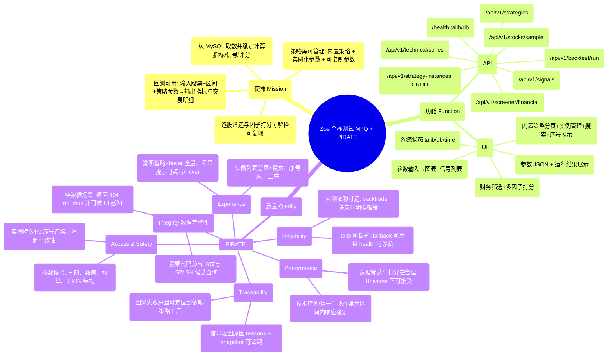

# Zoe 全栈测试交付物（MFQ 分析 / 用例 / 执行 / Bug / 报告）

日期：2026-04-22  
环境：Windows 本地（后端+Web：`http://127.0.0.1:8010`，DB：`wucai_trade`）

---

## Step 1：测试分析（MFQ 海盗测试法）—脑图（Mermaid）

---

## Step 2：测试用例（When-Given-Then）—表格

### API 测试用例

| ID | 场景 | Given | When | Then |
|---|---|---|---|---|
| API-01 | 健康检查 | 服务已启动 | When GET `/health` | Then 200 且 `db=true`，`talib=true`，`talib_backend` 可读 |
| API-02 | 样例股票 | DB 有日线 | When GET `/api/v1/stocks/sample?limit=10` | Then 200 且返回 codes 数组 |
| API-03 | 技术指标序列 | stock_code 有数据 | When GET `/api/v1/technical/series?stock_code=...&start=...&end=...` | Then 200 且 rows 按日期升序，含 MA/MACD/RSI/BBANDS 字段 |
| API-04 | 信号与评分 | stock_code 有数据 | When GET `/api/v1/signals?...` | Then 200 且 signals 每条包含 `signal/score/reasons/snapshot` |
| API-05 | 财务筛选 | 财务表可用 | When POST `/api/v1/screener/financial` | Then 200 且 rows 字段完整（允许为空） |
| API-06 | 策略库列表 | 注册表可用 | When GET `/api/v1/strategies` | Then 200 且返回 25 个策略 meta（含 description/schema/defaults/flags） |
| API-07 | 实例列表 | instances 存在或为空 | When GET `/api/v1/strategy-instances` | Then 200 且 instances 为数组 |
| API-08 | 创建实例 | strategy_id 合法 | When POST `/api/v1/strategy-instances` | Then 200 且返回数字字符串 instance_id |
| API-09 | 删除实例 | instance_id 存在 | When DELETE `/api/v1/strategy-instances/{id}` | Then 200 且 deleted=id |
| API-10 | 回测执行 | backtrader 可选 | When POST `/api/v1/backtest/run` | Then 200 返回 metrics/trades；若缺依赖则 500 且 detail 明确指出 backtrader 缺失 |
| API-11 | 空数据场景 | stock_code 不存在 | When GET `/api/v1/signals?...` | Then 404 且 detail=`no_data` |

### UI 测试用例

| ID | 场景 | Given | When | Then |
|---|---|---|---|---|
| UI-01 | 概览 | 服务已启动 | When 打开 `/` | Then 展示系统状态：talib/db/time |
| UI-02 | 信号中心计算 | DB 有行情 | When `/signals` 输入股票+日期并点“计算” | Then 图表渲染且信号列表出现多行 |
| UI-03 | 选股页面 | DB 有财务 | When 打开 `/screener` | Then 展示“财务筛选/多因子打分”两区块与表头 |
| UI-04 | 策略库实例体验 | 有策略与实例 | When 打开 `/strategies` | Then “说明”非输入框且省略显示、hover 可全量；实例列表第一列为“序号” |
| UI-05 | 回测页面（缺依赖提示） | 未安装 backtrader | When `/backtest` 点“运行回测” | Then 页面给出明确错误信息（不崩溃、不白屏） |

---

## Step 3：API 接口测试执行 + Bug 记录

### 执行记录（抽样关键接口）

本轮使用 stock_code=`000001.SZ`，区间 `2026-01-01`~`2026-04-07`，strategy_id=`ma_dual`。

| ID | 方法 | Path | 预期 | 实际 | 耗时(ms) | 结果 |
|---|---|---|---:|---:|---:|---|
| API-01 | GET | `/health` | 200 | 200 | 32.0 | PASS |
| API-02 | GET | `/api/v1/stocks/sample?limit=10` | 200 | 200 | 17.1 | PASS |
| API-03 | GET | `/api/v1/technical/series?...` | 200 | 200 | 89.6 | PASS |
| API-04 | GET | `/api/v1/signals?...` | 200 | 200 | 62.8 | PASS |
| API-05 | POST | `/api/v1/screener/financial` | 200 | 200 | 250.8 | PASS |
| API-06 | GET | `/api/v1/strategies` | 200 | 200 | 13.0 | PASS |
| API-07 | GET | `/api/v1/strategy-instances` | 200 | 200 | 5.3 | PASS |
| API-08 | POST | `/api/v1/strategy-instances` | 200 | 200 | 30.8 | PASS |
| API-09 | DELETE | `/api/v1/strategy-instances/2` | 200 | 200 | 23.2 | PASS |
| API-10 | POST | `/api/v1/backtest/run` | 200 | 500 | 50.5 | FAIL |
| API-11 | GET | `/api/v1/signals?stock_code=999999.SZ...` | 404 | 404 | - | PASS |

### Bug/Issue 清单

| Bug ID | 严重级别 | 影响模块 | 复现步骤 | 期望 | 实际 | 证据/备注 |
|---|---|---|---|---|---|---|
| BUG-ZOE-01 | Major | 回测 | POST `/api/v1/backtest/run` 或 UI `/backtest` 点“运行回测” | 可回测并返回指标 | 500：`strategy_factory_failed: No module named 'backtrader'` | 当前环境未安装 backtrader；可通过安装 `requirements-backtest.txt` 解决（不属于代码缺陷） |

---

## Step 4：UI 测试执行（Playwright MCP）+ Bug 记录

### 执行记录（关键路径）

| 用例 | 操作路径 | 结果 | 备注 |
|---|---|---|---|
| UI-01 | 打开 `/` | PASS | 系统状态显示 `talib=true(fallback)`、`db=true` |
| UI-02 | `/signals` 填 `000001.SZ` + 日期区间 → 点击“计算” | PASS | 信号列表生成 9 行 |
| UI-03 | 打开 `/screener` | PASS | 财务筛选与多因子打分区块可见 |
| UI-04 | 打开 `/strategies` | PASS | `#instanceDesc` 为 DIV 且含 `ellipsis`；搜索框提示“按 序号 / 策略ID / 名称” |
| UI-05 | `/backtest` 点击“运行回测” | FAIL(可预期) | 页面显示错误：`No module named 'backtrader'` |

### Bug/Issue 清单（与 API 一致）

| Bug ID | 严重级别 | 影响页面 | 复现步骤 | 期望 | 实际 | 备注 |
|---|---|---|---|---|---|---|
| BUG-ZOE-01 | Major | 回测 | `/backtest` 点“运行回测” | 展示回测指标与交易明细 | 显示 backtrader 缺失错误 | 安装 backtrader 后可恢复 |

---

## Step 5：整体测试报告

### 覆盖范围

- API：health、样例股票、技术序列、信号、选股筛选、策略库、实例 CRUD、回测
- UI：概览、信号中心、选股、策略库、回测

### 结论

- 指标/信号/选股/策略库：核心功能链路均通过。
- 回测：当前环境缺少 backtrader 依赖，导致回测 API 与 UI 不可用（问题可通过安装可选依赖解决）。

### 上线风险评估

- 中高风险：若生产环境未安装 backtrader，则“回测模块”不可用，需要在部署阶段明确依赖或做功能开关提示。
- 中风险：talib 当前使用 fallback（health 可诊断），如追求与 TA-Lib 一致性需在生产环境补齐 talib wheel。

### 优化建议（不修改代码，仅给方向）

- 部署：将 backtrader 作为“回测功能必选依赖”在部署清单中显式化。
- 体验：在回测页顶部增加“依赖缺失提示”与安装指引（避免用户重复点击）。
- 数据：对无数据场景（404 no_data）在 UI 上明确提示与示例股票代码推荐。

---

## Step 6：交付物

本文件已包含：

- Step 1 测试分析（Mermaid 脑图）
- Step 2 用例表（API + UI）
- Step 3 API 执行记录与缺陷清单
- Step 4 UI 执行记录与缺陷清单
- Step 5 整体测试报告

